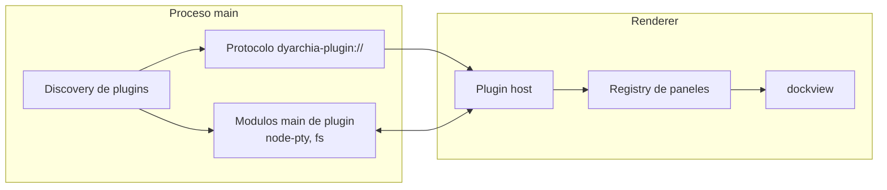

# dyarchia-desktop

Shell de escritorio para el ecosistema dyarchia. Contenedor de paneles al estilo del Code tab
de Claude Desktop: arranca vacio y cada funcionalidad se registra como plugin con sus propios
paneles, draggables, redimensionables y persistentes entre sesiones.


## 1. Arquitectura

- Shell en Electron + Vite + React + TypeScript, con dockview como gestor de layout.
- Cada plugin es un proyecto independiente que se descubre en runtime: no hay que recompilar
  el shell para anadir o quitar funcionalidad.
- El contrato de panel es framework-agnostic: un plugin monta lo que quiera (vanilla, React,
  otro framework) dentro del contenedor DOM que le cede el shell.



Detalle de piezas:

    Pieza                       Ubicacion                    Responsabilidad
    -----------------------     -------------------------    ----------------------------------------
    Shell (app Electron)        apps/shell                   ventana, layout, toggles, persistencia
    SDK                         packages/sdk                 contrato TypeScript de plugin
    Discovery + protocolo       apps/shell/src/main          escaneo de manifests, servido de bundles
    Plugin host                 apps/shell/src/renderer      carga de bundles y registro de paneles
    Plugins                     packages/plugin-*            funcionalidad real


## 2. Estructura del repo

    dyarchia-desktop/
        apps/
            shell/               app Electron (main, preload, renderer)
        packages/
            sdk/                 @dyarchia/sdk - tipos del contrato
            plugin-sample/       plugin minimo de referencia
            plugin-terminal/     terminal embebida (xterm.js + node-pty)
            plugin-docviewer/    arbol de ficheros + render markdown
            plugin-player/       reproductor de audio/video (dyarchia-media://)
        scripts/
            install-plugins.mjs  copia plugins a %APPDATA%/dyarchia/plugins
        docs/
            plugins.md           como escribir un plugin


## 3. Comandos

Desarrollo (ventana con hot reload; en dev el shell descubre los plugins directamente en
packages/, con prioridad sobre los instalados):

```bash
pnpm dev
```

Build de todos los workspaces:

```bash
pnpm build
```

Empaquetado portable de Windows (genera apps/shell/release/dyarchia-x.y.z.exe):

```bash
pnpm --filter @dyarchia/shell package
```

Instalacion de plugins para la app empaquetada:

```bash
node scripts/install-plugins.mjs
```


## 4. Persistencia y rutas

    Dato                  Ruta
    ------------------    -------------------------------------------
    Layout (dev)          %APPDATA%/@dyarchia/shell/layout.json
    Layout (portable)     %APPDATA%/dyarchia/layout.json
    Plugins instalados    %APPDATA%/dyarchia/plugins/<id>/


## 5. Debug

Con la variable de entorno DYARCHIA_DEBUG=1 (o siempre en dev) el shell expone Chrome
DevTools Protocol en el puerto 9222. El renderer publica la API de dockview en
window.__dockApi para inspeccion.

Nota conocida: dockview 8 emite un error de consola sobre el modulo ContextMenu de
dockview-enterprise. Es inofensivo — la edicion libre avisa de que los menus contextuales
de tabs son de pago. No afecta a ninguna funcionalidad del shell.
