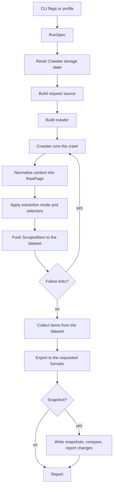

# Architecture

How crawlee-lab is put together, and the reasoning behind the parts that are not obvious.

## Index

- [1. Two layers](#1-two-layers)
- [2. Module map](#2-module-map)
- [3. The path of a run](#3-the-path-of-a-run)
- [4. One DOM interface over four parsers](#4-one-dom-interface-over-four-parsers)
- [5. Crawlee behaviours that had to be handled](#5-crawlee-behaviours-that-had-to-be-handled)
- [6. Snapshots and the change history](#6-snapshots-and-the-change-history)
- [7. Failure handling](#7-failure-handling)
- [8. Testing strategy](#8-testing-strategy)

## 1. Two layers

The engine knows nothing about any specific site. Profiles never touch the Crawlee API. A profile
describes what to look for; the engine decides how to obtain it.

That boundary is what makes a new target a data change rather than a code change. It also means
anything a target needs that a profile cannot express belongs in the engine as a reusable feature,
never as a per-site escape hatch. The claude-docs profile needed sitemap seeding and URL suffix
rewriting; both landed in the engine and both are now available to every target.

## 2. Module map

    Module                  Responsibility                                  Depends on
    --------------------    -------------------------------------------    -------------------
    cli                     Command parsing, run orchestration              config, registry
    config                  Settings from environment and .env              nothing
    models                  Data contracts between layers                   nothing
    errors                  Exception hierarchy                             nothing
    urls                    Suffix rewriting, snapshot path derivation      nothing
    patterns                URL matching for link following                 nothing
    registry                Discovery of YAML and Python profiles           profiles, sites
    runtime                 Resetting Crawlee state between runs            nothing
    recon                   Target reconnaissance for the inspect command   extraction
    engine                  Running a crawl end to end                      almost everything
    crawlers.factory        Building the requested crawler                  settings, hooks
    crawlers.settings       Concurrency, rate limit, transport              config
    crawlers.throttling     Per-domain delay and 429 backoff                models
    crawlers.hooks          Pre-navigation resource blocking                context
    crawlers.adaptive       Static-result sufficiency check                 models
    crawlers.context        Safe access to optional context members         nothing
    extraction.dom          One DOM interface, field selector language      nothing
    extraction.strategies   Extraction modes                                dom, models
    extraction.boilerplate  Removal of the header and footer every page     nothing
                            of a run shares
    extraction.markup       Cleaning of markup embedded in documents        nothing
                            that arrive as markdown
    profiles.schema         On-disk profile shape                           models
    profiles.loader         Reading and writing profile files               schema, errors
    storage.exporters       Output as json, jsonl, csv, markdown            models
    storage.snapshots       Snapshot writing and pruning                    versioning
    versioning.hashing      Content fingerprints                            nothing
    versioning.manifest     Per-target record of status and hashes          models
    versioning.diffing      Manifest comparison into a change report        manifest
    versioning.report       Rendering a change report                       diffing
    versioning.vcs          Committing a snapshot                           errors
    sites.claude_docs       The first Python profile                        profiles.schema

Dependencies point towards `models` and `config`, never towards `cli`.

## 3. The path of a run

`RunSpec` is the single contract. A profile and a command line produce the same object, which is why
`--profile` and ad-hoc flags compose rather than being two separate code paths.

Overrides are resolved through Click's parameter source rather than by comparing values against
defaults. A flag that happens to equal its default must not silently win over the profile that set
it deliberately.

## 4. One DOM interface over four parsers

Crawlee hands back a different object depending on the crawler: a BeautifulSoup document, a Parsel
selector, a live Playwright page, or raw bytes. `extraction.dom` defines the minimum a parsed
document must offer, and `engine.to_raw_page` is the single place that knows about the difference.

Adapters exist for BeautifulSoup and Parsel. A browser page is read through `page.content()` and
adapted as HTML. Anything not recognised falls through to the response body, where the content type
decides whether there is a DOM to build at all.

Extraction that starts from HTML can lean on structure to separate content from chrome. Text that
arrives already clean, such as a publisher's own markdown, has no structure left to lean on, so a
banner injected into every page survives into the snapshot. `extraction.boilerplate` closes that gap
from the other direction: a block of lines opening or closing at least ninety per cent of a run's
pages is chrome by definition, whatever it says. Detection therefore happens once the whole run is
collected, because the corpus is the evidence. Removing it is also free for change tracking, since
content identical on every page is constant and constant content never appears in a diff.

A second gap opens on the same kind of target. Sites built on MDX serve their prose pages as prose
and their landing pages as the layout that produced them: class names, wrapper elements, inline SVG
path coordinates. Nothing is missing from such a page, but nudging an icon by a pixel would read as
a content change. `extraction.markup` reduces a markup-heavy document to the prose and links inside
it, and the ratio test keeps it away from ordinary pages. Two details in it are what make it lossless
rather than merely tidy: component syntax puts real headings in attributes, so `title`, `label` and
`href` are rescued instead of stripped with the tag, and fenced code blocks are left untouched,
because an HTML example inside a fence is the content rather than the chrome.

## 5. Crawlee behaviours that had to be handled

Four behaviours of the library are easy to get wrong and are handled explicitly. Each one was
verified against the installed version rather than assumed.

### 5.1 Globs never cross the scheme separator

Crawlee matches include and exclude patterns against the whole URL, anchored at the start, using a
path-style glob translation. The obvious pattern `**/docs/**` therefore matches nothing, because
`**` refuses to cross the empty segment inside `https://`. It fails silently: the crawl simply
follows no links.

`patterns.to_matcher` gives the CLI its own contract instead. A bare pattern means the URL contains
this glob, a pattern with a scheme keeps Crawlee's own semantics, and a `re:` prefix is an explicit
regular expression.

### 5.2 Adaptive rendering does not update the parsed document

On a browser run, `AdaptivePlaywrightCrawlingContext.parsed_content` is parsed from the raw
navigation response body, not from the rendered DOM. Reading it would return the pre-JavaScript
shell of exactly the pages that needed a browser in the first place.

The engine therefore prefers the live page and falls back to `parsed_content`. Because that page is
a property that raises when the request was served by the static sub-crawler, access goes through
`crawlers.context.safe_page`.

### 5.3 The adaptive crawler needs a result checker to adapt

Without one it accepts whatever the cheap static path produced, including an empty shell.
`crawlers.adaptive.make_result_checker` rejects a static result carrying no signal, which is what
forces a browser render. It is aware of the run: a run that asked for nothing extractable accepts
any result, so `--extract none` does not render every page in a browser.

### 5.4 Crawl-delay is read but not enforced

`respect_robots_txt_file` reads `Crawl-delay` from robots.txt, then logs a warning and ignores it
unless the crawler is driven by a `ThrottlingRequestManager`. One is wired whenever robots.txt is
respected. The delays are reactive, from 429 responses and from robots directives, so an ordinary
crawl still runs at full speed.

## 6. Snapshots and the change history

Content lands under `data/<name>/pages/`, mirroring the URL structure, so a diff reads like a tour
of the site. A manifest beside the pages records per-URL status and hash, which is what allows a
report without invoking git, and what allows a page that disappeared to be told apart from a page
that failed to download.

Git is optional, and in this repository it is declined: `data/` is ignored in full. That is worth
being precise about, because it sounds like it should break change tracking and does not. Detection
compares the incoming run against the manifest and pages already on disk, so it works identically
whether or not anything is committed. What git adds is duration. Without it, a target keeps its
current state and the report of the most recent run; with it, every change acquires a date and an
author trail.

Removing `data/` from `.gitignore` restores that. `--commit` then stages a snapshot only when its
content fingerprint moved, and `versioning.vcs` refuses with an explanation rather than a git error
when the directory it was asked to commit is ignored.

Manifest timestamps move on every run, so comparing manifests directly would produce a commit per
run and turn the history into a record of how often the scraper ran. Snapshots are therefore
compared on a content fingerprint of status and hash. Unchanged pages are not rewritten, and the
manifest and report are only persisted when that fingerprint moves.

## 7. Failure handling

Retries with backoff belong to Crawlee. On top of that:

- Every URL gets a final status in the manifest, so a partial failure neither deletes valid
  snapshots nor pollutes the diff with false removals.
- A run whose success rate falls below its threshold writes no snapshot at all.
- A run that reaches far fewer pages than the snapshot it would replace writes nothing either. The
  success rate cannot see this: a run capped at three pages downloads three of three, scores a
  hundred per cent, and deletes everything it never visited. Coverage asks whether the run saw the
  target or only a corner of it, which is the failure mode of a page limit, a mistyped include
  pattern, or a sitemap that came back truncated.
- Extraction errors are isolated per page; one broken page does not abort the run.
- Snapshot paths are sanitised and resolved, so a target cannot steer writes outside its own
  directory through traversal in its URLs.

Crawlee caches storage instances, and the locks guarding them, in a process-global service locator.
Those locks bind to the event loop that created them, so a second run in the same process fails.
`runtime.reset_storage_state` is called when a run starts, which makes the engine usable from a test
suite or a scheduler and not only from a CLI that exits afterwards. It also implies runs are
sequential; concurrent crawls in one process were never safe under a global service locator.

## 8. Testing strategy

Unit tests run against local fixtures with no network at all, and cover the parts where correctness
is subtle: pattern semantics, selector parsing, extraction modes, path derivation, manifest
comparison, snapshot guards, profile loading.

Tests that reach the network are marked `network` and those that need a browser are marked
`browser`. They exercise the sandboxes at books.toscrape.com and quotes.toscrape.com through the
real command line entry point, including the case that motivated the adaptive result checker: the
static crawler sees an empty shell where the browser-backed one sees ten quotes. CI runs neither
mark, so the pipeline never depends on a third party being up.
