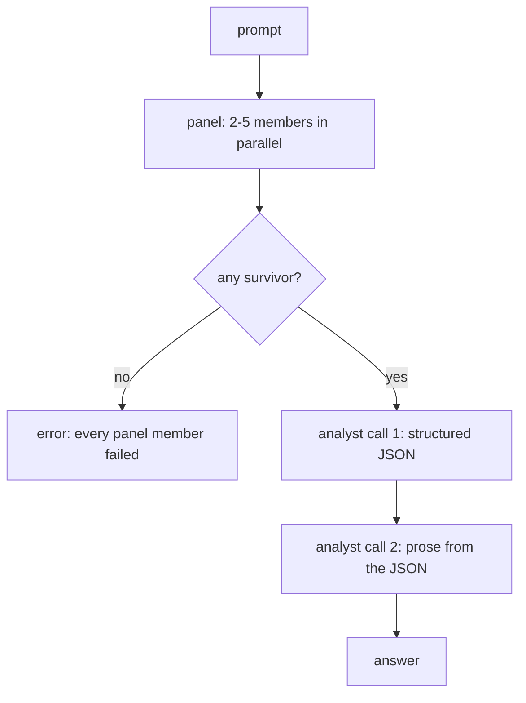

# Eforoi design

How the plugin is put together, what each route costs, and which parts are deliberately
absent. The user-facing summary is in [README.md](../README.md); this document is the
reasoning underneath it.


## Index

- [1. The pipeline](#1-the-pipeline)
- [2. Routes and adapters](#2-routes-and-adapters)
- [3. The catalogue is discovered, not declared](#3-the-catalogue-is-discovered-not-declared)
- [4. Isolation from your own configuration](#4-isolation-from-your-own-configuration)
- [5. What each route costs](#5-what-each-route-costs)
- [6. The IPC contract](#6-the-ipc-contract)
- [7. The nested menu](#7-the-nested-menu)
- [8. Styling without a dependency](#8-styling-without-a-dependency)
- [9. Reading order and the shape of the panel](#9-reading-order-and-the-shape-of-the-panel)
- [10. Deliberate omissions](#10-deliberate-omissions)


## 1. The pipeline



A member that fails does not fail the run — it is reported on its own card and the analyst
sees only the survivors. The run aborts only when nothing survives.

The analyst is one seat but two calls. The first returns the comparison as JSON; the second
writes the answer from that JSON. OpenRouter's Fusion splits these across two models — the
analyst emits the analysis, the caller's own model writes the reply. There is no caller
model in a desktop panel, so the roles collapse onto one seat while the two steps stay
separate. The intermediate JSON is rendered in the panel, and it is often more useful than
the prose: it is the only place the disagreement is visible as data.

The analysis schema:

```json
{
    "consensus": [{ "claim": "string", "supported_by": [1, 2] }],
    "contradictions": [{ "topic": "string", "positions": [{ "member": 1, "position": "string" }] }],
    "partial_coverage": [{ "point": "string", "covered_by": [1] }],
    "unique_insights": [{ "member": 2, "insight": "string" }],
    "blind_spots": ["string"]
}
```

Members are 1-based and match the seat ordinals in the panel, so every claim in the analysis
traces back to a card the reader can open.

Structured output is not requested through any provider's JSON mode. Three of the five
routes are CLI agents that have no such parameter, and an analyst whose behaviour changed
with the route would not be comparable across runs. Instead the schema is specified in the
prompt, the reply is parsed with a brace-balancing extractor that tolerates fences and
surrounding prose, and one retry with a stricter instruction follows a parse failure.


## 2. Routes and adapters

Five routes, two families.

```text
Route       Family   Transport                      Auth
---------   ------   ----------------------------   ----------------------------
claude      CLI      spawn, JSONL on stdout         Claude Code's own session
codex       CLI      spawn, JSONL on stdout         Codex CLI's own session
opencode    CLI      spawn, JSONL on stdout         opencode's own session
anthropic   API      @anthropic-ai/sdk, streaming   key from keychain or env
openai      API      openai sdk, streaming          key from keychain or env
```

Every CLI route funnels through one runner. A route contributes three things: the argument
vector, whether it accepts a separate system prompt, and a function mapping one JSONL event
to a text delta or a usage record. Everything else — spawn, line framing, cancellation,
stderr capture, exit handling — is shared.

The prompt always arrives over stdin, never as an argument. Windows caps a command line at
about 32k characters and the analyst prompt carries every panel answer inside it; passing
that as an argument would work in testing and fail on the first long run.

Two of the three CLIs report a final message only at the end of the turn, and one streams
text deltas. The runner accepts both: `delta` appends, `replace` diffs a re-emitted part
against what it already holds and forwards only the growth. A route that later gains
streaming needs no change to the runner.


## 3. The catalogue is discovered, not declared

No model list is hardcoded. Each source is asked what it currently offers:

```text
Route       Source of truth
---------   ---------------------------------------------------
claude      the CLI's model aliases: fable, opus, sonnet, haiku
codex       ~/.codex/models_cache.json, in the order it lists
opencode    opencode models
anthropic   GET /v1/models
openai      GET /v1/models
```

A model that exists on both a CLI and an API becomes one catalogue entry with two modes.
Anthropic needs an explicit pairing because the CLI takes aliases (`opus`) and the API takes
identifiers (`claude-opus-5`); OpenAI pairs on the identifier directly.

Catalogue order is provenance order, and it carries a `rank` that the presets use to pick
seats. This matters more than it sounds. Two scoring schemes were tried and thrown away
before the current one:

- Parsing version numbers out of model names ranked "Claude Haiku 4.5" above "Claude Opus 5",
  because the latter has no decimal point.
- Treating "the name announces a lesser tier" as the definition of cheap, then inverting it
  for the budget preset, seated **Claude Fable 5** — the most expensive model on offer —
  because Haiku's name contains none of `mini`, `flash` or `free`, so nothing in the family
  matched and rank 0 won by default.

Vendors already order their own models best first; Codex's cache opens with the one it calls
its latest frontier model. So rank carries the ordering, and only two regexes adjust it:
`EXCLUDE` removes pools that should never be auto-seated (`free`, `preview`, `contributor`,
and `reserve`, which is a fallback model rather than a cheap one), and `LIGHT` marks the
small tiers. A preset asking for capability walks rank forwards and skips `LIGHT`; a preset
asking for economy walks rank backwards and prefers it. Budget therefore lands on Haiku 4.5
even though nothing in its name says so.

No preset seats the same model twice through two routes. A panel of one model reached three
ways agrees with itself, which is the failure mode this whole design exists to avoid.


## 4. Isolation from your own configuration

A CLI agent invoked as an inference endpoint still loads everything it normally loads: your
memory files, your skills, your MCP servers, your hooks. The first working run of this
plugin answered an English prompt in Spanish, because the operator's global `CLAUDE.md` sets
Spanish as the conversation language and the panel inherited it.

That is not a cosmetic problem. Panel members must be comparable to each other and stable
across runs, and neither holds if each one silently inherits an operator's environment.

```text
Route       Flag                                  What it drops
---------   -----------------------------------   -------------------------------------
claude      --safe-mode --setting-sources ""      CLAUDE.md, skills, plugins, hooks, MCP
codex       --ignore-user-config --ignore-rules   config.toml, execpolicy rules
codex       --ephemeral                           session files on disk
opencode    --pure                                external plugins
```

`--safe-mode` is the right instrument because it keeps authentication working. The adjacent
`--bare` also strips context but forces API-key auth, which would silently move a
Subscription seat onto metered billing — the exact thing the mode exists to avoid.

Two further measures: every child runs in an empty scratch directory under the plugin's own
`userData`, so no project file is discovered; and `ANTHROPIC_API_KEY`, `ANTHROPIC_AUTH_TOKEN`
and `OPENAI_API_KEY` are stripped from the child environment, so a key exported in the shell
cannot quietly convert a plan call into a billed one.

The isolation is measurable, not just theoretical: it cut Claude Code's context prefix and
roughly halved the notional cost of a one-word reply.


## 5. What each route costs

Measured with a prompt that asks for a single word, so the numbers are almost entirely
fixed overhead rather than work.

```text
Route          Context prefix   Notional cost   Actually billed
------------   --------------   -------------   ----------------------
claude -p      ~47,400 tokens   $0.29           plan quota
codex exec     ~15,600 tokens   not reported    plan quota
opencode run   ~8,100 tokens    $0.025          plan quota
```

Driving an agent CLI as an inference endpoint means paying for the agent's system prompt and
tool definitions on every call. Replacing the system prompt with `--system-prompt` barely
moves it (47,473 against 48,631): the weight is the tools, not the prose.

On a subscription this is quota rather than money, which is why a Subscription seat shows
`plan` where an API seat shows a figure. The notional cost is still displayed when the route
reports one, because a panel that quietly burns a five-hour window is worth seeing.

The same call over the API carries none of that prefix. Subscription is not simply the cheap
option: it is free at the margin and expensive in tokens, and the two facts point in
opposite directions depending on which limit you are near.

API cost comes from a price table in `src/providers/api.ts`. Anthropic's rates are filled
in; OpenAI's are left empty on purpose, because a wrong price displayed with confidence is
worse than no price. An empty table yields token counts and no dollar figure.


## 6. The IPC contract

Channel names are short; the shell prefixes them with `plugin:eforoi:`.

```text
Direction   Channel     Purpose
---------   ---------   ---------------------------------------------------
invoke      catalog     models and modes, with a reason for each blocked one
invoke      keys        where each API key comes from: stored, env, or none
invoke      setKey      encrypt a key into userData, or clear it
invoke      run         start a run, returns a run id
invoke      cancel      abort a run in flight
broadcast   event       every run event, tagged with its run id
```

All run events travel on one channel as a discriminated union rather than on six channels.
The renderer filters by run id and switches on `type`, so a panel that was closed and
reopened mid-run ignores the tail of the previous one instead of rendering it into a fresh
layout.

Keys are encrypted with Electron's `safeStorage` and written to `userData/eforoi/keys.json`.
They are never placed in `localStorage`, never sent to the renderer, and never logged. The
renderer can learn that a key exists and where it came from; it cannot read it.


## 7. The nested menu

Each seat has two controls that open the same menu: the model, and the mode. Choosing a
model opens a side panel with `Subscription` and `API`, each enabled only if that route can
actually serve that model, and carrying the reason when it cannot.

Direction is computed, never declared:

- The menu opens downward when it fits below the anchor and upward when it does not,
  preferring whichever side has more room and clamping to the viewport.
- The submenu opens to the right when it fits and to the left when it does not.

A panel docked at the bottom of the shell gets a drop-up and a drop-right; the same code in
a top-docked panel gets a drop-down. Nothing is configured per panel.

The catalogue runs to nearly forty models once three plans are signed in, so the menu opens
with a focused filter box that matches on both model name and group.


## 8. Styling without a dependency

The plugin imports nothing from `dyarchia-ui` and nothing from `dyarchia-desktop`. It does
not need to: the panel mounts into the shell's own document, so every `--dya-*` custom
property on that document's root is inherited for free.

Where the shell has not yet adopted the design system, each token falls back to its dark
theme literal:

```css
color: var(--dya-text, #f4f4f6);
```

The plugin also never touches `ctx.theme`. That API resolves tokens to literal strings for
code that draws outside the DOM — canvas, WebGL, a terminal emulator. Eforoi is plain DOM,
so `var()` covers every case and the plugin has no reason to know which theme is active.

The system's rules are respected as stated: what can be pressed is raised, only text inputs
are recessed, rows are flat and express selection with a two-pixel accent edge, the orange
never fills and never carries text, and `box-shadow` never appears in a transition.


## 9. Reading order and the shape of the panel

The panel is laid out on a twelve-column grid so that nothing is allocated width it does not
use.

```text
Zone         Split                             Fills
----------   -------------------------------   ----------------------------------
head         prompt 5/12, panel 7/12           both reach the right edge
seat row     64 / 1fr / 124 / 76 / 46 / 54px   columns line up across rows
results      answer 6/12, analysis 6/12        text spans its assigned column
members      12/12 below                       collapsed strips
```

The grid is a container query grid, not a media query one: a panel docked narrow inside a
wide window collapses to a single column, which is what its own width calls for and what the
window's width would get wrong.

Cards are created up front, in a fixed order, the moment a run starts — answer, analysis,
then one per member in seat order. An earlier version created each card when its first token
arrived, which ordered them by whoever streamed fastest: the panel showed 2, 1, 3 while the
analysis referred to members 1, 2 and 3. Attribution the reader cannot follow is worse than
no attribution.

The answer leads because it is the deliverable; the analysis follows because it is the
evidence; members collapse because they are the raw material. Prose caps at 92ch — a card
spans the window, but a line of text that spans 1900 pixels is not read, it is scanned.

Two details worth keeping in mind for anything else built in this shell:

- **`overflow: hidden` on a card is a trap, and it bites twice.** Clipping the corners makes
  the card a scroll container, which sets its automatic minimum size to zero. Inside a column
  flex container that squashed every collapsed card from 31px to 15px, so they read as a row
  of stray horizontal lines. Converted to a grid, the same rule let a 510px analysis card sit
  in a 416px row and overlap the cards beneath it. Neither is fixed by patching the card: the
  fix is to stop asking one element to both scroll and lay out. The scroll container now holds
  a grid child, so the grid's height is indefinite, rows size to content, and the container
  scrolls.
- **The `dyarchia-plugin://` protocol response is cached, and the main module is only read
  at startup.** Reinstalling a build and restarting the shell updates the main module but
  can still serve the previous renderer bundle. Reload ignoring cache after every install,
  or spend an hour convinced your changes are not compiling.

The writer's output is rendered through a small markdown subset — paragraphs, headings,
lists, bold, inline code. Models reach for markdown whether or not you ask them to, and
rendering it is less work than fighting it. The streaming path stays plain text and the
markup is applied once, on completion.


## 10. Deliberate omissions

```text
Absent               Why
------------------   ---------------------------------------------------------
web search / fetch   Fusion enables them on every member. Here the tools are
                     switched off so members answer from their own knowledge and
                     stay comparable. Re-enabling them is per-route work, not a
                     flag.
temperature          Current Anthropic models reject the parameter with a 400,
                     and no CLI route exposes one. A control that worked on two
                     routes out of five would mislead.
analyst warnings     A weak analyst under a strong panel is a legitimate choice
                     — comparison is a bounded task. The UI names the role
                     instead of second-guessing who fills it.
uniform streaming    Members stream where their route allows it — claude and
                     opencode emit deltas, codex only a final message — so cards
                     fill at different rates. The analyst's JSON call never
                     streams; there is nothing readable to show mid-parse.
```
