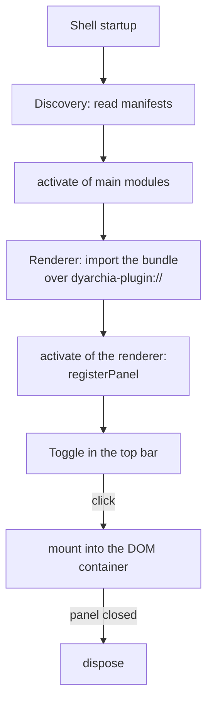

# Writing a dyarchia-desktop plugin

A plugin is a folder holding a manifest and one or two bundles; the shell discovers it at
startup. This file is the whole contract — the code side and the UI side. The visual
mandate it defers to is [packages/kanon/README.md](../packages/kanon/README.md).


## 1. Anatomy

    File                       Required    What it is
    -----------------------    --------    ------------------------------------------
    dyarchia-plugin.json       yes         manifest: identity and entry points
    dist/renderer.js           yes         ESM bundle that runs in the renderer
    dist/main.js               no          Node module that runs in the main process
    main.py                    no          Python module that runs as its own process
    node_modules/              no          native dependencies of the main module

```json
{
    "id": "myplugin",
    "name": "My Plugin",
    "version": "0.1.0",
    "renderer": "dist/renderer.js",
    "main": "dist/main.js"
}
```

- `id` is lowercase, `^[a-z][a-z0-9-]*$`. It is the namespace of the IPC channels. If two
  plugins declare the same id, the first discovered wins and the rest are skipped.
- `renderer` is required. `main` only if the plugin needs Node; `python` is the
  alternative, and a plugin declares one or the other, never both. The renderer cannot
  tell which: `invoke` and `on` work the same either way.
- `schemes` lists custom protocol schemes the plugin serves. The shell declares them
  privileged at boot and the plugin registers the handler with `protocol.handle` in its
  `activate`. Reserved names (`http`, `file`, `dyarchia-plugin`, …) are rejected.
- `description` is one line, shown in the Setup panel beside the plugin's own name. Write it
  for somebody deciding whether to turn this on, not for somebody who already has.

**Four more fields say what the plugin is made of, and every one of them is read rather than
guessed.** This is what lets the installer carry a plugin correctly without knowing anything
about it.

    field         holds                                          used by
    -----------   --------------------------------------------   -------------------------
    files         anything else needed at runtime, beside the     stage-plugins.mjs
                  entry points: sources, a lockfile, data
    nativeDeps    packages that must travel with their prebuilt   stage-plugins.mjs
                  binaries, copied into node_modules/
    requires      what has to be true before the plugin runs      the Setup panel
    description   one line for the Setup panel                    the Setup panel

A requirement is `{ "kind": …, "label": … }` plus what its kind needs. Two kinds exist:

```json
"requires": [
    { "kind": "command", "name": "claude", "label": "Claude Code CLI",
      "hint": "install it from claude.com/claude-code" },
    { "kind": "python", "label": "Python toolkit", "project": ".",
      "note": "an interpreter and about 600 MB of packages" }
]
```

`command` is checked on PATH and never installed: Setup reports it and shows the hint.
`python` is acquired with uv, into `%APPDATA%/dyarchia/environments/<id>/.venv`, and the
plugin is told where through `DYARCHIA_PLUGIN_ENV`. The sync is `--frozen --no-dev
--no-editable`: frozen because the shipped lockfile is the one to install and resolving again
would try to rewrite a read-only directory, and **non-editable because a portable build
unpacks its resources to a new temporary directory on every launch** — an editable install
records that path and is broken by the second start. Verified by deleting the plugin
directory and importing the package anyway. Its optional `postInstall` is a list of
uv argument lists run after the packages land, for whatever the project needs beyond them —
crawlee's is `playwright install chromium`, and leaving it out is an installation that looks
finished and fails on the first profile asking for a browser. **The steps belong to the
plugin, so Setup knows nothing about any particular one.** **A packaged plugin directory is
read-only**, which is why the environment cannot sit beside the code and why a Python plugin
must look at that variable before falling back to a `.venv` of its own.


## 2. The renderer bundle

An ESM module exporting `activate(ctx)`:

    Method                        Use
    --------------------------    ------------------------------------------------
    registerPanel(desc, mount)    registers a panel with the shell
    invoke(channel, ...args)      calls a handler in the plugin's main module
    on(channel, listener)         subscribes to broadcasts from the main module
    token(name)                   resolves a --dya-* custom property to its value
    onThemeChange(listener)       fires when the theme changes; returns unsubscribe
    shell                         the shell itself: catalogue(), enable(ids), relaunch()

**`ctx.shell` is the one member that is not namespaced to the plugin**, and it stays small
because of it. It exists for the Setup panel: what this installation holds, which of it
loads, and the relaunch that makes a change take effect. A plugin reaching for it to do
anything else is answering a question that is not its own.

`injectStyles(pluginId, css)` is exported by the SDK outside the context and adds the
plugin's style tag once. Call it at the top of the mount, not at module scope, so a plugin
never opened never touches the document.

```typescript
import type { PluginContext } from '@dyarchia/sdk'

export function activate(ctx: PluginContext): void {
    ctx.registerPanel({ id: 'myplugin', title: 'My Plugin', icon: 'M' }, (container) => {
        const el = document.createElement('div')
        el.textContent = 'hello'
        container.appendChild(el)
        return () => el.remove()
    })
}
```

- `icon` is the content of the top-bar toggle: inline SVG with `stroke="currentColor"`, or
  a one-character string as a fallback.
- `duplicable: true` allows several instances through a `+` in the group header. Each gets
  its own mount and dispose; the instance id is `<id>#<n>` and the plugin never handles it.
- `dispose` must release everything: observers, `on()` subscriptions, sessions opened
  through `invoke`.
- **`ctx.token` returns a copy, so it goes stale when the theme changes.** Pair it with
  `ctx.onThemeChange`, resolve again in the listener, unsubscribe from the dispose. It
  exists for what `var()` cannot reach — a canvas, a WebGL context, xterm's theme object.
  A panel drawn with `dya-*` classes and `var()` needs neither, and must never branch on
  which theme is mounted.

**A renderer is written in plain DOM. The shell's framework is not available to it and must
not be assumed.** The shell is React and dockview; that is an implementation detail, is not
exported, and no version of it is part of the contract. What a plugin gets is
`mount(container, handle)`. The contract is that small on purpose: it lets a main module be
written in any language, lets the shell be replaced wholesale as long as a DOM node still
arrives, and leaves nothing above the plugin deciding when its subtree exists.

A plugin may bundle a framework anyway, and for a genuinely stateful panel that can be
right. The cost is the plugin's: a second copy in the bundle, its own build complexity, and
unmounting it inside the `dispose` it returns. Note first what the plain path gives — every
`dya-*` class is already in the document, so the work a component library would do for a
button, a field, a table or a menu is done. Four of the six plugins here render real UI with
`document.createElement` and no framework, and the largest is a terminal.


## 3. The main module

Node, ESM, exporting `activate(ctx)`:

    Method                         Use
    ---------------------------    --------------------------------------------------
    handle(channel, handler)       answers invoke calls from the renderer
    broadcast(channel, ...args)    emits an event to every window
    notify(notice)                 tells the operator something happened

Channels namespace themselves: `handle('spawn')` in the terminal becomes
`plugin:terminal:spawn` at the IPC level, and the renderer's `invoke('spawn')` resolves to
the same string. **Never write the full channel name inside a plugin.**

`notify({ title, body, action })` shows a toast in the window and, **only when no window has
focus**, an OS notification as well. A plugin never chooses between the two: whether the
operator can see the window is the shell's business. Clicking either focuses the window and
hands `action` back on the `notice` channel. Spend it carefully — the shell deliberately
gives no way to make one notice louder or stickier than another.

```typescript
ctx.notify({ title: 'the card is waiting on you', body: 'it wants permission', action: { cardId } })
ctx.on('notice', (action) => open((action as { cardId: string }).cardId))
```

In Python the contract is the same with snake_case names and no `notify`:

```python
def activate(ctx):
    ctx.handle("greet", lambda name: f"hello {name}")
```

- The shell spawns one interpreter per Python plugin and talks JSON lines over stdio.
  Invokes run in a thread pool and are correlated by id, so a slow handler blocks nothing
  and replies may arrive out of order.
- **stdout is the protocol.** `dyarchia_sdk` redirects plugin `print` to stderr, which
  surfaces in the shell console prefixed `[python:<id>]`.
- The interpreter is `py -3` on Windows, `python3` elsewhere; `DYARCHIA_PYTHON` forces a
  path. `packages/pysdk` is stdlib-only, so there is nothing to pip install.


## 4. Build and installation

```json
"scripts": {
    "build": "pnpm build:renderer && pnpm build:main",
    "build:renderer": "node ../../scripts/build-plugin.mjs renderer",
    "build:main": "node ../../scripts/build-plugin.mjs main"
}
```

[scripts/build-plugin.mjs](../scripts/build-plugin.mjs) holds the esbuild invocation for
every plugin, so format, externals and output paths are decided once. Two flags:
`--splitting` emits entry plus chunks into `dist/` for dynamic `import()`, `--css-text`
loads `.css` imports as text. **A plugin needing anything else writes its own esbuild line
rather than growing a third flag** — the terminal does, for a CJS pty host with a native
external, and it is the only case.

- Native dependencies stay `--external` and are copied into the installed plugin's
  `node_modules/`; they must be listed in `nativeDeps` in the manifest, or the packaged app
  cannot load that main module. Prefer a package shipping N-API prebuilds — node-pty does —
  so no compiler is needed on the machine that installs it.
- Library CSS is imported as text and handed to `injectStyles`.
- `main.py` is copied as-is, never bundled.
- A heavy dependency only some documents need goes behind a dynamic `import()` with
  `--splitting`. docviewer does this for mermaid: the entry is 8 kB and the engine is
  fetched only when a document carries a diagram.

    Mode         Location                                   How it gets there
    ---------    ---------------------------------------    ---------------------------------
    dev          plugins/<folder>/                          the shell scans the workspace
    example      examples/<folder>/                         scanned only with DYARCHIA_EXAMPLES
    packaged     resources/plugins/<id>/                    staged into the installer
    by hand      %APPDATA%/dyarchia/plugins/<id>/           node scripts/install-plugins.mjs

**The bundled root wins over `%APPDATA%`**, in development and once packaged. An installed
copy must never shadow the one being worked on, and a copy left behind by an older version is
stale: letting it win reads the plugin from a manifest it no longer ships, silently. A plugin
of an id nobody ships still loads from `%APPDATA%`, which is the case that root exists for; an
installed copy of a plugin **deleted** from the workspace is discovered again for the same
reason, so delete it from `%APPDATA%/dyarchia/plugins/` too.

**In a packaged build, being discovered is not being loaded.** The shell loads what
`<userData>/plugins.json` names, which is what the Setup panel writes, and a fresh
installation names nothing. Enabling takes effect on the next launch, never in the running
window: main modules are imported once at startup and a plugin's own scheme has to be
privileged before the app is ready.

Development loads the workspace whole and never consults that file, because a plugin in the
tree is there on purpose. `DYARCHIA_SETUP=1` makes `pnpm dev` behave like a user's first run,
which is how the Setup panel is worked on.


## 5. The UI contract

The shell links the design system once, before React mounts, and plugins render into that
same document. So:

- **Components and tokens are ambient.** Every `dya-*` class and every `--dya-*` property
  is already resolvable. A panel writes `class="dya-button"`; it imports no CSS and ships
  no fonts.
- **The reset has applied**, including `[hidden] { display: none !important }`. Toggle
  `el.hidden` and never write a display rule for it.
- **The theme is an attribute and the shell owns it.** A plugin never reads it and never
  branches on it: it writes `var(--dya-surface-1)` and gets whichever theme is mounted.

The order to work in:

1. **A `dya-*` class exists.** Use it, with a plugin class alongside for layout only —
   `class="dya-field myplugin-input"` where `.myplugin-input` sets `flex: 1` and nothing
   else.
2. **No class exists.** Write a plugin-prefixed rule built entirely from tokens, say so in
   the plugin's README, and propose it upstream.
3. **A class exists but is nearly right.** Do not patch it locally. A product that
   restyles `.dya-button` has forked the system. Propose the modifier upstream.

The system declares only what something consumes, so the list above is short on purpose and
a gap in it is normal rather than an oversight. Building your own and proposing it is the
route every class added in the last week took.

```text
Structure    dya-bar (--flush --inset)  dya-card  dya-card__header  dya-brand
Pressable    dya-button (--quiet --sm --danger --bare)  dya-key (--active)
             dya-chip  dya-entry (--active)
Input        dya-field (--sm --auto)  dya-checkbox
Content      dya-tag  dya-badge (--success --warning --danger --soft)  dya-table  dya-row
             dya-text (--success --danger)  dya-label  dya-eyebrow  dya-value
             dya-mono  dya-key-label
Documents    dya-code  dya-log  dya-math (--block)  dya-prose__scroll
Layers       dya-menu  dya-menu__item (--selected)  dya-menu__shortcut
Navigation   dya-tabs  dya-tab
Absence      dya-empty  dya-loading
Assistive    dya-sr-only
```

Four carry a trap worth knowing before the first render: **`dya-field` is full width** and
`--auto` opts out; **`dya-bar` is window chrome**, 46px with a gradient and a hairline, and
`--inset` keeps only the rhythm; **`dya-log` is for what a process printed**, wraps instead
of scrolling sideways, and sets no height; **`dya-text--*` is a sentence and `dya-badge--*`
is a chip**.

The mandate is in kanon's README and holds here unchanged. Three rules are specific to
being a panel rather than the system:

- **Panel interiors are transparent.** The dock group already paints `--dya-surface-1`.
  Painting anything else hides the group's border and breaks the gap rhythm. The exception
  is a renderer that computes contrast and has to know its ground — the terminal paints
  `token('surface-1')` for exactly that.
- **`--dya-field` is a surface, not an ink.** Never set `color: var(--dya-field)`.
- **A label never sits on `--dya-selected` in Gi or `--dya-raised-hover` in Oneiro**, where
  `--dya-text-4` measures 4.43 and 4.27. Use `--dya-text-3` there.

The `--dya-` namespace belongs upstream. A plugin needing a colour the system lacks
declares it under its own prefix and says so in its README, or proposes it upstream — the
`[hidden]` rule, `dya-log`, the status modifiers, `dya-bar--inset` and `dya-field--auto`
all arrived that way. The shell declares one exception of its own, written down: caption
buttons are flat, because relief on a full-height caption button reads as a mistake.

**Programs choose their own colours.** The terminal ships a 16-colour ANSI palette, but a
program emitting truecolour escapes bypasses it; xterm's `minimumContrastRatio` is set to
4.5 as the backstop. A plugin rendering text it does not control needs an equivalent guard.


## 6. The gate



Before a panel is done:

1. `pnpm dev`, the toggle appears, the panel mounts and unmounts with no console errors.
   Rebuild after every edit: a renderer change needs a window reload, **a main module
   change needs the app restarted**, because main modules are imported once at startup.
   A reload against a stale main module fails as a missing IPC handler.
2. Grep the plugin for `#`, `rgb`, `rgba` — no literal colour anywhere.
3. Grep for `border-radius`, `box-shadow`, `font-family` — every hit is either layout or a
   component the system should own.
4. No `box-shadow` inside any `transition`. No local rule targets a bare `.dya-*` selector.
5. Chrome text is mono uppercase; prose is sans; file names and paths are mono, normal case.
6. Walk every state: idle, hover, pressed, selected, empty, error. In both themes.
7. No `backdrop-filter`, no infinite animation.
8. If there is a main module, exercise `invoke` and `broadcast` from the panel.
