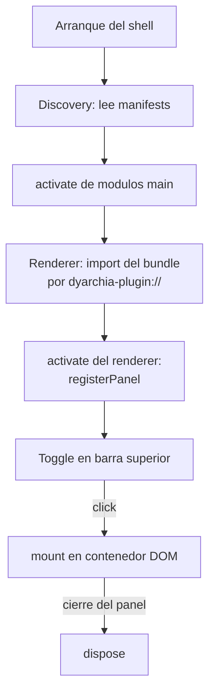

# Como escribir un plugin de dyarchia-desktop

Guia para crear una funcionalidad nueva y registrarla en el shell. Un plugin es una carpeta
con un manifest y uno o dos bundles JavaScript; el shell lo descubre al arrancar.


## 1. Anatomia de un plugin

    Fichero                    Obligatorio    Que es
    -----------------------    -----------    ------------------------------------------
    dyarchia-plugin.json      si             manifest: identidad y puntos de entrada
    dist/renderer.js           si             bundle ESM que corre en el renderer
    dist/main.js               no             modulo Node que corre en el proceso main
    main.py                    no             modulo Python que corre como proceso aparte
    node_modules/              no             dependencias nativas del modulo main

El manifest:

```json
{
    "id": "miplugin",
    "name": "Mi Plugin",
    "version": "0.1.0",
    "renderer": "dist/renderer.js",
    "main": "dist/main.js"
}
```

Reglas del manifest:

- id en minusculas, patron ^[a-z][a-z0-9-]*$. Es el namespace de los canales IPC.
- renderer es obligatorio; main solo si el plugin necesita Node (fs, procesos, nativos).
- python: entrada de un modulo Python, alternativa a main. Un plugin declara main o python,
  no los dos. El renderer no nota la diferencia: usa invoke y on igual en ambos casos.
- Si dos plugins declaran el mismo id, gana el primero descubierto y el resto se ignora.
- schemes (opcional): lista de schemes de protocolo custom que el plugin quiere servir
  (p. ej. streaming de media). El shell los declara como privilegiados en el boot
  (standard, secure, fetch, cors, stream) y el modulo main del plugin registra el handler
  con protocol.handle en su activate. Nombres en minusculas; los reservados (http, file,
  dyarchia-plugin, etc.) se rechazan.


## 2. El bundle renderer

Modulo ESM que exporta activate(ctx). El contexto ofrece:

    Metodo                        Uso
    --------------------------    ------------------------------------------------
    registerPanel(desc, mount)    registra un panel en el shell
    invoke(canal, ...args)        llama a un handler del modulo main del plugin
    on(canal, listener)           se suscribe a broadcasts del modulo main

El mount recibe el contenedor DOM del panel y devuelve (opcional) una funcion de limpieza:

```typescript
import type { PluginContext } from '@dyarchia/sdk'

export function activate(ctx: PluginContext): void {
    ctx.registerPanel({ id: 'miplugin', title: 'Mi Plugin', icon: 'M' }, (container) => {
        const el = document.createElement('div')
        el.textContent = 'hola'
        container.appendChild(el)
        return () => el.remove()
    })
}
```

Notas:

- El shell no impone framework: dentro del mount se puede montar React, un canvas o DOM puro.
  Cada plugin empaqueta sus propias dependencias de UI.
- El icon es el contenido del boton de toggle en la barra superior: markup SVG inline
  (recomendado, p. ej. un icono de Lucide con stroke="currentColor") o, como fallback,
  un texto corto de un caracter.
- duplicable: true permite abrir varias instancias del panel (boton + en la cabecera del
  grupo). Cada instancia recibe su propio mount/dispose; el id de instancia interno es
  <id>#<n> pero el plugin no necesita gestionarlo.
- Los estilos se inyectan desde el propio plugin (tag style con id propio para no duplicar).


## 3. El modulo main (opcional)

Modulo ESM para Node que exporta activate(ctx) con:

    Metodo                       Uso
    -------------------------    --------------------------------------------------
    handle(canal, handler)       responde a los invoke del renderer
    broadcast(canal, ...args)    emite un evento a todas las ventanas

Los canales se namespacian solos: un handle('spawn') del plugin terminal se convierte en
plugin:terminal:spawn a nivel de IPC. Renderer y main del mismo plugin usan el mismo nombre
corto de canal.

```typescript
import type { PluginMainContext } from '@dyarchia/sdk'

export function activate(ctx: PluginMainContext): void {
    ctx.handle('saluda', (...args) => `hola ${args[0]}`)
}
```


## 3.5. El modulo main en Python (opcional)

Alternativa a main para logica que se escribe mejor en Python. El contrato es el mismo que
el de Node, con los nombres en snake_case:

    Metodo                       Uso
    -------------------------    --------------------------------------------------
    handle(canal, handler)       responde a los invoke del renderer
    broadcast(canal, *args)      emite un evento a todas las ventanas

```python
def activate(ctx):
    ctx.handle("saluda", lambda nombre: f"hola {nombre}")
```

Como funciona por dentro:

- El shell lanza un proceso Python por plugin y habla con el por stdin/stdout en JSON,
  una linea por mensaje. El proceso muere cuando se cierra la app.
- Los invoke se corren en un pool de hilos y se correlacionan por id, asi que un handler
  lento no bloquea a los demas y las respuestas pueden volver desordenadas.
- stdout esta reservado para el protocolo: dentro del plugin, print va a stderr y sale
  en la consola del shell prefijado con [python:<id>].
- El interprete se busca como py -3 en Windows y python3 en el resto. La variable
  DYARCHIA_PYTHON fuerza una ruta concreta.

El runtime vive en packages/pysdk (dyarchia_sdk) y es stdlib pura: no hay que instalar
nada con pip. Esta capa es deliberadamente fina — el dia que exista un daemon que sirva
como fuente de verdad, se sustituye el transporte stdio sin tocar el activate de ningun
plugin ni el renderer.


## 4. Build e instalacion

Bundles con esbuild, formato ESM. El renderer se sirve por el protocolo dyarchia-plugin://
y el main se importa como modulo Node desde la carpeta del plugin.

```bash
esbuild src/renderer.ts --bundle --format=esm --outfile=dist/renderer.js
esbuild src/main.ts --bundle --platform=node --format=esm --external:node-pty --outfile=dist/main.js
```

Reglas de build:

- Dependencias nativas (node-pty) se marcan external y se copian a node_modules/ dentro de
  la carpeta instalada del plugin; el resto se bundlea.
- El modulo Python no se bundlea: main.py se copia tal cual junto al manifest.
- CSS de librerias se importa como texto (--loader:.css=text) y se inyecta en un tag style.

Donde vive el plugin segun el modo:

    Modo         Ubicacion                                  Como llega
    ---------    ---------------------------------------    ---------------------------------
    dev          packages/<carpeta>/                        el shell escanea el workspace
    portable     %APPDATA%/dyarchia/plugins/<id>/          node scripts/install-plugins.mjs

En dev el workspace tiene prioridad sobre los instalados, de modo que la copia instalada
nunca tapa a la version en desarrollo.


## 5. Ciclo de vida



- El layout se persiste solo; si al arrancar un panel guardado ya no tiene plugin, el shell
  lo poda del layout sin fallar.
- El dispose debe liberar todo: observers, suscripciones on(), sesiones abiertas via invoke.


## 6. Checklist para un plugin nuevo

1. Carpeta en packages/ con dyarchia-plugin.json valido.
2. renderer.ts con activate que registra al menos un panel.
3. Script build con esbuild y dist/ generado.
4. pnpm dev y comprobar: aparece el toggle, el panel monta y desmonta sin errores en consola.
5. Si hay modulo main: probar invoke y broadcast desde el panel.
6. node scripts/install-plugins.mjs y probar tambien en la app empaquetada.
