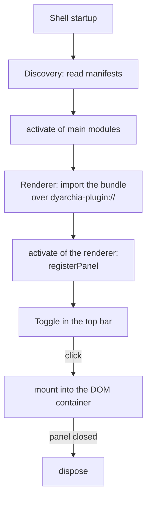

# Writing a dyarchia-desktop plugin

Guide to building a new feature and registering it with the shell. A plugin is a folder
holding a manifest and one or two JavaScript bundles; the shell discovers it at startup.


## 1. Anatomy of a plugin

    File                       Required    What it is
    -----------------------    --------    ------------------------------------------
    dyarchia-plugin.json       yes         manifest: identity and entry points
    dist/renderer.js           yes         ESM bundle that runs in the renderer
    dist/main.js               no          Node module that runs in the main process
    main.py                    no          Python module that runs as its own process
    node_modules/              no          native dependencies of the main module

The manifest:

```json
{
    "id": "myplugin",
    "name": "My Plugin",
    "version": "0.1.0",
    "renderer": "dist/renderer.js",
    "main": "dist/main.js"
}
```

Manifest rules:

- id is lowercase, pattern ^[a-z][a-z0-9-]*$. It is the namespace of the IPC channels.
- renderer is required; main only if the plugin needs Node (fs, processes, native modules).
- python is an alternative to main. A plugin declares main or python, never both. The
  renderer cannot tell the difference: it uses invoke and on the same way for either.
- If two plugins declare the same id, the first one discovered wins and the rest are ignored.
- schemes (optional): list of custom protocol schemes the plugin wants to serve, for media
  streaming for instance. The shell declares them as privileged at boot (standard, secure,
  fetch, cors, stream) and the plugin's main module registers the handler with
  protocol.handle inside its activate. Lowercase names; reserved ones (http, file,
  dyarchia-plugin, and so on) are rejected.


## 2. The renderer bundle

An ESM module exporting activate(ctx). The context offers:

    Method                        Use
    --------------------------    ------------------------------------------------
    registerPanel(desc, mount)    registers a panel with the shell
    invoke(channel, ...args)      calls a handler in the plugin's main module
    on(channel, listener)         subscribes to broadcasts from the main module
    theme                         current theme, token lookup, change subscription

The mount receives the panel's DOM container and optionally returns a cleanup function:

```typescript
import type { PluginContext } from '@dyarchia/sdk'

export function activate(ctx: PluginContext): void {
    ctx.registerPanel({ id: 'myplugin', title: 'My Plugin', icon: 'M' }, (container) => {
        const el = document.createElement('div')
        el.textContent = 'hello'
        container.appendChild(el)
        return () => el.remove()
    })
}
```

Notes:

- The shell imposes no framework: the mount can host React, a canvas, or plain DOM. Each
  plugin bundles its own UI dependencies.
- icon is the content of the toggle button in the top bar: inline SVG markup, recommended,
  such as a Lucide icon with stroke="currentColor"; or, as a fallback, a short
  one-character string.
- duplicable: true allows several instances of the panel, through a + button in the group
  header. Each instance gets its own mount/dispose; the internal instance id is <id>#<n>,
  but the plugin never needs to handle it.
- Styles are injected by the plugin itself, using a style tag with its own id to avoid
  duplicates. What goes inside that tag is not free: the shell links the shared design
  system once, so every --dya-* token is already resolvable and a plugin must never write
  a literal colour, font or radius. See docs/ui.md for the rules, the token list and the
  recipes.
- ctx.theme covers the case that var() cannot: a canvas, a WebGL context or xterm needs a
  resolved string. token('accent') returns the value, onChange(listener) fires on every
  theme flip and returns its own unsubscribe, which the panel's dispose must call.


## 3. The main module (optional)

An ESM module for Node exporting activate(ctx) with:

    Method                         Use
    ---------------------------    --------------------------------------------------
    handle(channel, handler)       answers invoke calls from the renderer
    broadcast(channel, ...args)    emits an event to every window

Channels namespace themselves: a handle('spawn') in the terminal plugin becomes
plugin:terminal:spawn at the IPC level. The renderer and the main module of the same plugin
use the same short channel name.

```typescript
import type { PluginMainContext } from '@dyarchia/sdk'

export function activate(ctx: PluginMainContext): void {
    ctx.handle('greet', (...args) => `hello ${args[0]}`)
}
```


## 4. The main module in Python (optional)

An alternative to main, for logic better written in Python. The contract is the same as the
Node one, with snake_case names:

    Method                        Use
    --------------------------    --------------------------------------------------
    handle(channel, handler)      answers invoke calls from the renderer
    broadcast(channel, *args)     emits an event to every window

```python
def activate(ctx):
    ctx.handle("greet", lambda name: f"hello {name}")
```

How it works underneath:

- The shell spawns one Python process per plugin and talks to it over stdin/stdout in JSON,
  one message per line. The process dies when the app closes.
- Invokes run in a thread pool and are correlated by id, so a slow handler blocks nothing
  and replies may arrive out of order.
- stdout is reserved for the protocol: inside the plugin, print goes to stderr and shows up
  in the shell console prefixed with [python:<id>].
- The interpreter is looked up as py -3 on Windows and python3 elsewhere. The
  DYARCHIA_PYTHON environment variable forces a specific path.

The runtime lives in packages/pysdk (dyarchia_sdk) and is stdlib only: nothing to install
with pip. The layer is deliberately thin — context.py is the contract, host.py is the stdio
transport, and only the transport changes the day an API tier owns this logic. No plugin
activate and no renderer code is affected.


## 5. Build and installation

Bundles are built with esbuild, ESM format. The renderer is served over the
dyarchia-plugin:// protocol and the main module is imported as a Node module from the
plugin folder.

```bash
esbuild src/renderer.ts --bundle --format=esm --outfile=dist/renderer.js
esbuild src/main.ts --bundle --platform=node --format=esm --external:node-pty --outfile=dist/main.js
```

Build rules:

- Native dependencies such as node-pty are marked external and copied into node_modules/
  inside the installed plugin folder; everything else is bundled.
- Library CSS is imported as text (--loader:.css=text) and injected into a style tag.
- The Python module is not bundled: main.py is copied as-is next to the manifest.

Where a plugin lives, by mode:

    Mode         Location                                   How it gets there
    ---------    ---------------------------------------    ---------------------------------
    dev          packages/<folder>/                         the shell scans the workspace
    portable     %APPDATA%/dyarchia/plugins/<id>/           node scripts/install-plugins.mjs

In dev the workspace takes priority over installed plugins, so an installed copy never
shadows the version under development.


## 6. Lifecycle



- The layout persists itself; if a saved panel no longer has a plugin at startup, the shell
  prunes it from the layout without failing.
- dispose must release everything: observers, on() subscriptions, sessions opened via invoke.


## 7. Checklist for a new plugin

1. A folder under packages/ with a valid dyarchia-plugin.json.
2. renderer.ts with an activate that registers at least one panel.
3. A build script with esbuild, producing dist/.
4. pnpm dev, then check that the toggle appears and the panel mounts and unmounts with no
   console errors.
5. Flip the theme with the top bar toggle and walk every state of the panel. Nothing keeps
   the previous theme's colours or relief. The rest of the gate is in docs/ui.md.
6. If there is a main module, whether Node or Python: test invoke and broadcast from the
   panel.
7. node scripts/install-plugins.mjs, then test in the packaged app too.
