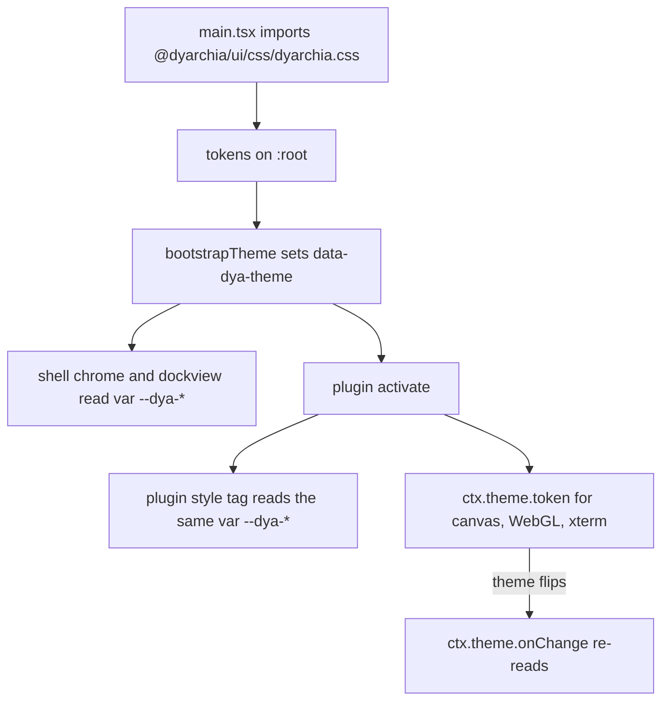

# The dyarchia-desktop UI contract

Every dyarchia product renders against the same design system: two themes, one
typeface, one grammar of relief. This document is the desktop side of that
contract — what the shell provides, and what a plugin must respect to look like
it belongs.

The system itself is specified in the `dyarchia-ui` repository. This document
never restates its values; it says how they reach a plugin.


## Index

- [1. Where the system lives](#1-where-the-system-lives)
- [2. The ambient contract](#2-the-ambient-contract)
- [3. The five rules](#3-the-five-rules)
- [4. Tokens a plugin reaches for](#4-tokens-a-plugin-reaches-for)
- [5. Literal values and theme changes](#5-literal-values-and-theme-changes)
- [6. Recipes](#6-recipes)
- [7. Shell extensions](#7-shell-extensions)
- [8. Review gate](#8-review-gate)
- [9. Known limits](#9-known-limits)


## 1. Where the system lives

`packages/ui` is a vendored copy of `dyarchia-ui`, published to the workspace as
`@dyarchia/ui`.

```text
Path                        What it is
-------------------------   -------------------------------------------------
packages/ui/css/            the stylesheet, copied verbatim from upstream
packages/ui/fonts/          Geist Sans and Geist Mono variable, 140 KB
packages/ui/src/index.ts    theme helpers for code that needs literal values
scripts/sync-ui.mjs         re-copies css/ and fonts/ from the upstream checkout
```

`css/` and `fonts/` are never edited here. A change to the system is a change
upstream followed by:

```bash
node scripts/sync-ui.mjs
```

The script reads `DYARCHIA_UI` for the upstream checkout and falls back to
`../dyarchia-ui` next to this repository.


## 2. The ambient contract

The shell links the stylesheet exactly once, in
[main.tsx](apps/shell/src/renderer/src/main.tsx), before React mounts. Plugins
render into that same document, so:

- **Tokens are ambient.** Every `--dya-*` custom property is already resolvable
  from any node a plugin creates. A plugin never imports CSS from
  `@dyarchia/ui` and never ships fonts.
- **The reset already applied.** `box-sizing`, margin zeroing, focus ring,
  scrollbars and the reduced-motion block are in force before the plugin runs.
- **The theme is an attribute on the root**, `data-dya-theme`. The shell owns
  it: it is set from `localStorage` before the first paint and flipped by the
  top bar toggle. A plugin reads it, never writes it.



A plugin still injects its own styles the same way as before — one `<style>`
tag with its own id, guarded against duplicates. What changed is what goes
inside it: `var(--dya-*)`, never a literal colour.


## 3. The five rules

The full mandate lives upstream. These five are the ones a panel breaks first.

1. **What can be pressed stands out.** Buttons, toolbar items and keys carry
   `--dya-elev-raised`, `--dya-elev-raised-hover` and `--dya-elev-pressed`.
2. **Only what receives input is recessed.** Text fields sit on `--dya-bg` with
   `--dya-elev-pressed`. Nothing else is sunk.
3. **Surfaces and rows are flat.** A container that groups controls carries no
   relief of its own — if it does, the controls inside read as sunk into a well.
   A row expresses its state with background, and its selection with a 2px
   accent edge.
4. **`box-shadow` is never in a `transition`.** Listing it freezes the shadow
   against theme changes: the browser stops re-evaluating the `var()` and the
   relief keeps the previous theme's geometry. Animate `transform`, `opacity`
   and `background-color` only.
5. **The orange is never a fill and never text.** `--dya-accent` marks what is
   active — a tab underline, a selected row's edge, a status dot, `::selection`.
   At 3.05:1 it clears the bar for a graphical object, not for text.

Two more that are cheap to get right:

- **Interface text is Geist Mono, uppercase, `--dya-tracking-mono`**: buttons,
  labels, tab titles, metadata, empty states. Content prose is Geist Sans.
  File names and paths are the exception — they are data, so mono in normal
  case.
- **Radius is `--dya-radius` (3px) everywhere**, `--dya-radius-media` for video
  and images, `--dya-radius-full` only for dots and avatars. There is no
  intermediate radius. If something asks for 8px, the answer is 3px.


## 4. Tokens a plugin reaches for

```text
Group     Tokens
-------   ----------------------------------------------------------------
Surface   --dya-bg  --dya-surface-1  --dya-surface-2  --dya-surface-inverse
Text      --dya-text  --dya-text-2  --dya-text-3  --dya-text-4
Relief    --dya-elev-raised  --dya-elev-raised-hover  --dya-elev-pressed
          --dya-elev-overlay  --dya-elev-flat
Line      --dya-line  --dya-border  --dya-border-control  --dya-border-card
Accent    --dya-accent  --dya-accent-soft
Status    --dya-danger  --dya-success  --dya-warning  --dya-*-soft
          --dya-on-danger
Shape     --dya-radius  --dya-radius-media  --dya-radius-full
Type      --dya-font-sans  --dya-font-mono  --dya-size-*  --dya-tracking-mono
Spacing   --dya-space-1 .. --dya-space-24
Motion    --dya-dur-press  --dya-dur-fast  --dya-dur  --dya-ease-press
```

Panel interiors are transparent: the dock group already paints
`--dya-surface-1`. Leave it alone unless the panel needs a different surface, or
needs an opaque one — a canvas renderer that computes contrast has to know what
it is drawing on, and the terminal paints `token('surface-1')` for exactly that
reason. Painting anything else hides the group's border and breaks the gap
rhythm.


## 5. Literal values and theme changes

`var()` covers CSS. A canvas, a WebGL context or xterm's theme object needs a
resolved string, and needs to be told when the theme flips. That is `ctx.theme`,
the third member of `PluginContext`:

```text
Member                Returns
-------------------   -----------------------------------------------------
current               'light' or 'dark'
token(name)           the resolved value; 'accent' and '--dya-accent' both work
onChange(listener)    subscription, returns its own unsubscribe
```

`onChange` observes the root attribute, so it fires for every theme change no
matter who caused it. The unsubscribe must run in the panel's dispose.

```typescript
export function activate(ctx: PluginContext): void {
    ctx.registerPanel({ id: 'chart', title: 'Chart', icon: ICON }, (container) => {
        const paint = (): void => draw(container, ctx.theme.token('text'))
        const unwatch = ctx.theme.onChange(paint)
        paint()
        return () => unwatch()
    })
}
```

The terminal plugin is the worked example: it rebuilds xterm's `ITheme` from
`token('surface-1')`, `token('text')` and `token('accent-soft')`, picks the
matching 16-colour ANSI palette, and reassigns `terminal.options.theme` on every
change — [renderer.ts](packages/plugin-terminal/src/renderer.ts).

Colour a plugin paints itself is colour the system cannot check. The terminal's
two ANSI palettes are measured against the surface they sit on: every entry
clears 6.6:1 in light and 3.5:1 in dark, because thin monospace stems lose
contrast to antialiasing and a nominal 4.5:1 reads thinner than it measures. The
default xterm palette clears none of that in light — a bright yellow command
token lands at 1.1:1 on white. Any plugin that draws text outside the DOM owes
the same check.

Plugins built outside this workspace need no dependency for any of it:
`ctx.theme` is passed in by the shell. `@dyarchia/ui` exports the same three
operations for code that runs before a context exists, such as the shell itself.


## 6. Recipes

A button, the whole system applied:

```css
.myplugin-button {
    height: 28px;
    padding: 0 var(--dya-space-4);
    border: none;
    border-radius: var(--dya-radius);
    color: var(--dya-text);
    background: var(--dya-surface-1);
    box-shadow: var(--dya-elev-raised);
    font-family: var(--dya-font-mono);
    font-size: var(--dya-size-label-sm);
    letter-spacing: var(--dya-tracking-mono);
    text-transform: uppercase;
    cursor: pointer;
    transition: transform var(--dya-dur-press) var(--dya-ease-press);
}

.myplugin-button:hover  { box-shadow: var(--dya-elev-raised-hover); }
.myplugin-button:active { box-shadow: var(--dya-elev-pressed); transform: translateY(1px); }
```

A text field, the only recessed control:

```css
.myplugin-input {
    height: 28px;
    padding: 0 var(--dya-space-3);
    border: none;
    border-radius: var(--dya-radius);
    color: var(--dya-text);
    background: var(--dya-bg);
    box-shadow: var(--dya-elev-pressed);
    font-family: var(--dya-font-mono);
    font-size: var(--dya-size-label-sm);
    letter-spacing: var(--dya-tracking-mono);
}
```

A list row — flat, state in the background, selection on the edge:

```css
.myplugin-row {
    display: block;
    width: 100%;
    padding: 3px var(--dya-space-3);
    border: none;
    border-left: 2px solid transparent;
    background: none;
    color: var(--dya-text-3);
    transition: background-color var(--dya-dur-fast) var(--dya-ease);
}

.myplugin-row:hover    { color: var(--dya-text); background: var(--dya-surface-2); }
.myplugin-row-active   { color: var(--dya-text); background: var(--dya-surface-2);
                         border-left-color: var(--dya-accent); }
```

A section heading, with the accent dot that marks every eyebrow in the system:

```css
.myplugin-title {
    display: flex;
    align-items: center;
    gap: var(--dya-space-2);
    color: var(--dya-text-3);
    font-family: var(--dya-font-mono);
    font-size: var(--dya-size-label-sm);
    letter-spacing: var(--dya-tracking-mono);
    text-transform: uppercase;
}

.myplugin-title::before {
    content: '';
    flex: none;
    width: 6px;
    height: 6px;
    border-radius: var(--dya-radius-full);
    background: var(--dya-accent);
}
```


## 7. Shell extensions

The shell declares its own metrics in
[styles.css](apps/shell/src/renderer/src/styles.css). These are ambient like any
other custom property and plugins may use them.

```text
Token               Use
-----------------   ------------------------------------------------
--shell-titlebar    title bar height
--shell-control     side of a square top bar control
```

No colour lives here. The status hues that used to be shell-local are upstream
now as `--dya-danger`, `--dya-success` and `--dya-warning`, so a red in a plugin
and a red in the web product are the same red.

The `--dya-` namespace belongs upstream. A plugin that needs a colour the system
does not have declares it under its own prefix and says so in its README, or
proposes it upstream — the second is almost always the right answer.

One place deliberately steps outside the mandate: **window caption buttons are
flat**. They are OS chrome, not content controls, and relief on a full-height
caption button reads as a mistake.


## 8. Review gate

Before a panel is considered done:

1. No literal colour anywhere in the plugin — grep the source for `#`, `rgb`
   and `rgba`.
2. Toggle the theme with the top bar control and look at every state: idle,
   hover, pressed, selected, empty, error. Nothing keeps the previous theme's
   relief.
3. No `box-shadow` inside any `transition` list.
4. Chrome text is mono uppercase; prose is sans.
5. Every `ctx.theme.onChange` unsubscribes in the panel's dispose.
6. No `backdrop-filter`, no animated `box-shadow` on anything that repeats, no
   infinite animation.


## 9. Known limits

- **Programs choose their own colours.** The terminal ships a per-theme 16-colour
  ANSI palette, but a program emitting 256-colour or truecolour escapes bypasses
  it. xterm's `minimumContrastRatio` is set to 4.5 as the backstop, which lifts
  any foreground the palette cannot reach. A plugin that renders text it does
  not control needs an equivalent guard.
- **`--dya-text-3` in dark gives 3.75:1**, so it is only compliant at 18px and
  above. Chrome labels use it at 12px, which is below AA. The dark ramp has two
  compliant text levels and the shell wants three, so either the token moves
  upstream (about `#8b8e93` would give 5.83:1) or the shell collapses to two
  levels. Until then, nothing that must be read to operate the app is allowed
  below `--dya-text-3`, and `--dya-text-4` is not used for text at all.
- **The two themes have opposite neutral temperature** — warm in light, cold in
  dark. Switching reads as a change of temperature, not only of luminance.
  Upstream is still deciding whether to unify.
