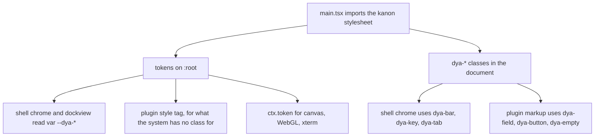

# The dyarchia-desktop UI contract

Every dyarchia product renders against the same design system: two dark themes over one
token contract, one pair of typefaces, one grammar of relief, and a layer of `dya-*`
component classes the products consume without redefining them. This document is the
desktop side of that contract — what the shell provides, and what a plugin must respect
to look like it belongs.

The system itself is specified in the `dyarchia-kanon` repository. This document never
restates its values; it says how they reach a plugin.


## Index

- [1. Where the system lives](#1-where-the-system-lives)
- [2. The ambient contract](#2-the-ambient-contract)
- [3. Components first, tokens second](#3-components-first-tokens-second)
- [4. The rules a panel breaks first](#4-the-rules-a-panel-breaks-first)
- [5. Tokens a plugin reaches for](#5-tokens-a-plugin-reaches-for)
- [6. Literal values](#6-literal-values)
- [7. Shell extensions and declared exceptions](#7-shell-extensions-and-declared-exceptions)
- [8. Review gate](#8-review-gate)
- [9. Known limits](#9-known-limits)


## 1. Where the system lives

`packages/kanon` is the design system itself, published to the workspace as
`@dyarchia/kanon`.

```text
Path                              What it is
-------------------------------   -------------------------------------------------
packages/kanon/css/               the stylesheet
packages/kanon/fonts/             IBM Plex Sans Condensed and Mono, six static woff2
packages/kanon/src/index.ts       token(), for code that needs a resolved value
packages/kanon/docs/specs/        the spec, which is the authority over the CSS
```

**This is the source.** It was a separate repository, vendored here and kept in step by a
sync script; it was absorbed by subtree, so its history is this history and the sync is
gone. `css/` and `fonts/` are edited in place, and the spec is brought into line with the
same commit.

What that buys, beyond one less script: the system used to carry no version a consumer
could read. A plugin references `dya-*` from the document without importing anything, so a
plugin written against a class that had not shipped yet installed cleanly and rendered
wrong — silently, with no error anywhere. A plugin and the system it references now ship
from the same commit.

What it costs: nothing enforces the separation any more. The rule that a product never
restyles a `dya-*` class used to be protected by the class living in another repository.
It is now protected only by review. `packages/kanon/css/components.css` is the single
declaration site for every component, and a rule that overrides one belongs in the plugin's
own prefixed stylesheet or in kanon itself — never as a second `.dya-button`.

Any change to a colour token is re-measured against every surface it can sit on, in both
themes, with the ratios in the commit body. The full rule set is in the repository's
CLAUDE.md; the mandate is in `packages/kanon/docs/specs/`.


## 2. The ambient contract

The shell links the stylesheet exactly once, in
[main.tsx](apps/shell/src/renderer/src/main.tsx), before React mounts. Plugins render
into that same document, so:

- **Components are ambient.** Every `dya-*` class is already in the document. A plugin
  writes `class="dya-button"` and gets the button — it does not import CSS from
  `@dyarchia/kanon` and it does not ship fonts.
- **Tokens are ambient.** Every `--dya-*` custom property is resolvable from any node a
  plugin creates.
- **The reset already applied.** `box-sizing`, margin zeroing, focus ring, scrollbars
  and the reduced-motion block are in force before the plugin runs.
- **`[hidden]` works.** The reset declares it `!important`, so a panel toggles
  `el.hidden` and never writes a display rule for it. Without that, the UA stylesheet
  loses to any class that sets `display` and a hidden flex container stays on screen,
  which is how a panel ends up rendering both of its tabs at once.
- **The theme is an attribute, and the shell owns it.** The system carries two dark
  themes: `Gi` on `:root` and `Oneiro` under `[data-theme="oneiro"]`. The two buttons at
  the right of the title bar set it, [theme.ts](apps/shell/src/renderer/src/theme.ts) owns
  the read and the apply, and the choice lives in `localStorage` under `dyarchia:theme`,
  read in module scope before React renders so the first paint is already correct. A theme
  redefines colour tokens and nothing else, so a plugin never reads it and never branches
  on it — it writes `var(--dya-surface-1)` and gets whichever theme is mounted. The CSS
  never consults `prefers-color-scheme` and there is no light theme.
- **A plugin that paints outside the DOM subscribes.** The cascade cannot reach a canvas,
  a WebGL context or xterm's theme object, so a plugin that resolved tokens through
  `ctx.token` holds stale strings after a switch. `ctx.onThemeChange(listener)` fires after
  the attribute moves and returns an unsubscribe to call from the panel's dispose. The
  listener receives nothing on purpose: the answer is always to resolve the tokens again,
  never to branch on which theme is mounted.




## 3. Components first, tokens second

The order matters, and it is the point of the whole exercise:

1. **A `dya-*` class exists for it.** Use it. Add a plugin class alongside for layout
   only — `class="dya-field pyinfo-input"`, where `.pyinfo-input` sets `flex: 1` and
   nothing else.
2. **No class exists for it.** Write a plugin-prefixed rule built entirely from tokens,
   and say so in the plugin's README. Then propose it upstream — that is almost always
   the right answer.
3. **A class exists but is nearly right.** Do not patch it locally. A product that
   restyles `.dya-button` has forked the system. Propose the modifier upstream.

What the system already declares:

```text
Structure    dya-panel  dya-bar (--flush --inset)  dya-dock  dya-card
             dya-card__header  dya-card__body  dya-rule  dya-brand
Pressable    dya-button (--quiet --sm --danger)  dya-key  dya-chip  dya-item
             dya-entry (--strong --active)
Input        dya-field (--sm --auto)  dya-toggle  dya-checkbox  dya-radio  dya-slider
Content      dya-tag  dya-badge  dya-table  dya-row  dya-metric  dya-display
             dya-heading  dya-text (--success --warning --danger)  dya-label
             dya-eyebrow  dya-value  dya-mono  dya-key-label
Documents    dya-prose  dya-code  dya-log  dya-math
Layers       dya-menu  dya-menu__item  dya-tooltip
Navigation   dya-tabs  dya-tab  dya-pagination
Absence      dya-empty  dya-loading  dya-skeleton
```

Four of those carry a trap worth knowing before the first render:

- **`dya-field` is full width.** It claims 100% and pushes whatever follows it onto a
  second line in a control row. `--auto` opts out; the minimum width is yours.
- **`dya-bar` is window chrome**, 46px tall with a gradient and a hairline under it.
  Inside a panel that reads as a second title bar. `--inset` keeps the rhythm and drops
  the chrome.
- **`dya-log` is for what a process printed**, not for authored code: it wraps instead of
  scrolling sideways. It sets no height, so give it one or let a flex parent do it.
- **`dya-text--*` is a sentence, `dya-badge--*` is a chip.** Same three tokens, and the
  wrong one dresses an outcome as a label.

Where the desktop currently lands:

```text
Surface                     Class
-------------------------   ---------------------------------------------------
Title bar                   dya-bar dya-bar--flush, dya-brand,
                            dya-key / dya-key--active
Panel overflow              dya-key with a three-dot glyph opening a dya-menu of
                            dya-menu__item; only past the third plugin
Theme toggle                dya-key, two SVG glyphs at currentColor, separated
                            from the panel toggles by a 1px rule
Dock tab                    dya-tab, aria-selected drives the active state
Group actions               dya-key
Loading and empty states    dya-loading, dya-empty
Docs and player, closed     dya-empty holding a bare icon at 28px that opens
                            the native file dialog, declared plugin-side
Docs and player, open       dya-mono file name, the same icon at 14px to
                            change it
pyinfo field and button     dya-field, dya-button
pyinfo key and value        dya-key-label, dya-mono
player title                dya-mono
docviewer prose             dya-text, plus local rules for injected markdown
docviewer mode toggle       dya-key, eye and pencil, present only while the
                            open file is markdown
```

What is left in a plugin style tag after that is layout and the markdown the viewer does
not control: widths, scroll containers, and the `h2`/`h3`/`code` rules marked injects,
which cannot carry a class.


## 4. The rules a panel breaks first

The full mandate lives upstream. These are the ones a panel breaks first.

1. **Relief means pressable.** Buttons, keys and chips are raised. Rows, cells and
   containers are flat and express state through background.
2. **Only what receives input is recessed.** Text fields and sliders, plus any control
   while it is being pressed. Nothing else is sunk.
3. **Hover changes the background, never the shadow.** There is no
   `--dya-elev-raised-hover`; `--dya-raised` moves to `--dya-raised-hover`.
4. **`box-shadow` is never in a `transition`.** It is the most expensive property to
   animate and it interpolates badly against a list of shadows. Animate `transform`,
   `opacity` and `background-color`.
5. **An ink under 4.50 against what it sits on is not text.** Above 3.00 it can still
   be a graphical object: a tab underline, a selected row's edge, a status dot,
   `::selection`. In Gi that catches `--dya-accent` on `--dya-raised-hover` and
   `--dya-selected` at 4.42 and 3.99, and `--dya-accent-3` on everything above
   `--dya-surface-1`.
6. **`--dya-field` is a surface, not an ink.** It is the one token meant to be flooded
   across a whole region, and it carries `--dya-on-field`. In Oneiro it measures 2.12 as
   text and 9.20 as a ground, which is the entire point. Never set `color:
   var(--dya-field)`.
7. **A label never sits on `--dya-selected` in Gi or `--dya-raised-hover` in Oneiro.**
   `--dya-text-4` measures 4.43 and 4.27 there. On those, use `--dya-text-3`.
8. **Interface text is IBM Plex Mono, uppercase, with tracking chosen by role.** Content
   prose is IBM Plex Sans Condensed. File names and paths are the exception — they are
   data, so mono in normal case at `--dya-tracking-mono`.
9. **Five radii, and 8px is not one of them.** Something asking for 8px gets
   `--dya-radius`, 6px.
10. **Nothing animates forever.** No shimmer on a skeleton, no pulse on a status dot.


## 5. Tokens a plugin reaches for

```text
Group       Tokens
---------   --------------------------------------------------------------------
Surface     --dya-bg  --dya-chassis  --dya-surface-1  --dya-surface-2
            --dya-flat-hover  --dya-raised  --dya-raised-hover  --dya-overlay
            --dya-sunken  --dya-selected
Text        --dya-text  --dya-text-2  --dya-text-3  --dya-text-4
Relief      --dya-elev-flat  --dya-elev-chassis  --dya-elev-raised
            --dya-elev-pressed  --dya-elev-sunken  --dya-elev-focus
            --dya-elev-popover  --dya-elev-overlay
Line        --dya-border  --dya-border-strong  --dya-hairline  --dya-rule
            --dya-dashed  --dya-faint
Accent      --dya-accent  --dya-accent-soft  --dya-accent-faint  --dya-on-accent
            --dya-accent-2 (--soft)  --dya-accent-3 (--soft)
Field       --dya-field  --dya-on-field
Status      --dya-success  --dya-warning  --dya-danger  --dya-*-soft for each
            --dya-on-status  --dya-idle  --dya-on-idle
Shape       --dya-radius-sm  --dya-radius  --dya-radius-media
            --dya-radius-chassis  --dya-radius-tag  --dya-radius-full
Type        --dya-font-sans  --dya-font-mono  --dya-size-*  --dya-tracking-*
            --dya-weight-*  --dya-leading-*
Spacing     --dya-space-1 .. --dya-space-24
Motion      --dya-dur-*  --dya-ease-*  --dya-press-y  --dya-press-y-key
            --dya-press-scale
```

Panel interiors are transparent: the dock group already paints `--dya-surface-1`. Leave
it alone unless the panel needs a different surface, or needs an opaque one — a canvas
renderer that computes contrast has to know what it is drawing on, and the terminal
paints `token('surface-1')` for exactly that reason. Painting anything else hides the
group's border and breaks the gap rhythm.


## 6. Literal values

`var()` covers CSS. A canvas, a WebGL context or xterm's theme object needs a resolved
string. That is `ctx.token`, the second member of `PluginContext`:

```typescript
export function activate(ctx: PluginContext): void {
    ctx.registerPanel({ id: 'chart', title: 'Chart', icon: ICON }, (container) => {
        draw(container, ctx.token('text'))
        return () => container.replaceChildren()
    })
}
```

`'accent'` and `'--dya-accent'` both resolve. A resolved string is a copy, so anything
held across a theme switch is stale: pair `ctx.token` with `ctx.onThemeChange` and resolve
again inside the listener. The terminal is the worked example — it rebuilds xterm's
`ITheme` and reassigns `terminal.options.theme`, and unsubscribes in its dispose.

The terminal plugin is the worked example: it builds xterm's `ITheme` from
`token('surface-1')`, `token('text')` and `token('accent-soft')` over a fixed 16-colour
ANSI palette — [renderer.ts](plugins/terminal/src/renderer.ts).

Colour a plugin paints itself is colour the system cannot check, and a theme cannot
reach it either — a fixed palette has to clear every ground the product can mount. The
terminal's sixteen slots are measured against `--dya-surface-1` in both themes: every
entry but `black` clears 5.92:1 in Gi and 6.06:1 in Oneiro, the floor being
`brightBlack`. The margin over AA is deliberate, because thin monospace stems lose
contrast to antialiasing and a nominal 4.5:1 reads thinner than it measures. The `black`
slot is 1.67:1 by definition and `minimumContrastRatio: 4.5` lifts it at render time.
Any plugin that draws text outside the DOM owes the same check, in both themes.

Plugins built outside this workspace need no dependency for any of it: `ctx.token` is
passed in by the shell. `@dyarchia/kanon` exports the same function for code that runs
before a context exists, such as the shell itself.


## 7. Shell extensions and declared exceptions

The shell declares no colour and no metric of its own. Everything in
[styles.css](apps/shell/src/renderer/src/styles.css) is layout, the dockview bridge, or
one of two deliberate exceptions.

The dockview bridge maps `--dv-*` variables onto `--dya-*` ones. It is the only place
where a third-party theme is reconciled with the system, and it belongs to the shell.

One place steps outside the mandate:

```text
Exception                       Why
-----------------------------   -----------------------------------------------
Caption buttons are flat        relief on a full-height caption button reads as
                                a mistake; they are OS chrome, not controls
```

The bar's right padding used to be the second. It is not any more: the caption cluster
reaches the window edge through `dya-bar--flush`, which the system now carries. That is
the shape every one of these should take — a product-side override is a bug report
waiting to be filed upstream.

The `--dya-` namespace belongs upstream. A plugin that needs a colour the system does
not have declares it under its own prefix and says so in its README, or proposes it
upstream.


## 8. Review gate

Before a panel is considered done:

1. Every surface the system has a class for uses that class. Grep the plugin for
   `border-radius`, `box-shadow` and `font-family` — each hit is either layout or a
   component the system should own.
2. No literal colour anywhere in the plugin — grep the source for `#`, `rgb` and `rgba`.
3. No `box-shadow` inside any `transition` list.
4. No local rule targets a bare `.dya-*` selector.
5. Chrome text is mono uppercase; prose is sans; file names and paths are mono in
   normal case.
6. Walk every state: idle, hover, pressed, selected, empty, error.
7. No `backdrop-filter`, no animated `box-shadow` on anything that repeats, no infinite
   animation.


## 9. Known limits

- **Programs choose their own colours.** The terminal ships a 16-colour ANSI palette,
  but a program emitting 256-colour or truecolour escapes bypasses it. xterm's
  `minimumContrastRatio` is set to 4.5 as the backstop. A plugin that renders text it
  does not control needs an equivalent guard.
- **The system has one prose heading size.** `.dya-heading` is the only step between
  `--dya-size-metric` and `--dya-size-body`, so the markdown viewer renders `h1` at
  `--dya-size-h2` and drops `h2` and `h3` into the mono label idiom. Upstream carries
  this as an open question and the mono idiom as its standing answer, so the viewer is
  aligned with the system rather than working around it.
- **`--dya-text-4` is the floor.** It measures 6.50 against `--dya-surface-1` in Gi and
  6.45 in Oneiro, and clears AA on every surface but one per theme — 4.43 on
  `--dya-selected` in Gi, 4.27 on `--dya-raised-hover` in Oneiro. Check the surface
  before reaching for it.
- **Six of Oneiro's ten surfaces are interpolated.** They follow the mandate but have not
  been seen against real content, so a panel that looks wrong in Oneiro and right in Gi
  is a report worth filing upstream rather than a local fix.
