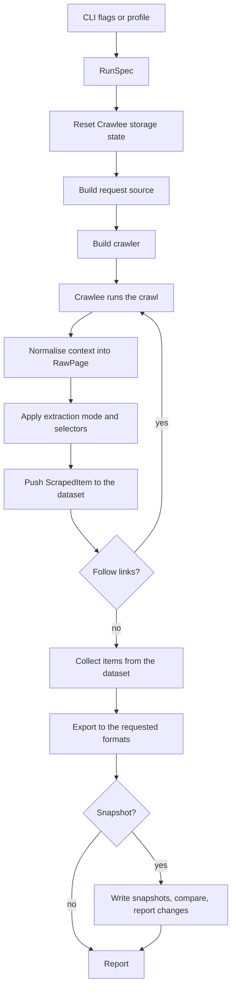

# Architecture

How dyarchia-crawlee is put together, and the reasoning behind the parts that are not obvious.

## Index

- [1. Two layers](#1-two-layers)
- [2. Module map](#2-module-map)
- [3. The path of a run](#3-the-path-of-a-run)
- [4. One DOM interface over four parsers](#4-one-dom-interface-over-four-parsers)
- [5. Crawlee behaviours that had to be handled](#5-crawlee-behaviours-that-had-to-be-handled)
- [6. Snapshots and the change history](#6-snapshots-and-the-change-history)
- [7. Failure handling](#7-failure-handling)
- [8. Sweeping a corpus](#8-sweeping-a-corpus)
- [9. The panel](#9-the-panel)
- [10. Where this lives](#10-where-this-lives)
- [11. Testing strategy](#11-testing-strategy)

## 1. Two layers

The engine knows nothing about any specific site. Profiles never touch the Crawlee API. A profile
describes what to look for; the engine decides how to obtain it.

That boundary is what makes a new target a data change rather than a code change. It also means
anything a target needs that a profile cannot express belongs in the engine as a reusable feature,
never as a per-site escape hatch. The claude-docs profile needed sitemap seeding and URL suffix
rewriting; both landed in the engine and both are now available to every target.

## 2. Module map

    Module                  Responsibility                                  Depends on
    --------------------    -------------------------------------------    -------------------
    cli                     Command parsing, run orchestration              config, registry
    config                  Settings from environment and .env              nothing
    models                  Data contracts between layers                   nothing
    errors                  Exception hierarchy                             nothing
    urls                    Suffix rewriting, snapshot path derivation      nothing
    patterns                URL matching for link following                 nothing
    registry                Discovery of YAML and Python profiles           profiles, sites
    runtime                 Crawlee state and working directory per run    nothing
    recon                   Target reconnaissance for the inspect command   extraction
    watch                   Sweeping every tracked target in one round      registry, engine
    digest                  Bundling a sweep's changes for the step         inventory, registry,
                            that runs after it                              versioning
    state                   Every corpus in every repository, as one        digest, inventory,
                            answer for whatever reads it next               versioning.vcs
    locking                 One round over a corpus at a time               config, errors
    inventory               Reading a manifest back as a per-section        config,
                            report of what a target is holding              versioning.manifest
    engine                  Running a crawl end to end                      almost everything
    crawlers.factory        Building the requested crawler                  settings, hooks
    crawlers.settings       Concurrency, rate limit, transport              config
    crawlers.throttling     Per-domain delay and 429 backoff                models
    crawlers.hooks          Pre-navigation resource blocking                context
    crawlers.adaptive       Static-result sufficiency check                 models
    crawlers.context        Safe access to optional context members         nothing
    extraction.dom          One DOM interface, field selector language      nothing
    extraction.strategies   Extraction modes                                dom, models
    extraction.boilerplate  Removal of the header and footer every page     nothing
                            of a run shares
    extraction.markup       Cleaning of markup embedded in documents        nothing
                            that arrive as markdown, and repair of the
                            code blocks HTML extraction cannot see
    extraction.frontmatter  Splitting a metadata block off a document       nothing
                            so the corpus judges only its prose
    profiles.schema         On-disk profile shape                           models
    profiles.loader         Reading and writing profile files               schema, errors
    storage.exporters       Output as json, jsonl, csv, markdown            models
    storage.snapshots       Snapshot writing and pruning                    versioning
    versioning.hashing      Content fingerprints                            nothing
    versioning.manifest     Per-target record of status and hashes          models
    versioning.diffing      Manifest comparison into a change report        manifest
    versioning.report       Rendering a change report                       diffing
    versioning.vcs          Committing a snapshot                           errors
    sites.claude_docs       The one profile the package ships, and the      profiles.schema
                            worked example of a Python definition. It does
                            not ask to be snapshotted: it is present in
                            every corpus repository, and one that asked
                            would join every round swept on the machine

Dependencies point towards `models` and `config`, never towards `cli`.

## 3. The path of a run

`RunSpec` is the single contract. A profile and a command line produce the same object, which is why
`--profile` and ad-hoc flags compose rather than being two separate code paths.

Overrides are resolved through Click's parameter source rather than by comparing values against
defaults. A flag that happens to equal its default must not silently win over the profile that set
it deliberately.

## 4. One DOM interface over four parsers

Crawlee hands back a different object depending on the crawler: a BeautifulSoup document, a Parsel
selector, a live Playwright page, or raw bytes. `extraction.dom` defines the minimum a parsed
document must offer, and `engine.to_raw_page` is the single place that knows about the difference.

Adapters exist for BeautifulSoup and Parsel. A browser page is read through `page.content()` and
adapted as HTML. Anything not recognised falls through to the response body, where the content type
decides whether there is a DOM to build at all.

Extraction that starts from HTML can lean on structure to separate content from chrome. Text that
arrives already clean, such as a publisher's own markdown, has no structure left to lean on, so a
banner injected into every page survives into the snapshot. `extraction.boilerplate` closes that gap
from the other direction: a block of lines opening or closing at least ninety per cent of a run's
pages is chrome by definition, whatever it says. Detection therefore happens once the whole run is
collected, because the corpus is the evidence. Removing it is also free for change tracking, since
content identical on every page is constant and constant content never appears in a diff.

A second gap opens on the same kind of target. Sites built on MDX serve their prose pages as prose
and their landing pages as the layout that produced them: class names, wrapper elements, inline SVG
path coordinates. Nothing is missing from such a page, but nudging an icon by a pixel would read as
a content change. `extraction.markup` reduces a markup-heavy document to the prose and links inside
it, and the ratio test keeps it away from ordinary pages. Two details in it are what make it lossless
rather than merely tidy: component syntax puts real headings in attributes, so `title`, `label` and
`href` are rescued instead of stripped with the tag, and fenced code blocks are left untouched,
because an HTML example inside a fence is the content rather than the chrome.

The ratio test is not the whole answer, because two different faults arrive looking like one. A
landing page is markup all the way down and the ratio finds it. A prose page that happens to define
its interactive component carries a block of JavaScript instead, and it fails the ratio precisely
because it is mostly prose; no amount of tag-stripping reaches a `useMemo` call in any case. That
definition is removed outright and its invocation kept, so a reader still learns that a widget stood
there. A code fence again exempts everything inside it, since a page teaching JavaScript is a page
whose `export const` is the lesson.

A third gap is not extraction misreading a page but a page giving extraction nothing to read. A
renderer that splits a code sample into one bare `div` per line publishes no `pre` and no `code`, so
the sample is indistinguishable from layout and is dropped whole: five Claude Cookbook recipes
carried 1,411 lines of code between them and 134 survived. `extraction.markup` rebuilds such a run
into the one `pre` it was meant to be, before extraction rather than after, because afterwards there
is nothing left to repair.

A fourth is the same defect from the publisher's side, and it was found by asking whether the other
HTML-extracted corpora had the third one. A `pre` holding a single line is rendered as inline code,
and the opening fence of the block after it is glued to the end of that line. 26 mistral-docs pages
were inverted from that point on, with 444 lines of prose sitting inside a fence between them, and
the page it hit hardest had 16 of its 31 code lines loose. Giving the block a second line prevents
it. The newline belongs inside the innermost `code` element, since publishers nest `pre > code >
span` and a newline outside the `code` stops the glue while leaving the sample inline: half a
repair, and one that reads as fixed.

Extraction from HTML has a failure of its own, and it is corrected where it is made rather than
where it is noticed. Collapsing a paragraph and the code block after it onto one line leaves a fence
delimiter mid-line, which no parser can see; from there every delimiter reads as the opposite of
what it is, and the page's prose is stored as code. Two of those on one page pair up, so the
document balances while staying inverted, and the check that returned early on a balanced document
read most of the 50 such lines the corpora held as healthy. Every document is attempted now, and
the split runs to a fixed point, because repairing the first glued line is what reveals the second
was never inside a block either. 49 of the 50 are repaired; the one that is not sits on a page
broken for another reason, where the result would not balance either way.

Both repairs refuse to act unless the result is demonstrably better than the input, and neither
touches a document fetched as markdown from its
publisher: that one is stored as published, which is the only promise a snapshot of it makes.

## 5. Crawlee behaviours that had to be handled

Four behaviours of the library are easy to get wrong and are handled explicitly. Each one was
verified against the installed version rather than assumed.

### 5.1 Globs never cross the scheme separator

Crawlee matches include and exclude patterns against the whole URL, anchored at the start, using a
path-style glob translation. The obvious pattern `**/docs/**` therefore matches nothing, because
`**` refuses to cross the empty segment inside `https://`. It fails silently: the crawl simply
follows no links.

`patterns.to_matcher` gives the CLI its own contract instead. A bare pattern means the URL contains
this glob, a pattern with a scheme keeps Crawlee's own semantics, and a `re:` prefix is an explicit
regular expression.

### 5.2 Adaptive rendering does not update the parsed document

On a browser run, `AdaptivePlaywrightCrawlingContext.parsed_content` is parsed from the raw
navigation response body, not from the rendered DOM. Reading it would return the pre-JavaScript
shell of exactly the pages that needed a browser in the first place.

The engine therefore prefers the live page and falls back to `parsed_content`. Because that page is
a property that raises when the request was served by the static sub-crawler, access goes through
`crawlers.context.safe_page`.

### 5.3 The adaptive crawler needs a result checker to adapt

Without one it accepts whatever the cheap static path produced, including an empty shell.
`crawlers.adaptive.make_result_checker` rejects a static result carrying no signal, which is what
forces a browser render. It is aware of the run: a run that asked for nothing extractable accepts
any result, so `--extract none` does not render every page in a browser.

### 5.4 Crawl-delay is read but not enforced

`respect_robots_txt_file` reads `Crawl-delay` from robots.txt, then logs a warning and ignores it
unless the crawler is driven by a `ThrottlingRequestManager`. One is wired whenever robots.txt is
respected. The delays are reactive, from 429 responses and from robots directives, so an ordinary
crawl still runs at full speed.

## 6. Snapshots and the change history

Content lands under `data/<name>/pages/`, mirroring the URL structure, so a diff reads like a tour
of the site. A manifest beside the pages records per-URL status and hash, which is what allows a
report without invoking git, and what allows a page that disappeared to be told apart from a page
that failed to download.

A profile may name a `group`, which nests that target one level deeper, at `data/<group>/<name>/`,
and sends its output to `output/<group>/`. The group is a folder and a round at once: it is also
what `watch --group` sweeps, so the targets that share a subject share a schedule, and a corpus
added later joins neither by accident. That double duty is the point. A machine watching several
corpora otherwise has one flat data directory and one round that quietly grows to whatever asked
for snapshots most recently.

Writing derives the path from the profile alone, and reading does not. A profile that joins a group
does not carry its files with it, so `inventory.directory_for` tries the group, then the data root,
then any group folder that actually holds the manifest. Half a move therefore reports what is on
disk instead of declaring the corpus missing and crawling it again from nothing. The tolerance
belongs on the reading side only: a write that guessed would scatter one target across two folders.

Git is optional, and it is worth being precise about why, because declining it sounds like it
should break change tracking and does not. Detection compares the incoming run against the manifest
and pages already on disk, so it works identically whether or not anything is committed. What git
adds is duration. Without it, a target keeps its current state and the report of the most recent
run; with it, every change acquires a date and an author trail.

The corpora are versioned, but not here. They live in their own repository alongside this one, which
is what `DYARCHIA_CRAWLEE_DATA_DIR` and `DYARCHIA_CRAWLEE_PROFILES_DIR` point at, and the tool's own history
stays a history of the tool. The two sides share no import: one names a directory, the other holds
it.

That split is why `versioning.vcs` asks git which repository owns the data directory instead of
deriving one from where `pyproject.toml` sits. Deriving it only ever finds the tool, and `git add`
on a path outside the repository is a fatal error, so a corpus that moved out would have made
`--commit` fail rather than commit elsewhere. `--commit` stages a snapshot only when its content
fingerprint moved, and refuses with an explanation rather than a git error when the directory it
was asked to commit is ignored or sits in no repository at all.

Manifest timestamps move on every run, so comparing manifests directly would produce a commit per
run and turn the history into a record of how often the scraper ran. Snapshots are therefore
compared on a content fingerprint of status and hash. Unchanged pages are not rewritten, and the
manifest and report are only persisted when that fingerprint moves.

## 7. Failure handling

Retries with backoff belong to Crawlee. On top of that:

- Every URL gets a final status in the manifest, so a partial failure neither deletes valid
  snapshots nor pollutes the diff with false removals.
- A run whose success rate falls below its threshold writes no snapshot at all.
- A run that reaches far fewer pages than the snapshot it would replace writes nothing either. The
  success rate cannot see this: a run capped at three pages downloads three of three, scores a
  hundred per cent, and deletes everything it never visited. Coverage asks whether the run saw the
  target or only a corner of it, which is the failure mode of a page limit, a mistyped include
  pattern, or a sitemap that came back truncated.
- Extraction errors are isolated per page; one broken page does not abort the run.
- Snapshot paths are sanitised and resolved, so a target cannot steer writes outside its own
  directory through traversal in its URLs.

Crawlee caches storage instances, and the locks guarding them, in a process-global service locator.
Those locks bind to the event loop that created them, so a second run in the same process fails.
`runtime.reset_storage_state` is called when a run starts, which makes the engine usable from a test
suite or a long-lived host and not only from a CLI that exits afterwards. It also implies runs are
sequential within a process; concurrent crawls in one process were never safe under a global service
locator.

Two processes are the other half of that, and the half that does not announce itself. Crawlee keeps
its request queue on disk under one directory for the whole checkout, so a crawl started while
another is running takes requests from the other's queue and hands over its own. Neither run errors,
neither reports anything unusual, and both write a corpus: one of them holding pages that belong to
somebody else's target while its own are recorded as removed. `runtime.use_private_storage` names
that directory after the process, which makes the collision impossible rather than unlikely. It was
written after a ten-page test crawl of one site emptied 236 pages out of another site's corpus and
left ten of its own behind.

Where that directory goes is `settings.storage_root`, which is configurable for the same reason the
data root is: it is not the tool. Scratch is purged at the start of every run and removed when the
process exits, so nothing of value is kept there, but a run that is killed leaves its folder
behind, and a checkout that collects those is a checkout collecting somebody's abandoned crawls.

## 8. Sweeping a corpus

`watch` is one round over a whole corpus, and it is shaped by what a caller can consume without
reading prose: an exit code, two documents and a lock.

It sweeps every profile that asks for snapshots, one after another rather than concurrently: these
are polite crawls of whole documentation sites, and running five at once would multiply the request
rate against hosts that have done nothing to deserve it. A target that raises is recorded and the
sweep continues, because one unreachable host must not hide the state of the other four.

The verdict is the exit code, which is the one thing every caller reads without help:

    Code    Meaning
    ----    ----------------------------------------------------------------
    0       nothing changed
    10      at least one target changed
    1       at least one target failed, so the sweep cannot vouch for itself

A failure outranks a change deliberately. A target that did not answer may be sitting on a change
nobody can see, so the sweep must not report success. A first snapshot deliberately does not count
as a change: there is nothing yet for it to differ from, and a monitor that fires on its own first
run teaches its reader to ignore it.

Neither does a reordering. `diffing.is_reordering` asks whether a page holds the same lines as
before in a different order, after the same normalisation the hash uses, and marks the change if it
does. The page is still stored and still rewrites its hash, because the file did change; it is just
not counted, and so raises nothing. The distinction is not academic. One real sweep of xai-docs
reported three modified pages, all three of them pricing tables that had shuffled their rows, and
every one of them raised a desktop notification that said nothing.

The classification is computed once, at comparison time, from the text on both sides, and stored in
the report. Deriving it later from the diff would be cheaper and wrong: the diff is trimmed at two
hundred lines, so a large genuine change can look balanced, and the error would fall in the
direction of hiding a change rather than reporting a false one.

Nothing starts a round by itself. This machine ran two scheduled rounds at logon for a season, and
they were removed rather than reduced: an unattended crawler is a thing that spends an hour of a
laptop on a week nobody asked about, and every safeguard it needed -- a record of the last week
swept, a bound on how many times a week may be attempted, a notification for the week it gave up on
-- existed to contain a problem that not running unattended does not have. A round now happens
because somebody asked for one.

More than one somebody can ask at once, which is what the lock is for. `watch` takes one on the
group before it crawls and exits 30 without crawling if another round holds it. The lock lives in
the toolkit rather than in whatever calls it, because a lock only one caller respects is not a lock:
a panel's button has to obey the same one a prompt does.

It is an operating system lock held for the life of the process, not a witness file. A witness has
to be reaped when its owner dies, and a run that is killed gets no chance to reap anything; the file
would survive and block every round after it. The kernel releases this one however the holder ends
-- promptly rather than instantly, measured at 56 ms after a kill on this machine, so a caller
retrying in the same breath may still be refused once.

### 8.1 The step after the sweep

An exit code is enough to know that something moved and not enough to decide what it means. The
sweep therefore writes `WATCH.json` beside `WATCH.md`, carrying the same verdict as
data, and `digest` assembles the rest: every changed page with its diff and the path to the file
holding its current text. The path is the part that matters. A step given only diffs writes a
changelog; a step that can open the page writes an answer.

Reorderings travel through the digest labelled and uncounted, so a bundle of nothing but shuffled
tables reports no change while still showing what moved, for anyone who wonders.

So does currency, and that one had to be learned. A run that finds nothing rewrites nothing, which
is the right behaviour and means the report left beside a quiet corpus describes whatever the last
run that did find something wrote. `digest` read that back as the latest word, and on the first
real sweep it handed the follow-up 105 pages of a corpus that had not changed in three days. The
corpus cannot answer the question itself; only the sweep can, which is what `WATCH.json` is for.
A report older than the sweep that covered it is reported as no change, and its pages are dropped
rather than passed on.

The digest is written on exit 10 and only then, and what it produces is a path. That is the seam,
and it is a file rather than a call on purpose: what to do with a change is an editorial decision,
and the moment the toolkit holds one it also holds a provider, a key and a prompt.

It belongs in the same sitting as the round that produced it, because the change reports it reads
are the ones that sweep just wrote and the next sweep overwrites them. A digest taken later reads
the previous round's diff or none at all, which is also the argument for `--commit`: once the
corpora moved to their own repositories, git is the only copy of what a previous round found.

## 9. The panel

`renderer.js` and `main.py` are a Dyarchia Desktop panel, and it is deliberately the thinnest
thing that can be called one. It holds no crawling logic, no profile schema and no second copy of the lock. Every
answer it shows comes from running the CLI under this project's interpreter and reading what came
back.

That is not laziness about layering, it is the layering. The CLI is the surface the test suite
covers and the surface a person already uses, so a panel built on anything else would be a second
implementation of the same decisions, free to drift from the first. A button and a prompt cannot
disagree about what a round is when the button *is* a prompt.

Three consequences follow, and each of them was a choice:

- **The panel runs under the shell's interpreter, not the toolkit's.** The shell spawns one Python
  process per plugin with whatever `py -3` resolves to, which has none of this project's
  dependencies. So `main.py` imports nothing from the package: it locates the checkout, then drives
  `.venv`'s own interpreter as a subprocess. An installed copy sits outside the checkout and carries
  a file naming it, because a plugin that guesses where its toolkit lives will one day guess wrong.
- **Reads answer in place; work streams.** The shell gives an invoke sixty seconds and a round takes
  tens of minutes, so `state`, `profiles`, `show` and `save` answer directly while `start` returns
  immediately and the process is followed on a thread, a line at a time. The interesting round is
  the one that never reaches the end: a crawl stopped after twenty minutes has still said what it
  found.
- **The panel composes YAML and the toolkit validates it.** `RunSpec` forbids unknown keys, so a
  field the panel invents is refused by `profile save` with nothing written. That is what lets the
  form stay a form instead of becoming a second copy of the schema, and it is why the edit path is
  the profile's own text rather than a rendering of the model: the comments are the measurements.

What the panel cannot do is raise a notification. The Python plugin contract carries `handle` and
`broadcast` and no `notify`, which belongs to the Node one. A round's verdict is therefore something
the panel shows rather than something it announces, and that is the right way round for work a
person started thirty seconds ago and is watching.

## 10. Where this lives

This was a repository of its own until 2026-09-11, when dyarchia-desktop absorbed it as
`packages/plugin-crawlee/` with its history intact. The move was decided the same day the product
was renamed, and the reason it is written here rather than left in a conversation is that the
checkout, its remote and every conversation about it are the things that disappear.

The plugin sits at the top of the package and the toolkit underneath it, which is the arrangement
`main.py` already expected: it walks up for `pyproject.toml` and now finds it in its own directory.
The shell scans `packages/` in its own workspace, so the panel is discovered without being
installed.

What the move removed, and why each piece existed:

    Gone                              Because
    -------------------------------   -----------------------------------------------------
    scripts/install_plugin.py         it copied the panel under %APPDATA%, which the
                                      workspace scan makes unnecessary
    the `home` file it stamped        it existed only so that copy could find a toolkit
                                      outside its own tree
    docs/design/                      the five additions were a cross-repo proposal and
    dyarchia-ui-proposal.md           are now five classes in kanon
    the `until upstream` rules        they held up classes the same workspace ships
    in the panel's stylesheet

The consequence of dropping the installer is worth stating plainly: the panel runs from the
workspace. A packaged build of the shell does not carry it, and the way back is not the `home` file
but a package that ships its own interpreter, which is a different piece of work.

What survives untouched is the part worth being deliberate about. The panel still shells out to the
CLI rather than importing the package, because the shell spawns one Python process per plugin with
whatever `py -3` resolves to, and that interpreter has none of this project's dependencies whether
the code sits in a sibling checkout or in the same workspace. The reason for the arrangement does
not change with the address: the CLI is the surface the tests cover, so a button that is a prompt
cannot disagree with a prompt.

One thing the move did not fix. The history carries the target inventory that was taken out of the
README, and it came across with everything else. dyarchia-desktop is private, so it is contained;
opening it is the moment to rewrite that history.

## 11. Testing strategy

Unit tests run against local fixtures with no network at all, and cover the parts where correctness
is subtle: pattern semantics, selector parsing, extraction modes, path derivation, manifest
comparison, snapshot guards, profile loading.

Integration tests drive the real command line entry point against a fixture site served from
`tests/fixtures/site` on localhost for the duration of the session. It is deliberately small and
deliberately awkward: static pages with selectable structure, a catalogue to follow links into, a
page outside it that a filter must exclude, two pages published twice so the markdown probe has
something to find, and one page whose quotes only exist after JavaScript runs. That last one is
the case that motivated the adaptive result checker, and it is asserted from both sides: the
static crawler sees an empty shell where the browser-backed one sees ten quotes.

The two twins differ on purpose, because publishers disagree about where a twin goes:
`guide.html` has `guide.html.md` beside it, the appended form, and `handbook.html` has
`handbook.md`, the form that replaces the extension and the one developer.salesforce.com uses.
Nothing serves `handbook.html.md`, so a probe that only appends passes the first and fails the
second.

Nothing in the suite leaves the machine. Tests needing Playwright carry the `browser` mark, which is
the only reason to deselect anything. An earlier version pointed these tests at public scraping
sandboxes; the fixture answers the same questions without making the suite depend on someone else's
uptime, or on the machine having a network at all.
