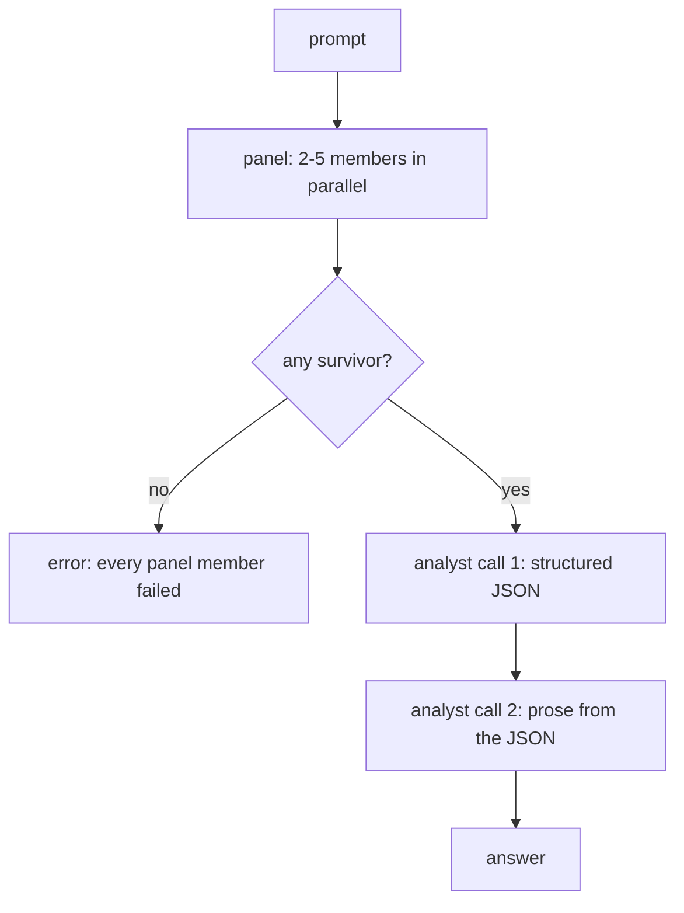

# Eforoi design

How the plugin is put together, what each route costs, and which parts are deliberately
absent. The user-facing summary is in [README.md](../README.md); this document is the
reasoning underneath it.


## Index

- [1. The pipeline](#1-the-pipeline)
- [2. One prompt, one run](#2-one-prompt-one-run)
- [3. Routes and adapters](#3-routes-and-adapters)
- [4. The catalogue is discovered, not declared](#4-the-catalogue-is-discovered-not-declared)
- [5. Effort and presets](#5-effort-and-presets)
- [6. Web search and fetch](#6-web-search-and-fetch)
- [7. Isolation from your own configuration](#7-isolation-from-your-own-configuration)
- [8. What each route costs](#8-what-each-route-costs)
- [9. The IPC contract](#9-the-ipc-contract)
- [10. The nested menu](#10-the-nested-menu)
- [11. Styling by reference, not by copy](#11-styling-by-reference-not-by-copy)
- [12. Reading order and the shape of the panel](#12-reading-order-and-the-shape-of-the-panel)
- [13. Deliberate omissions](#13-deliberate-omissions)


## 1. The pipeline



A member that fails does not fail the run — it is reported on its own card and the analyst
sees only the survivors. The run aborts only when nothing survives.

**The analyst is one seat and one call.** It emits the comparison as JSON, then a marker,
then the answer, and the run splits the reply on that marker:

```text
===ANALYSIS===
{ the comparison, as JSON }
===ANSWER===
the answer, in markdown
```

OpenRouter's Fusion splits these across two models — the analyst emits the analysis, the
caller's own model writes the reply. There is no caller model in a desktop panel, so the
roles collapsed onto one seat, and for a while they stayed two calls made in sequence. That
cost more than time.

It cost time first. Members run in parallel, so the panel stage costs whatever the slowest
member costs; the analyst then ran twice with nothing to overlap against, and had become
the larger half of a run — 64 seconds of 108, against 42 for three members together.

It also cost the answer. The writer was given the question and the analysis JSON, and
nothing else. It never saw a member's actual words, and it was told never to introduce a
fact absent from the analysis, so the answer could not be richer than a compressed summary
of answers it had not read. The observed failure was exactly that: a long, specific analysis
followed by a thin answer that dropped most of its own reasoning.

And it cost the language. `panelSystem` and the writer both opened by fixing the reply to
the question's language; the analyst prompt never mentioned language at all. A Spanish
question therefore produced Spanish member answers, an English analysis, and a Spanish
answer written from it. The rule now governs the JSON as explicitly as the prose — every
claim, topic, position and insight inside it.

One call fixes all three. The analyst holds the member answers and its own comparison in the
same context, so the answer is written from both; the language rule covers the whole reply;
and the second call is gone.

```text
                  two calls   one call
--------------   ---------   --------
analyst stage        63.7s      35.1s
whole run           108.2s      74.5s
shadow cost       $0.3099    $0.2595
```

The answer still streams, which is the reason for a marker rather than one JSON object with
the answer as a field. Deltas are buffered until the marker appears; at that point the
analysis is parsed and rendered, and everything after it streams into the answer card. A
reply that cannot be split is retried once with the format restated, and the retry re-emits
the two stages so a partial answer from the first attempt is cleared rather than appended
to.

**The analyst is bounded and the bound covers both attempts.** `ANALYST_DEADLINE_MS` is 300
seconds against one `AbortController` wrapping the whole of `fuse`, not each call inside it,
because a per-attempt deadline would let a retry double the worst case rather than cap it.

It needs its own number rather than sharing `MEMBER_DEADLINE_MS`, and the reason is
structural: a member answers a one-line question, while the analyst reads that question plus
every surviving answer. A run where three members produced 4891, 427 and 3849 tokens hands
the analyst more than nine thousand tokens of input before it writes anything. Comparing its
time against a member's is not comparing like with like, and a small model can be slower here
than any seat was.

That run is also why the attempt count reaches the panel. The analyst took 388.9 seconds
against members at 21, 37 and 38, and nothing said whether that was one slow call or two
ordinary ones — a free model that misses the marker on the first try pays for the prompt
twice, invisibly. The analysis card now reads `attempt 2` when it happens, and the card
counts elapsed seconds while the stage runs rather than sitting on a static label for minutes.


The JSON is rendered in the panel, and it is often more useful than the prose: it is the
only place the disagreement is visible as data.

The analysis schema:

```json
{
    "consensus": [{ "claim": "string", "supported_by": [1, 2] }],
    "contradictions": [{ "topic": "string", "positions": [{ "member": 1, "position": "string" }] }],
    "partial_coverage": [{ "point": "string", "covered_by": [1] }],
    "unique_insights": [{ "member": 2, "insight": "string" }],
    "blind_spots": ["string"]
}
```

Members are 1-based and match the seat ordinals in the panel, so every claim in the analysis
traces back to a card the reader can open.

The seat that plays this role is labelled **Dogma** in the panel — δόγμα, from δοκεῖν, "to
seem good": in Greek usage the resolution a council arrives at and issues. The code calls it
the analyst throughout, which is what it does; Dogma is what it produces.

Both system prompts open with the language rule — write in the language the question is
written in — because a buried instruction is not an instruction. It sat as the last of eight
bullets, and Sonnet 5 answered an English question in Italian. The system prompt itself was
arriving intact: told to answer in French, the same route replies "La capitale de l'Italie est
Rome." What failed was salience, not plumbing.

Structured output is not requested through any provider's JSON mode. Three of the five
routes are CLI agents that have no such parameter, and an analyst whose behaviour changed
with the route would not be comparable across runs. Instead the schema is specified in the
prompt, the reply is parsed with a brace-balancing extractor that tolerates fences and
surrounding prose, and one retry with a stricter instruction follows a parse failure.


## 2. One prompt, one run

A run is one-shot. Every participant is asked once, answers once, and is not asked again;
nothing carries from one Run to the next.

It did not start that way. Members and analyst each kept a thread, continuity used every
route's native mechanism — `claude --resume`, `codex exec resume`, `opencode -s`, and a
replayed `messages[]` on the API routes — and conversations were capped at ten turns. That
machinery existed to make turn two cheaper than turn one, and it worked: a measured second
turn cost $0.0376 against $0.0493 for the first, because resuming kept each CLI's prompt
cache warm.

It was removed because the panel is not a chat. What the panel does is put one question to
several models that cannot see each other and compare what comes back; a follow-up is a new
question, and a new question deserves a fresh panel. The cost of keeping it was paid on
every route: `CompletionRequest` carried `history` and `session`, `CompletionResult` carried
`session` back, and each of the three CLI specs had a resume branch in its argument list and
a session sink in its event handler. Removing the feature removed all of it.

One consequence is worth having on its own. `--ephemeral` had been dropped from the codex
invocation entirely, because it suppresses the very session file `exec resume` needs. With
nothing to resume the flag is back, and a panel run no longer leaves a rollout in the
operator's own codex history:

```text
Route       Wrote to                                   Still does
---------   ----------------------------------------   ----------
codex       ~/.codex/sessions/<date>/rollout-*.jsonl   no
claude      ~/.claude/projects/<scratch-slug>/         no
opencode    ~/.local/share/opencode/storage            yes
```

Claude has no flag for it: `claude -p` persists every headless run as a full session
transcript, and a panel of four seats puts four rows into the operator's resume picker,
each titled with the same prompt. So the plugin removes them itself. Every stream-json
event carries `session_id`, the transcript is named after it, and once the child has
exited its file is deleted from whichever project directory it landed in. Two seats of
the same run cannot collide, since each holds its own id.

The scratch directory is the second half of that. Sessions are keyed by working
directory, so a member running there is filed away from the operator's own projects, and
it inherits no repository: a seat that ran in the desktop checkout read the memory index,
the skill listing and the agent listing before answering, and spent 27k input tokens to
say `Four`. From scratch the same seat spends 1.7k.

Deletion is the guarantee and segregation is the fallback, for the run that is killed
before its child exits.

`Clear` empties the board. It is not `New` renamed: there is no conversation left to
forget, so it removes the cards and nothing else.


## 3. Routes and adapters

Five routes, two families.

```text
Route       Family   Transport                      Auth
---------   ------   ----------------------------   ----------------------------
claude      CLI      spawn, JSONL on stdout         Claude Code's own session
codex       CLI      spawn, JSONL on stdout         Codex CLI's own session
opencode    CLI      spawn, JSONL on stdout         opencode's own session
anthropic   API      @anthropic-ai/sdk, streaming   key from keychain or env
openai      API      openai sdk, streaming          key from keychain or env
```

Every CLI route funnels through one runner. A route contributes three things: the argument
vector, whether it accepts a separate system prompt, and a function mapping one JSONL event
to a text delta or a usage record. Everything else — spawn, line framing, cancellation,
stderr capture, exit handling — is shared.

The prompt always arrives over stdin, never as an argument. Windows caps a command line at
about 32k characters and the analyst prompt carries every panel answer inside it; passing
that as an argument would work in testing and fail on the first long run.

Two of the three CLIs report a final message only at the end of the turn, and one streams
text deltas. The runner accepts both: `delta` appends, `replace` diffs a re-emitted part
against what it already holds and forwards only the growth. A route that later gains
streaming needs no change to the runner.


## 4. The catalogue is discovered, not declared

No model list is hardcoded. Each source is asked what it currently offers:

```text
Route       Source of truth
---------   ---------------------------------------------------
claude      the CLI's model aliases: fable, opus, sonnet, haiku
codex       ~/.codex/models_cache.json, in the order it lists
opencode    opencode models
anthropic   GET /v1/models
openai      GET /v1/models
```

A model that exists on both a CLI and an API becomes one catalogue entry with two modes.
Anthropic needs an explicit pairing because the CLI takes aliases (`opus`) and the API takes
identifiers (`claude-opus-5`); OpenAI pairs on the identifier directly.

Catalogue order is provenance order, and it carries a `rank` used to seat a fresh panel. This
matters more than it sounds. Two scoring schemes were tried and thrown away before the current
one:

- Parsing version numbers out of model names ranked "Claude Haiku 4.5" above "Claude Opus 5",
  because the latter has no decimal point.
- Treating "the name announces a lesser tier" as the definition of cheap, then inverting it
  as a way to pick cheap seats, seated **Claude Fable 5** — the most expensive model on offer —
  because Haiku's name contains none of `mini`, `flash` or `free`, so nothing in the family
  matched and rank 0 won by default.

Vendors already order their own models best first; Codex's cache opens with the one it calls
its latest frontier model. So rank carries the ordering, and only two regexes adjust it:
`EXCLUDE` removes pools that should never be auto-seated (`free`, `preview`, `contributor`,
and `reserve`, which is a fallback model rather than a cheap one), and `LIGHT` marks the
small tiers. Seating for capability walks rank forwards and skips `LIGHT`; seating for economy
walks rank backwards and prefers it.

A fresh panel never seats the same model twice through two routes. A panel of one model reached three
ways agrees with itself, which is the failure mode this whole design exists to avoid.


## 5. Effort and presets

A seat is three things: a model, a route, and an effort level. Effort turned out to be
available on every route, with a different spelling on each:

```text
Route       Passed as                            Levels come from
---------   ----------------------------------   -------------------------------------
claude      --effort <level>                     the CLI's own list, five levels
codex       -c model_reasoning_effort=<level>    models_cache.json, per model
opencode    --variant <level>                    provider-specific, a common set
anthropic   output_config.effort                 the SDK's own union type
openai      reasoning.effort                     the SDK's own union type
```

Levels are discovered rather than assumed wherever a source exists. Codex publishes
`supported_reasoning_levels` per model, so `gpt-5.6-sol` offers an `ultra` that `gpt-5.5` does
not, and the menu shows exactly that. Both SDKs export the effort union as a type, which
caught a guess: the OpenAI set is `minimal` through `max`, not the three levels first written.
Haiku 4.5 is given no levels at all, because effort errors on it.

An effort the selected route does not list is dropped before the call rather than passed and
rejected, so changing a seat's route cannot silently send a level that route never offered.

**A seat whose model has gone is kept, not dropped.** `refresh` used to filter the panel
against the catalogue and silently discard any seat whose key no longer resolved. A preset
saved when `openai/gpt-5.6-sol` existed therefore loaded, lost that seat without a word,
and looked like a preset that had not been read at all — the catalogue moves under a saved
panel whenever a CLI updates its model list. The seat now survives, shows its raw key in
the danger colour with the reason on hover, and the action bar names it. Reseeding from
`defaultPanel` only happens when the panel is genuinely empty, not merely short.

Presets are saved by name to a JSON file beside the encrypted key store:

```text
Windows   %APPDATA%\dyarchia\eforoi\panels.json
macOS     ~/Library/Application Support/dyarchia/eforoi/panels.json
Linux     ~/.config/dyarchia/eforoi/panels.json
```

It holds the seats, their routes and their efforts, plus a save timestamp, and it is written
by the main process — the renderer never touches the path. Forty entries are kept, newest
first, and saving under an existing name replaces it. The `Save` tooltip shows the resolved
path, so the answer to "where is this stored" is in the interface and not only in this file.

The catalogue is fetched fresh every time a panel mounts, not once per session. It used to be
fetched with whatever the main process had cached, which meant a panel opened before a
capability was discovered offered less than the plugin could do, silently — the effort levels
were missing from the menu with nothing to say why. Discovery costs a couple of seconds and
runs off the render path, which is a cheap price for never having to wonder whether the panel
is showing you everything.


## 6. Web search and fetch

Every member searches, always, and there is no switch. The analyst never searches: it is
given the members' answers and compares them, and a comparison that goes looking for a sixth
opinion is not a comparison.

**What is bounded is the number of searches, not the ability to search.** Three identical
Haiku seats, same question, same run, before any budget existed:

```text
seat   time      searches   output
----   -------   --------   ------
1       53.8s     6         2184
2       67.5s     8         2663
3      107.3s    15         3707
```

The same model, the same prompt, the same moment, and a two-fold spread in wall clock that
is entirely a spread in how many times it decided to search. Nothing capped the agent loop:
the API routes carried a `max_uses` cap from the start, the CLI routes carried nothing, and
`claude -p` has no `--max-turns` to give them. A run lasted as long as whichever member
happened to be most curious, and a panel is only as fast as its slowest seat.

Two things bound it. `PANEL_SYSTEM` states a budget in as many words — at most three
searches, only where the answer turns on a fact the model does not hold, and searching is
not free because the panel is waiting. And because a prompt is a request rather than a
guarantee, `MEMBER_DEADLINE_MS` gives each member 120 seconds on its own `AbortController`,
after which that seat reports that it did not answer in time and does not vote. The pipeline
already tolerated a failed member, so a seat that overruns costs the run nothing but its own
opinion. `MAX_WEB_USES` on the API routes is set to the same three.

The budget held, measured the same way:

```text
                  before             after
--------------   ----------------   ----------------
searches         6 / 8 / 15         3 / 3 / 3
members          53.8/67.5/107.3s   38.7/42.2/33.6s
panel stage      107.3s             42.2s
shadow cost      $0.6657            $0.3099
```

Half the cost, and the tail is gone: the spread across three identical seats fell from
two-fold to a quarter. Nothing was turned off to get it.

**There was briefly a Web switch, and removing it is the point of this section.** It was
added on the belief that searching was the problem, defaulting to off. That reading came
from timing one CLI call rather than the pipeline, and it was wrong twice over: it did not
explain the member that took 87 seconds, and a panel that cannot look anything up is a panel
of models guessing. It also failed this document's own test for a control — the same test
that keeps `temperature` out. `opencode` has no flag for web access, so the switch reached
four routes of five and silently lied about the fifth.

The routes, with the budget rather than a switch:

```text
Route       How it searches
---------   -----------------------------------------
claude      --allowed-tools "WebSearch WebFetch"
codex       -c tools.web_search=true
opencode    on by default, no flag either way
anthropic   web_search + web_fetch, max_uses 3
openai      Responses API web_search tool
```

Each member card reports its own search count beside its time, so the budget is visible
rather than asserted — **and where it cannot be counted, it says so rather than showing a
zero.**

```text
Card reads   Means
----------   ----------------------------------------------------
3 web        the route reported three searches
0 web        the route reported none, and none happened
web ?        this route does not report tool use; unknown
```

`searches` is `number | null` all the way from `CompletionResult`, and `opencode` is the
route that returns `null`. Its spec carries `countsSearches: false` and no counter at all.

There was a counter for it, and removing it is the point. It matched `event.type === 'tool'`
with `part.state.status === 'completed'`, which was written without ever having seen an
opencode event stream — the shape was a guess. A guess that reports zero is worse than
reporting nothing, because a card showing no searches then asserts a fact the plugin cannot
establish, and the operator reasonably reads it as "this model did not search".

Confirming the real shape needs a successful `opencode run --format json`, and the free tier
would not produce one: `ling-3.0-flash-fin-free` returned `{"type":"error"}` in 1.2s,
`mimo-v2.5-free` the same in 2s, and both `mimo-v2.5-free` and
`muse-spark-1.3-contributor-free` produced zero bytes on stdout and stderr across 200
seconds. The same three models had answered in that operator's panel minutes earlier at
16.4s, 61.6s and 73.8s. That variance is the free tier, not the pipeline, and it is also the
best available explanation for an analyst on `nemotron-3.5-lightning-free` taking 377.2s on
a single attempt while its members took under 75.

When a run does succeed, dump its event types, give `opencode` a real counter and flip
`countsSearches` to true.

`--sandbox read-only` on codex and `--pure` on opencode restrict command execution and
plugins; neither touches web search. Both were searching all along.

**An allowlist is not enough on the claude route.** Given a research question, a member
answered "I've launched a search agent to find the latest information — you'll be notified
when the results come back", then invented an answer from nothing. Its transcript shows the
`Agent` tool in use and a subagent transcript written beside it, despite
`--allowed-tools "WebSearch WebFetch"`. Driving a coding agent as an inference endpoint means
inheriting its instinct to delegate and to narrate work in progress, and naming what is
allowed does not by itself deny what is not. `--disallowed-tools "Agent Task ToolSearch"`
does, and the panel system prompt now says in as many words that the member has nobody to
delegate to and no later results to promise. The same question afterwards used WebSearch three
times and answered from what it found.

The Anthropic route picks its tool variant by model: `web_search_20260209` and
`web_fetch_20260209` on the current family, the older `_20250305` / `_20250910` pair on
Haiku 4.5 and anything else dated 4.5. Because server tools can end a turn with
`stop_reason: pause_turn`, the adapter loops on that, appending the assistant turn and
continuing, up to the same four iterations.

This is also what makes the analyst worth having. Ask three models for a version number and
they will search, land on different pages, and return different answers — that disagreement
is data, and it is exactly what the comparison stage is for.


## 7. Isolation from your own configuration

A CLI agent invoked as an inference endpoint still loads everything it normally loads: your
memory files, your skills, your MCP servers, your hooks. The first working run of this
plugin answered an English prompt in Spanish, because the operator's global `CLAUDE.md` sets
Spanish as the conversation language and the panel inherited it.

That is not a cosmetic problem. Panel members must be comparable to each other and stable
across runs, and neither holds if each one silently inherits an operator's environment.

```text
Route       Flag                                  What it drops
---------   -----------------------------------   -------------------------------------
claude      --safe-mode --setting-sources ""      CLAUDE.md, skills, plugins, hooks, MCP
claude      --disallowed-tools "Agent Task …"     delegating to subagents
codex       --ignore-user-config --ignore-rules   config.toml, execpolicy rules
opencode    --pure                                external plugins
```

No flag governs the session file a CLI writes on its way out. See
[2. One prompt, one run](#2-one-prompt-one-run) for what each route leaves behind and what
the plugin deletes afterwards.

`--safe-mode` is the right instrument because it keeps authentication working. The adjacent
`--bare` also strips context but forces API-key auth, which would silently move a
Subscription seat onto metered billing — the exact thing the mode exists to avoid.

Two further measures: every child runs in an empty scratch directory under the plugin's own
`userData`, so no project file is discovered; and `ANTHROPIC_API_KEY`, `ANTHROPIC_AUTH_TOKEN`
and `OPENAI_API_KEY` are stripped from the child environment, so a key exported in the shell
cannot quietly convert a plan call into a billed one.

The isolation is measurable, not just theoretical: it cut Claude Code's context prefix and
roughly halved the notional cost of a one-word reply.


## 8. What each route costs

Measured with a prompt that asks for a single word, so the numbers are almost entirely
fixed overhead rather than work.

```text
Route          Context prefix   Notional cost   Actually billed
------------   --------------   -------------   ----------------------
claude -p         1,348 tokens   $0.0025        plan quota
codex exec      ~15,600 tokens   not reported   plan quota
opencode run     ~8,100 tokens   $0.025         plan quota
```

Driving an agent CLI as an inference endpoint means paying for whatever it puts in front of
your prompt, and on the claude route that started at roughly 48,600 tokens a call. Replacing
the system prompt with `--system-prompt` barely dented it — 47,473 against 48,631 — because
the weight is tool definitions, not prose.

Denying the tools is what removes them. `--allowed-tools` governs what may be *executed*;
a denied tool is dropped from the context altogether, and the difference is not marginal:

```text
Denied on the claude route                    Prefix   Cost per call
-------------------------------------------   ------   -------------
nothing (allowed-tools alone)                 48,600   $0.2900
Agent, Task, ToolSearch                       36,819   $0.0098
the whole editing and orchestration surface    1,348   $0.0025
```

Thirty-six times less context for the same answer. It matters beyond the arithmetic: a member
carrying thirty-two tool definitions behaves like the agent those tools belong to, which is
how one came to announce it had delegated the question to a subagent. With the surface denied
it reports exactly two tools, WebSearch and WebFetch, and answers.

What cannot be removed is the identity. Asked directly, a member still says it is "a Claude
agent, built on Anthropic's Claude Agent SDK" — `--system-prompt` replaces the instructions
layered on top, not the harness underneath. A Subscription seat is therefore the model inside
its CLI, not the bare model; the API route is the bare model. They are close enough to compare
and not identical, and that is worth knowing before reading too much into a disagreement
between the same model on two routes.

On a subscription this is quota rather than money, which is why a Subscription seat shows
`plan` where an API seat shows a figure. The notional cost is still displayed when the route
reports one, because a panel that quietly burns a five-hour window is worth seeing.

The same call over the API carries none of that prefix. Subscription is not simply the cheap
option: it is free at the margin and expensive in tokens, and the two facts point in
opposite directions depending on which limit you are near.

API cost comes from a price table in `src/providers/api.ts`. Anthropic's rates are filled
in; OpenAI's are left empty on purpose, because a wrong price displayed with confidence is
worse than no price. An empty table yields token counts and no dollar figure.


## 9. The IPC contract

Channel names are short; the shell prefixes them with `plugin:eforoi:`.

```text
Direction   Channel     Purpose
---------   ---------   ---------------------------------------------------
invoke      catalog     models and modes, with a reason for each blocked one
invoke      keys        where each API key comes from: stored, env, or none
invoke      setKey      encrypt a key into userData, or clear it
invoke      run         start a run, returns a run id
invoke      cancel      abort a run in flight
invoke      panels      the saved presets and the path they live at
invoke      savePanel   store the current arrangement under a name
invoke      deletePanel forget one saved preset
broadcast   event       every run event, tagged with its run id
```

All run events travel on one channel as a discriminated union rather than on six channels.
The renderer filters by run id and switches on `type`, so a panel that was closed and
reopened mid-run ignores the tail of the previous one instead of rendering it into a fresh
layout.

Keys are encrypted with Electron's `safeStorage` and written to `userData/eforoi/keys.json`.
They are never placed in `localStorage`, never sent to the renderer, and never logged. The
renderer can learn that a key exists and where it came from; it cannot read it.


## 10. The nested menu

Each seat has two controls that open the same menu: the model, and the mode. Choosing a
model opens a side panel with `Subscription` and `API`, each enabled only if that route can
actually serve that model, and carrying the reason when it cannot.

Direction is computed, never declared:

- The menu opens downward when it fits below the anchor and upward when it does not,
  preferring whichever side has more room and clamping to the viewport.
- The submenu opens to the right when it fits and to the left when it does not.

A panel docked at the bottom of the shell gets a drop-up and a drop-right; the same code in
a top-docked panel gets a drop-down. Nothing is configured per panel.

The catalogue runs to nearly forty models once three plans are signed in, so the menu opens
with a focused filter box that matches on both model name and group.


## 11. Styling by reference, not by copy

The plugin imports no CSS and no token. It does not need to: the panel mounts into the
shell's own document, and the shell links kanon there. Both halves of that system are
inherited for free — the `--dya-*` custom properties on the root, and the `dya-*` component
classes. `packages/kanon` being a sibling in the same workspace changes nothing about this:
the inheritance is ambient, through the document, not through a module graph.

So the plugin declares classes where it used to declare rules:

```text
Element                  Class it carries
----------------------   ------------------------------------------------
rendered answers         dya-prose
fenced code              dya-code, dya-code__kw / __str / __num / __com
buttons                  dya-button
icon buttons, copy       dya-key
seat pickers             dya-item
prompt, name, filter     dya-field, dya-field--sm
model menu               dya-menu, dya-menu__item, dya-menu__shortcut
cards                    dya-card, dya-card__header
seat rows                dya-row
tiers, member tags       dya-badge, dya-badge--soft
section labels           dya-label
values, routes, meta     dya-value
empty and pending state  dya-empty
```

What `styles.ts` still holds is what kanon has no opinion about: the twelve-column grid, the
seat row template, the container queries, the card spans, the analysis sections, the prose
block and the menu's fixed positioning. It carries no colour, no radius and no duration that
is not a token.

There are no literal fallbacks. An earlier version mirrored every token into an `--e-*` of
its own with a dark-theme literal behind it, which survived a shell without the design system
at the cost of silently rendering a different one: the literals were still Geist at a 3px
radius long after kanon had moved to IBM Plex at 6px, and they named `--dya-line` and
`--dya-elev-raised-hover`, neither of which exists any more. A missing stylesheet should look
missing.

Two properties are overridden per instance, both on the system's own authority rather than
against it:

- The prompt box is a `dya-field` in the sans family, because what the operator writes is
  content, and the type rule puts content in IBM Plex Sans Condensed.
- Model names and route labels carry `--dya-tracking-mono` rather than the 0.2em their
  component declares. Tracking follows the role, and a model name is an identifier, not a
  section label.

One shape is drawn rather than borrowed. The accent edge on the Dogma seat is a square 2px
`::before`, not the `inset 2px 0 0` that `dya-row--selected` uses. Kanon applies that form to
a `td`, which carries no radius; the seat row carries 6px, and an inset shadow follows it into
a bracket at both ends.

The plugin never touches `ctx.theme`. That API resolves tokens to literal strings for code
that draws outside the DOM — canvas, WebGL, a terminal emulator. Eforoi is plain DOM, so
`var()` and a class name cover every case.

The system's rules are respected as stated, and two of them cost the panel something it had:

- **Hover changes the background, never the shadow.** Buttons and seat pickers used to lift
  on hover by swapping in a heavier `box-shadow`. They now change background, which is what
  `dya-button` and `dya-row` do.
- **Nothing animates forever.** The status dot pulsed while a member was running. It is now
  static, and the running state reads from its colour together with the note beside it —
  which the system asks for anyway: colour states the outcome, a word says what it is.


## 12. Reading order and the shape of the panel

The panel is laid out on a twelve-column grid so that nothing is allocated width it does not
use.

```text
Zone         Split                             Fills
----------   -------------------------------   ----------------------------------
head         prompt 5/12, panel 7/12           both reach the right edge
seat row     64 / 1fr / 168 / 76 / 46 / 54px   columns line up across rows
results      analysis 6/12, answer 6/12        text spans its assigned column
members      one column each, full width       a band of equal-width cards
```

The grid is a container query grid, not a media query one: a panel docked narrow inside a
wide window collapses to a single column, which is what its own width calls for and what the
window's width would get wrong.

Cards are created up front, in a fixed order, the moment a run starts — answer, analysis,
then one per member in seat order. An earlier version created each card when its first token
arrived, which ordered them by whoever streamed fastest: the panel showed 2, 1, 3 while the
analysis referred to members 1, 2 and 3. Attribution the reader cannot follow is worse than
no attribution.

**The analysis leads and the answer closes.** The first version had it the other way, on
the reasoning that the answer is the deliverable and a reader wants the deliverable first.
Reading it that way for a while showed the flaw: the eye lands left, and what it lands on
should be what makes the answer trustworthy. The comparison is the evidence and the answer
is the conclusion, so they read in that order.

**Members are a band, not a stack.** They used to be collapsed strips twelve columns wide,
one under the other, on the reasoning that they are raw material. They are raw material
that exists to be compared, and three answers stacked vertically cannot be compared at all
— you scroll past one to reach the next and hold the first in your head. They now sit in
their own row, one column each, expanded, each body capped at `min(46vh, 520px)` with its
own scrollbar. The cap is what makes it work: without it the longest answer sets the row
height and the band becomes a stack again with extra steps. Container queries drop the band
to two columns under 1180px and to one under 720px, where comparison is not on offer
anyway.

A detail that cost an hour. A member card still carries `.eforoi-card`, which is
`grid-column: span 12`. Dropped into a three-column band that made every card span twelve
tracks — three explicit and nine implicit at 0px — so the three sat stacked and the
computed template read `560px 560px 560px 0px 0px 0px …`. The band resets `grid-column` to
`auto` on its own children. A nested grid does not isolate a child from a span it already
carries.

Line length is governed by the grid rather than by a character cap. An earlier version put a
`max-width` in characters on every prose block, which left a card spanning the window with its
text stopping a third of the way across — the width was allocated and then refused. Splitting
the answer and the analysis into six columns each solved it properly: both fill what they are
given, and neither line runs the full width of a wide window.

Two details worth keeping in mind for anything else built in this shell:

- **`overflow: hidden` on a card is a trap, and it bites twice.** Clipping the corners makes
  the card a scroll container, which sets its automatic minimum size to zero. Inside a column
  flex container that squashed every collapsed card from 31px to 15px, so they read as a row
  of stray horizontal lines. Converted to a grid, the same rule let a 510px analysis card sit
  in a 416px row and overlap the cards beneath it. Neither is fixed by patching the card: the
  fix is to stop asking one element to both scroll and lay out. The scroll container now holds
  a grid child, so the grid's height is indefinite, rows size to content, and the container
  scrolls.
- **The `dyarchia-plugin://` protocol response is cached, and the main module is only read
  at startup.** Reinstalling a build and restarting the shell updates the main module but
  can still serve the previous renderer bundle. Reload ignoring cache after every install,
  or spend an hour convinced your changes are not compiling.

Markdown is rendered **while the answer streams**, not once at the end. The first version
appended plain text during the stream and applied the markup on completion, which meant a
reader watched raw asterisks and fence markers for most of the run and then saw the card
snap into shape. Each delta now appends to the card's source and schedules a repaint at
most every 140ms; the repaint keeps the body pinned to the bottom if it was already there,
so a streaming card follows itself. The final event cancels any pending repaint and draws
once more from the completed text.

Every model returns markdown whether or not you ask it to, so every prose card renders it
through `renderMarkdown` from `@dyarchia/sdk` and carries `.dya-prose`. That covers fenced
code with a language, thematic breaks, links, ordered and nested lists, blockquotes, pipe
tables and six heading levels.

The plugin used to carry its own renderer, and it had two failures that made long answers
unreadable. A fenced block fell through to the paragraph branch and was joined with spaces,
so a twelve-line Python function arrived as one line. And all six heading levels mapped to
`h4.dya-label`, which is kanon's uppercase section label at 0.2em tracking, so a document's
structure came out as a run of identical rubber stamps. Both are fixed upstream rather than
here: the renderer is in the SDK because any plugin showing model output needs it, and the
scale it renders into is kanon's.

**Mathematics is rendered as Unicode, not typeset.** Ask a mathematical question and every
member answers in LaTeX, whether or not the question used any: `$\Im(s)=t\approx
14.13\dots$` arrives literally, and a page of it is unreadable. `texToUnicode` in the SDK
maps the notation that actually turns up — Greek, operators, relations, set and logic
symbols, superscripts, subscripts, roots and fractions — onto real characters, so that
line becomes `ℑ(s)=t≈14.13…`. Inline math is wrapped in `.dya-math`, and a `$$` block
becomes `.dya-math--block`.

It is a subset and it is meant to be. Fractions degrade to `(1)/(n²)` and a superscript
with no Unicode form degrades to `^(∞)`; both read, neither typesets. KaTeX would typeset
properly and costs a 280 KB bundle plus twenty font files that `install-plugins.mjs` does
not currently carry, which is a trade worth making only if someone is reading real
mathematics here rather than the occasional expression.

Two details that matter more than they look. A `$` pair is only treated as math when
neither delimiter touches a space and the content is not purely numeric, so `$0.0376` and
`$0.0493` in the same paragraph survive as currency. And `\{` is protected before grouping
braces are stripped, so `$d\in\{2,3,5,7\}$` keeps its set braces rather than losing them
to the same pass that removes `^{-11}`.

The streaming path stays plain text and the markup is applied once, on completion.

```text
Card       Model returns      Displayed as          Copy button yields
--------   ----------------   -------------------   ------------------------
Answer     markdown           rendered prose        the markdown source
Member     markdown           rendered prose        the markdown source
Analysis   JSON               structured sections   a plain-text outline
```

Every card carries a copy button in its header. It copies the source rather than the render,
because that is what survives being pasted somewhere else — except the analysis, which has no
source worth pasting, so it yields the outline as text with the member tags kept as bare
numbers. The button sits beside the collapse toggle rather than inside it: a button nested in
a button is invalid, so the header is a row holding two of them.


## 13. Deliberate omissions

A note on where the rest of the time goes. Members run in parallel, so the panel stage
costs whatever the slowest member costs. The analyst then runs **twice, sequentially** —
once for the comparison JSON and once to write the answer — after every member has
finished. A slow model in the Dogma seat is therefore paid for twice and cannot overlap
with anything, which is the usual reason a run takes far longer than its slowest member.

```text
Absent               Why
------------------   ---------------------------------------------------------
a web switch         It reached four routes of five: opencode has no flag for
                     web access either way. The same objection that keeps
                     temperature out. Section 6 has the whole story.
follow-up turns      A panel is not a chat. A follow-up is a new question and a
                     new question deserves a fresh panel. Section 2 has the
                     machinery this removed and what it bought back.
markdown library     Model output reaches the DOM through innerHTML, so a
                     parser that emits raw HTML would need a sanitiser behind
                     it. The SDK renderer escapes at every leaf instead.
temperature          Current Anthropic models reject the parameter with a 400,
                     and no CLI route exposes one. A control that worked on two
                     routes out of five would mislead.
analyst warnings     A weak analyst under a strong panel is a legitimate choice
                     — comparison is a bounded task. The UI names the role
                     instead of second-guessing who fills it.
uniform streaming    Members stream where their route allows it — claude and
                     opencode emit deltas, codex only a final message — so cards
                     fill at different rates. The analyst's JSON call never
                     streams; there is nothing readable to show mid-parse.
```
