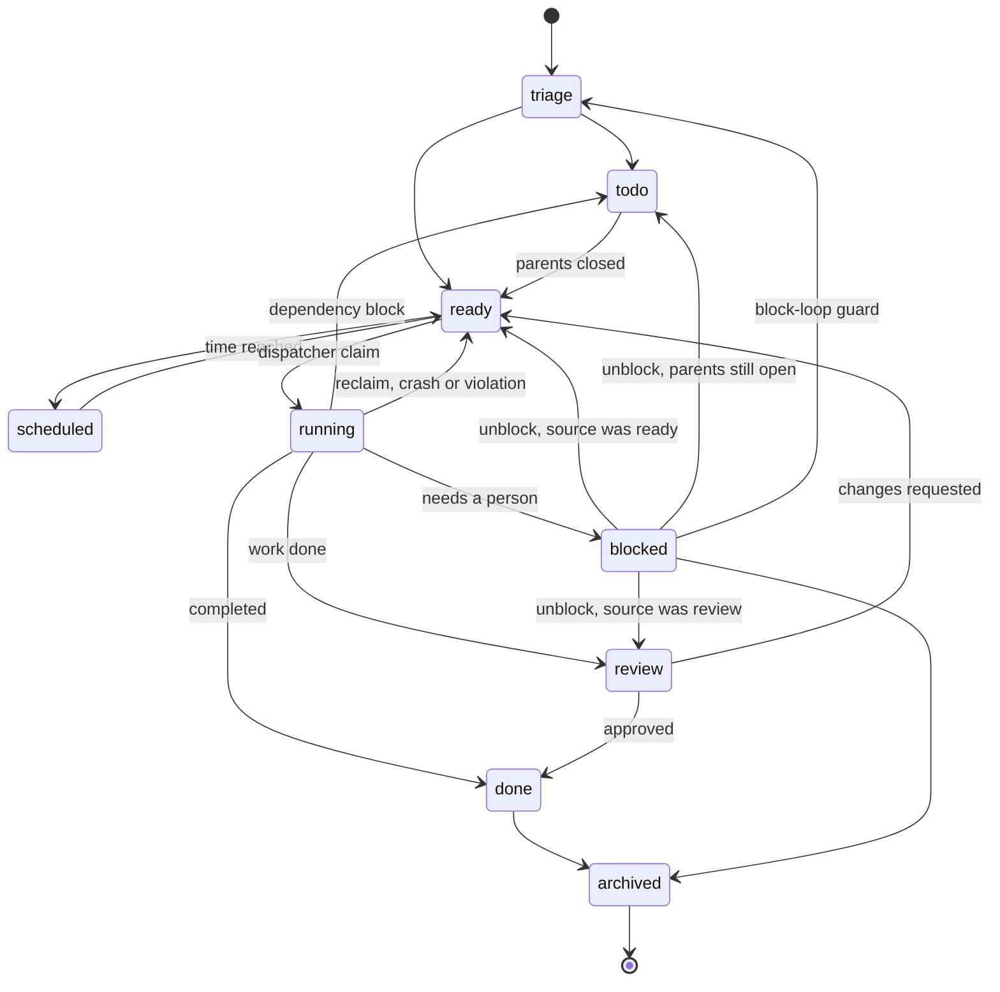

# plugin-kanban: design specification

A task board that dispatches work to Claude Code and lets the operator watch the agent work
and talk to it while it does.

This document is the design authority and the handoff artifact. It is written for an
implementer with no prior context. What it says the plugin should be, the plugin is not all of
yet: [open-problems.md](open-problems.md) is the register of the gap, and it is the file to
read before deciding what to build next. Every capability is specified here from first principles;
nothing requires reading another product, another repository or another document.

Target: a plugin for `dyarchia-desktop`, an Electron shell at
`C:\Users\Usuario\ai-department\dyarchia\dyarchia-desktop` whose features are all runtime
plugins.

## Index

- [1. Purpose and origin](#1-purpose-and-origin)
- [2. Capability inventory](#2-capability-inventory)
- [3. Host contract](#3-host-contract)
- [4. Repo conventions](#4-repo-conventions)
- [5. Verified facts about the Claude Code CLI](#5-verified-facts-about-the-claude-code-cli)
- [6. Answers from phase 0](#6-answers-from-phase-0)
- [7. Architecture decisions](#7-architecture-decisions)
- [8. Data model](#8-data-model)
- [9. State machine](#9-state-machine)
- [10. The worker](#10-the-worker)
- [11. Termination and the evidence ladder](#11-termination-and-the-evidence-ladder)
- [12. Failure taxonomy](#12-failure-taxonomy)
- [13. The dispatcher](#13-the-dispatcher)
- [14. Watch and talk](#14-watch-and-talk)
- [15. IPC contract](#15-ipc-contract)
- [16. The renderer](#16-the-renderer)
- [17. Files](#17-files)
- [18. Phases](#18-phases)
- [19. Verification](#19-verification)
- [20. Traps](#20-traps)
- [21. Executor portability, and what it unlocks](#21-executor-portability-and-what-it-unlocks)

## 1. Purpose and origin

The board exists to hold work that a single conversation cannot: work that outlives a session,
that may need a human decision partway, that is picked up more than once, and that must still
be explicable afterwards.

The design was distilled from the task board of another agent product, which was studied in
detail and is not otherwise involved. No code, dependency, process or installation from that
product is used. What was taken is the design: a durable board, a worker contract, a failure
taxonomy, and the discipline of telling a dead worker apart from a thinking one. Section 2
records the full capability set that was studied so that none of it is lost by accident, and
says for each item whether it is in scope, deferred or dropped.

Three constraints shaped the result and should not be relaxed without a conversation:

- No external agent runtime is installed alongside this. The board owns its execution.
- The board is local and single-machine.
- Exactly one process writes the board: this plugin's main module.

The requirement that drove the shape of the UI: **the operator must be able to see what the
agent is doing and talk to it while it works.**

## 2. Capability inventory

The reference system's board is specified here in full, so an implementer can judge the
tradeoffs without access to it. Each row says whether this plugin reproduces it.

### 2.1 Core model

```text
CAPABILITY              WHAT IT MEANS                                  STATUS
----------------------  ---------------------------------------------  ----------
Card                    title, body, one assignee, status, priority    IN SCOPE
Dependencies            parent to child edges; a child is not          IN SCOPE
                        dispatchable until every parent is closed.
                        Cycles rejected server side
Comments                an append-only thread on the card. This is     IN SCOPE
                        the protocol between operator and agent: a
                        respawned worker reads the whole thread as
                        part of its context
Attachments             files bound to a card, surfaced to the         DEFERRED
                        worker as absolute paths so it reads them      phase 5
                        with its own tools
Runs                    one row per attempt, with start, end,          IN SCOPE
                        outcome, summary and error. Full history
                        kept; the card points at the in-flight one
Priority                integer, sortable, drives claim order          IN SCOPE
Idempotency key         prevents a duplicate card from an automated    DROPPED
                        creator                                        no automated
                                                                       creators here
Tenants                 a soft string namespace within one board       DROPPED
                                                                       single operator
Multiple boards         hard isolation: separate storage, separate     IN SCOPE
                        worker scope, cross-board links forbidden      phase 1, see 8.1
```

### 2.2 Workspaces

```text
scratch      a fresh temporary directory, DELETED on completion. Only files the       IN SCOPE
             worker explicitly declares as artifacts are copied out first. A
             declared artifact that is missing keeps the card in flight so the
             worker can correct the path
dir:<path>   an existing shared directory, preserved. MUST be absolute; a relative    IN SCOPE
             path is refused at dispatch because the resolution base is the
             dispatcher's, not the operator's, which is a confused-deputy vector
worktree     a git worktree, preserved                                                DEFERRED
                                                                                      phase 5
```

The scratch rule is worth keeping even though it surprises people. It forces the worker to
declare what mattered, which is the difference between a run that produced an artifact and a
run that merely produced a directory.

### 2.3 Dispatch and worker lifecycle

```text
CAPABILITY               WHAT IT MEANS                                  STATUS
-----------------------  ---------------------------------------------  ----------
Dispatcher tick          a loop that reclaims dead claims, promotes     IN SCOPE
                         cards whose parents closed, claims the
                         highest-priority ready card, and spawns
Atomic claim             two dispatchers cannot take the same card      IN SCOPE
Worker lane              a lane supplies three things: an assignee      IN SCOPE
                         string, a spawn mechanism, and a lifecycle     simplified
                         terminator. An unresolvable assignee leaves    to one lane
                         the card alone rather than running it
Injected guidance        the worker is told, in its own prompt, how     IN SCOPE
                         to read its card and how to finish
Terminal verb            the worker must end with exactly one of        REDESIGNED
                         complete, request review, or block. Exiting    see section 11
                         cleanly without one counts as a crash
Concurrency caps         board-wide and per-assignee limits on          IN SCOPE
                         simultaneous runs                              board-wide only
Per-card overrides       model, effort, retry limit, skills, runtime    IN SCOPE
                         cap, budget
```

### 2.4 Failure handling

Every item here is in scope. This is the part most worth reproducing, because each entry is a
production incident someone already paid for.

```text
Claim expiry           a claim has a TTL, but expiry alone never reclaims. A worker
                       that is alive gets its claim EXTENDED. Only a worker proven
                       gone is reclaimed. This single distinction is the most
                       valuable thing in the whole design
Crashed worker         the process is gone with no completion signal
Stale run              alive but producing nothing for an hour, past a four hour
                       wall clock, then terminated and requeued
Max runtime            a hard per-run wall clock, terminate on breach
Stranded in ready      a card sitting claimable but unclaimed past a threshold is a
                       diagnostic, not an action
Orphan reconcile       the board says running, but no worker exists: requeue
Circuit breaker        N consecutive failures on one card auto-blocks it
Protocol violation     a bounded retry count for workers that exit without signalling,
                       then block
Respawn guard          do not relaunch after a quota or auth error, after a recent
                       success, or while an external review is pending
Block routing          a block carries a kind. A dependency block returns to the
                       waiting state and resumes by itself. Only the kinds needing a
                       person go to blocked
Unblock restores       unblocking returns the card to the phase it came from, review
the source phase       or ready, never straight to triage
Block loop guard       after N cycles of block, unblock, same block kind, the card
                       goes to triage instead. The counter survives unblock and
                       resets only on success. A deterministic guard that a task body
                       cannot opt out of
```

### 2.5 Review and orchestration

```text
CAPABILITY            WHAT IT MEANS                                     STATUS
--------------------  ------------------------------------------------  ----------
Same-card review      a card moves to review with a summary; a          IN SCOPE
                      reviewer approves or requests changes, which      phase 4
                      returns it to the implementer WITHOUT counting
                      as a block
Automatic reviewer    a reviewer is dispatched automatically            DEFERRED
                                                                        opt-in later
Goal mode             a judge evaluates each turn against the card's    DEFERRED
                      title and body as acceptance criteria and feeds   phase 6
                      a continuation prompt back into the same
                      session until it agrees or a turn budget runs
                      out. Budget exhaustion BLOCKS rather than
                      silently exiting
Swarm                 one command builds a graph atomically: a root     TODO
                      card as a shared blackboard, N parallel           see 2.8
                      workers, a verifier gated on all of them, and
                      a synthesizer gated on the verifier
Auto-decompose        an auxiliary model turns a triage card into a     DEFERRED
                      dependency graph of child cards                   phase 6
Orchestrator role     a designated owner of the root card after a       DROPPED
                      fan-out
```

Swarm is dropped rather than deferred because its value depends on auto-decompose and on
multiple distinct worker identities, neither of which exists in the first version. Reintroduce
it only if fan-out becomes routine. The parts of it worth keeping in mind if it returns: the
graph must be committed atomically, so a reader sees either no swarm or the whole topology,
and the shared blackboard is structured comments on the root card.

### 2.6 Surfaces and integration

```text
CAPABILITY             WHAT IT MEANS                                   STATUS
---------------------  ----------------------------------------------  ----------
Agent-facing tools     the model manipulates the board through         REPLACED
                       explicit tools rather than shell commands,      see below
                       so it works even where the CLI is absent
Command line           roughly forty verbs over the board              DROPPED
Board view             columns, lanes, drag and drop, bulk actions,    IN SCOPE
                       a detail drawer with run history and the        the panel
                       comment thread, and a manual dispatch button
Notifications          terminal events delivered to a chat, with       DROPPED
                       three modes: notify only, notify and wake the   no chat
                       agent, or wake only                             surface
Deliverable mode       declared artifacts ride the completion          IN SCOPE
                       notification as real files                      as card
                                                                       attachments
Scheduled start        a card parked until a time                      IN SCOPE
                                                                       phase 4
Diagnostics            a queryable list of board health problems       IN SCOPE
```

The agent-facing tool surface is replaced rather than reproduced. The reference system exposes
board tools to the model because its workers may run on a remote backend with no access to the
board's storage. Here the worker is a local Claude Code session and the board is a local file
owned by the plugin. The worker does not manipulate the board: the plugin reads the worker's own
transcript and derives board state from it. That removes a whole class of failure, a worker that
lies about its own state, because the completion signal is emitted by the CLI rather than by the
model. See section 11.

The one capability that would genuinely be lost is fan-out discovered mid-work: an agent that
finds four new problems while doing a job cannot file them as cards. That is recovered without
giving the model any tools at all, by letting the terminal block it already writes carry a
`followups` array:

```json
{ "outcome": "blocked",
  "blockKind": "needs_input",
  "summary": "...",
  "artifacts": [],
  "followups": [
      { "title": "Raise coverage on QuoteLineTriggerHandler", "body": "..." },
      { "title": "Isolate the managed-package dependency", "body": "..." }
  ] }
```

The plugin creates those cards on completion, as children of the card that proposed them. The
agent proposes, the plugin disposes, and the agent still cannot assert anything about board
state. Cost is one more field in something already being parsed.

### 2.8 Deferred: swarm

Cheap to add later, so it waits. In the reference system each parallel worker is a different
identity with its own model, memory and configuration, so a swarm is five specialists. Here
there is one worker kind, so a swarm is five identical cards and the command is a
card-creation macro. It also depends on auto-decompose. Revisit after that lands.

If it returns, two properties are load-bearing: the graph must be committed atomically so a
reader never sees half a topology, and the shared blackboard is structured comments on the
root card.

**Swarm and executor portability are the same question asked twice.** What made a swarm worth
having was worker diversity, and worker diversity is exactly what section 21 is about. Read
them together: a swarm over one executor is a macro, a swarm over several is a panel of
specialists that disagree usefully. Neither should be built before the other.

### 2.9 Things deliberately not reproduced

```text
Multi-machine boards      the reference system is explicit that its board is single-host
                          by design: local storage, host-local workers, host-local
                          liveness. Two hosts means two boards
Automatic assignment      user space
Budgets and governance    user space, except the per-run cost cap in section 10
Org-chart views           user space
```

## 3. Host contract

The plugin runs inside `dyarchia-desktop`. Read `docs/plugins.md` in that repo before starting;
this is the summary that matters.

A plugin is a folder holding a manifest and one or two bundles.

```text
dyarchia-plugin.json    manifest: id, name, version, renderer, and either main or python
dist/renderer.js        REQUIRED. ESM bundle running in the renderer
dist/main.js            optional. Node module imported into the Electron main process
```

The renderer bundle exports `activate(ctx)` and receives:

```ts
interface PluginContext {
    readonly pluginId: string
    token(name: string): string
    registerPanel(descriptor: PanelDescriptor, mount: PanelMount): void
    invoke(channel: string, ...args: unknown[]): Promise<unknown>
    on(channel: string, listener: (...args: unknown[]) => void): () => void
    onThemeChange(listener: () => void): () => void
}

type PanelMount = (container: HTMLElement, handle: PanelHandle) => PanelDispose | void
```

The main module exports `activate(ctx)` and receives:

```ts
interface PluginMainContext {
    readonly pluginId: string
    handle(channel: string, handler: (...args: unknown[]) => unknown | Promise<unknown>): void
    broadcast(channel: string, ...args: unknown[]): void
}
```

Channels are namespaced by the shell: `handle('board')` becomes `plugin:kanban:board`. Never
write the full channel name inside a plugin.

Constraints that shape the design:

```text
The renderer is PLAIN DOM. The shell is React and dockview; neither is exported and
    neither is part of the contract. What a plugin gets is a DOM node and a teardown function
An invoke has a 60 second timeout. Anything long runs on a timer and reports by broadcast
A broadcast reaches every window
install-plugins.mjs copies the manifest, dist/ recursively, and for a Python plugin a
    SINGLE file. Nothing else: no package.json, no src/, no sibling modules
A main module is imported ONCE at startup, so changing it requires restarting the app.
    A renderer change needs only a window reload. The shell's watch mode covers neither
```

## 4. Repo conventions

```text
Source style     4-space indent, no semicolons, single quotes, NO comments in source,
                 identifiers in English
All files        everything written to disk is in English, commit messages included
ESM              "type": "module" everywhere
Prose docs       headings, bullets, mermaid, and ASCII tables. NEVER markdown pipe tables
Renderer         plain DOM, see section 3
Design system    dya-* classes are ambient in the document. Use them first. Never restyle
                 a dya-* selector. No literal colour, radius, duration or font anywhere.
                 Read docs/ui.md in full
Branches         cut feature/* from develop BEFORE the first edit. Never merge on your own
                 judgement: finished work waits on its branch until asked
Commit bodies    long and evidentiary: the measurement or failure that forced the change,
                 the alternative, and what was deliberately left alone
```

Precedent files to read before writing the equivalent:

```text
packages/plugin-eforoi/docs/design.md        how a design doc here is written, and the
                                             source of traps 1 and 2 in section 20
packages/plugin-eforoi/src/renderer.ts       a non-trivial plain-DOM panel: the el()
                                             helper, state in the mount closure, a card
                                             map, timer maps, one ctx.on subscription,
                                             and a dispose that tears all of it down
packages/plugin-eforoi/src/menu.ts           the menu this plugin copies, see section 17
packages/plugin-eforoi/src/styles.ts         column and scroll idioms; the status-dot
                                             precedent at lines 203-213
packages/plugin-eforoi/src/providers/cli.ts  spawning a CLI agent: argv construction,
                                             prompt over stdin, JSONL parsing, aborts
packages/plugin-terminal/src/ptyhost.ts      a pty in a utilityProcess, for phase 7
scripts/install-plugins.mjs                  what actually reaches the packaged app
apps/shell/src/main/plugins.ts               discovery, IPC namespacing, main activation
```

## 5. Verified facts about the Claude Code CLI

Checked on the target machine. The verifying command is given so this can be rechecked when
the CLI updates. **Do not trust any of this after a CLI upgrade without rerunning it.**

### 5.1 Background agents are built in

Verified with `claude --help`.

```text
claude --bg            start detached, return immediately, print a short id. Survives the
                       parent process. With --resume <id>, continues that session in the
                       background under the same id
claude agents --json   print active sessions as a JSON array and exit. Documented as "for
                       scripting; does not require a TTY". --all adds completed ones,
                       --cwd filters by the directory a session started under
claude logs <id>       print a background session's recent terminal output
claude attach <id>     open it in a terminal; it keeps running either way
claude stop <id>       stop it, conversation kept and resumable
claude rm <id>         delete it; works on already-exited sessions
claude respawn <id>    restart it under the current CLI version
```

This is why the plugin needs no daemon of its own and tracks no PIDs. Durability across an app
restart is provided by the CLI, not by us.

### 5.2 The shape of `claude agents --json`

Re-verified on 2026-09-07 against CLI 2.1.263. Two record shapes, discriminated by `kind`.
**Both fields an earlier draft asserted about them were wrong**, so the corrected shape is
below and the old claims are named in 5.6.

```json
{
    "pid": 32792,
    "id": "440e7692",
    "cwd": "C:\path\to\repo",
    "kind": "background",
    "startedAt": 1788806905452,
    "sessionId": "440e7692-75c4-4ae2-b40c-19244478bb51",
    "name": "kanban-probe",
    "status": "idle",
    "state": "done"
}
```

```json
{
    "pid": 20688,
    "cwd": "C:\path\to\repo",
    "kind": "interactive",
    "startedAt": 1788774744368,
    "sessionId": "c2e51d1a-9bdf-42f3-ba3c-f07d2d2021c6",
    "name": "another-name"
}
```

```text
id            the first 8 characters of sessionId. Present on BACKGROUND records only;
              an interactive record carries no `id` at all
kind          'background' carries `state`, `status` and, while it has a process, `pid`.
              An earlier draft said background records carry no pid. They do
startedAt     epoch milliseconds
state         MEASURED vocabulary, widened on 2026-09-08 against a live board:
              'working', 'blocked', 'done', 'stopped', 'failed'. The first two are
              the only ones that mean a worker is still there. An unrecognised value
              is NOT a guess in either direction: liveness answers 'unknown', the
              claim is held, and the health strip says so
status        a second axis the earlier draft did not know about: 'busy' while a turn is
              running, 'idle' otherwise. 'blocked' + 'idle' is the pair that means a
              person is being waited on
cwd           the directory the session started under, which is what --cwd filters on
scope         it lists EVERY session on the machine, including the operator's own
              terminals and unrelated projects. Filter to the plugin's own set of session
              ids. The absence of an id you did not create means nothing
```

**`state: 'blocked'` is the permission prompt.** Measured: a `--bg` session started with
`--permission-mode manual` and asked to run a shell command goes `working`/`busy`, then
settles at `blocked`/`idle` and stays there indefinitely with nobody attached. That answers
one of section 6's questions and it is better news than the question expected: the board does
not have to infer a permission stall from transcript mtime, because `agents --json` says so
directly, on the same call the reconciler already makes.

### 5.7 A background session is confined to a git worktree

Measured on 2026-09-07, and it is the largest single finding of phase 3, because the design
had this capability filed as OPTIONAL and deferred to phase 5.

A `--bg` session in a git repository **cannot edit the checkout it started in**. The Read
succeeded; the first Edit came back with:

```text
This background session hasn't isolated its changes yet. Call EnterWorktree first so edits
land in a worktree instead of the shared checkout, then retry this edit using the worktree
path (a path inside a linked git worktree).
```

The session then sat at `state: 'blocked'` waiting for a person, having done nothing.

Passing `-w/--worktree <name>` at launch fixes it and is what this plugin does:

```text
The CLI creates <repo>/.claude/worktrees/<name> on branch worktree-<name>, and LOCKS it
The session's cwd becomes that worktree, so its transcript directory is mangled from the
    WORKTREE path, not the project path
The operator's checkout is never touched. Measured: the worker appended a line and
    committed it, and the main checkout was still three lines afterwards
`claude rm <id>` REFUSES a session whose worktree holds unmerged commits, saying so:
    "kept <id> - 2 unpushed commits on worktree-kanban-b7820484". Never assume rm succeeded
```

The consequence for the board is that a `dir` workspace on a git project is really a
worktree workspace, and the operator has a branch to land at the end. That is why a run that
completes inside a worktree lands its card in `review` rather than `done`: something needs a
person, and pretending otherwise would lose the branch.

`agents --json` reports the ORIGINAL cwd for about a second after the launcher exits, before
the session switches into its worktree, so reading the worktree path off that record is a
race. The path is derivable from the name passed to `-w`, so derive it and wait for the
directory to appear instead.

**Measured again on 2026-09-08, with a real card run from a launched dyarchia, and it cost
this design one of its assumptions: a worker does NOT commit unless the brief says so.** The
run completed, the card landed in review, and the branch was empty. `count.md` sat in the
worktree as an untracked file. "The operator has a branch to land" was a fiction for exactly
as long as the brief left the word out, and 10.5 now says COMMIT in those words.

The lock is the other half of the same story, and it decides how a worktree may be removed:

```text
git worktree list --porcelain reports the lock on a `locked` line, with the reason the CLI
    wrote: "claude session kanban-<8> (pid <n>)"
git worktree remove REFUSES a locked tree, and refuses a dirty one, and says which
So removal is: refuse if a worker is in it, refuse if it is dirty because uncommitted work
    is not a board's to discard, refuse if the branch is not an ancestor of HEAD, and only
    then unlock, remove, and delete the branch with `branch -d`, which refuses on its own
    if the history says otherwise
```

Measured against three worktrees the CLI had created and locked on a live board: the dirty
one was refused, the same one after `git clean` was unlocked and removed with its branch, and
the one whose work had been committed was refused as unlanded.

**Telling the worker to commit is necessary and not sufficient**, and the next run said why: a
commit is a `Bash` call, `acceptEdits` allows edits and asks about commands, so an unattended
worker on the default permission mode edits happily and then sits waiting for a person to let
it run `git commit`. The same is true of running the tests it was asked to run. A card whose
work needs commands has to say so in its permission mode, which is the reason that control is
per card and now reachable from the drawer.

**The board does not commit on the worker's behalf, and that was decided after building it.**
A dispatcher that committed whatever a run left was written, measured working end to end, and
then removed: the worktree, the session and the branch belong to the CLI, the agent is the one
running in it, and a board that quietly makes commits in the operator's repository has stopped
being a board. Nothing is lost by declining. Neither this plugin nor `claude rm` will remove a
worktree that holds uncommitted changes, so the work stays exactly where the worker left it and
the board's job is to SAY so: the card sits in review, and the worktrees menu reads "it holds
changes nobody committed". The operator decides, with the terminal drawer right there to tell
the worker to commit, or the permission mode on the card to let it commit unattended next time.

The circle it does own, measured end to end on a live board: the worker's branch was merged by
the operator, and the board then unlocked the worktree, removed it, and deleted the branch,
with the work surviving in the project.

`claude rm` turns out to apply the same two rules, which is a good sign for them. Cleaning up
the five sessions that live board had produced, it removed three and refused two, in its own
words: "kept c94ea457 - worktree has uncommitted changes" and "kept 17cb2391 - 2 unpushed
commits on worktree-kanban-cd6e022a". It also offers an escape hatch this plugin deliberately
does not use, `--discard-unpushed <commit>@<worktree-id>`, which throws the commits away.

### 5.8 The brief goes inline, and why the file indirection was not enough

An earlier draft put the brief in a file and passed a short instruction pointing at it. That
is correct about the command line and wrong about permissions: with `-w`, the session's cwd is
the worktree while the brief sits in the main checkout, so the first thing the worker does is
ask permission to read a file outside its working directory, and it blocks there with nobody
attached.

The brief is therefore passed **inline as the positional prompt** whenever it is under 8000
characters, which is safe even where the CLI resolves through `cmd.exe` and its 8191 limit.
The file is still written, because the operator wants to read it and because a brief over the
limit still needs somewhere to live.

### 5.9 The worker inherits the parent process environment

If dyarchia is launched from inside a Claude Code session, its workers inherit that session's
variables and fail with "Not logged in - Please run /login", because `ANTHROPIC_BASE_URL`
points at a host proxy the child cannot authenticate against. Measured, twice, before the
cause was found.

Every spawn here therefore strips the variables that identify a PARENT session -
`CLAUDECODE`, `CLAUDE_CODE_ENTRYPOINT`, `CLAUDE_CODE_SESSION_ID`, `CLAUDE_CODE_HOST_SESSION_ID`,
`CLAUDE_CODE_CHILD_SESSION`, `CLAUDE_CODE_MESSAGING_SOCKET`, `CLAUDE_CODE_SDK_HAS_HOST_AUTH_REFRESH`,
`CLAUDE_CODE_OAUTH_SCOPES`, `CLAUDE_AGENT_SDK_VERSION`, `CLAUDE_PID`, `CLAUDE_EFFORT` - and
drops `ANTHROPIC_BASE_URL` and `ANTHROPIC_AUTH_TOKEN` only when the host-auth marker was
present, so a user who legitimately points at Bedrock or a gateway keeps their setting.

### 5.10 `blocked` does not mean the worker is still working

Phase 4 found the one place the phase 0 reading of `state` was too generous. Three
measurements, all on real runs:

```text
SITUATION                                     state       status
--------------------------------------------  ----------  --------
a permission prompt, nobody attached          blocked     waiting
a turn that finished cleanly                  done        idle
a turn that finished having DECLARED a block  blocked     idle
```

The third is the trap. A worker that finishes by saying "a person has to decide this" leaves
its session sitting at `blocked`, which the liveness rule reads as ALIVE, so a card whose
worker had already said everything it was going to say stayed `running` forever. Measured: the
card sat there through several ticks with a complete terminal block on disk.

`status` does not save it either. `blocked`+`waiting` and `blocked`+`idle` are close enough
that branching on it would be guessing about a vocabulary section 5.2 already says is not
known to be exhaustive.

**So a declared terminal block outranks liveness.** The reconciler reads the transcript first
on every tick, and if it holds a terminal block AND the turn has ended, it resolves the card
whatever `agents --json` says, then calls `claude stop` on the session so it does not sit idle
holding a slot. Liveness answers "is it still working"; only the worker can say "I am
finished", and the CLI-emitted `turn_duration` is what stops that being a bare cooperation
contract.

The rung order in section 11 is unchanged in spirit and clearer in practice:

```text
1. a terminal block plus a finished turn    resolve, whatever liveness says
2. liveness DEAD                            walk the rest of the ladder
3. liveness ALIVE or UNKNOWN                keep the claim, touch nothing
```

### 5.11 A scratch workspace under userData did not work, and the reason is NOT settled

Phase 5 put a card in a `scratch` workspace for the first time, and every launch failed:

```text
Couldn't start a background session (working directory no longer exists or is not
accessible: C:\Users\Usuario\AppData\Roaming\dyarchia\kanban\boards\p5\workspaces\<id>)
```

The directory existed, and Electron had just created it and stat'd it successfully.

**An earlier version of this section concluded that the CLI refuses any working directory
under AppData. That conclusion was wrong, and it is worth explaining how, because the same
trap is waiting for the next person who measures anything on this machine.**

Every measurement "from a shell" in this document was taken from a shell running inside the
Claude desktop app, which is an MSIX package. Writes that shell makes to `AppData\Roaming` are
redirected into the package container. Verified directly:

```text
write  ~/AppData/Roaming/marker.txt        from that shell
read   ~/AppData/Local/Packages/Claude_<id>/LocalCache/Roaming/marker.txt   the same file
```

The transcript directory names prove the sessions followed the redirect: a session launched
from that shell into `AppData\Roaming\dyarchia\...` recorded its cwd as
`...\AppData\Local\Packages\Claude_<id>\LocalCache\Roaming\dyarchia\...` and ran perfectly
happily. That path is itself under AppData, which is the counter-example the earlier
conclusion needed and did not get.

So what is actually established is narrower:

```text
ESTABLISHED   A directory created by the Electron process at
              userData/kanban/boards/<slug>/workspaces/<id> was refused by the CLI as
              "no longer exists or is not accessible"
ESTABLISHED   The same apparent path, when the directory was created by the packaged
              shell instead, was accepted
ESTABLISHED   Sessions run without complaint in a directory under AppData, as long as
              it is the one the resolving side can see
NOT KNOWN     Whether the CLI has any policy about AppData at all. The evidence now
              points at a path-virtualization mismatch between the process that
              created the directory and the process that resolved it, rather than at
              a refusal
NOT KNOWN     Whether this reproduces at all on a machine where dyarchia is launched
              normally, outside any package container
```

Scratch workspaces are at `<tmpdir>/dyarchia-kanban/<slug>/<cardId>` and should stay there,
but for a reason that does not depend on any of the above: section 2.2 calls a scratch
workspace "a fresh temporary directory", userData is not temporary, and the system temp
directory is outside every redirect either way. What stays in userData is what has to outlive
the run, which is the board and the harvested artifacts under `attachments/<cardId>/`.

**Measured again on 2026-09-08, against a dyarchia the operator had launched with `pnpm dev`
from an ordinary terminal, so the app itself was outside any container.** Two things were
settled and one was not:

```text
SETTLED    The redirect covers READS as well as writes. That shell read
           AppData\Roaming\dyarchia\DevToolsActivePort and got a file naming the
           browser guid 112000ee-..., from a launch the day before, while the app
           running at that moment was exposing d40dd86b-... on the same port. So a
           shell inside the package cannot see the real userData AT ALL, and no
           claim about a path under AppData\Roaming may be taken from one
SETTLED    ~/.claude is NOT under the redirect: its subdirectories showed writes
           from that same minute, made by processes outside the container. Every
           fact in this section that rests on the transcripts or on the session
           registry therefore stands as measured
OPEN       Whether the CLI accepts a working directory under userData when the
           directory is created by an unpackaged process and resolved by one. It
           cannot be measured from inside the package, and nothing in the plugin
           depends on the answer since scratch workspaces live in tmpdir
```

The app is the only oracle left for anything under AppData. In dev mode it exposes a
DevTools port, so a channel can be invoked through `window.dyarchia.invoke` from outside and
answers from the real filesystem.

The open question is in [open-problems.md](open-problems.md); it is not blocking, and it is
not to be quietly re-answered by guessing.

Two smaller facts from the same phase, both solid:

```text
A finished session still holds its working directory open. `rm` on a reclaimed scratch
    workspace fails until the session is stopped, so the reclaim calls `claude stop` first and
    then retries the removal a few times before giving up and saying so on the run
A worker asked to declare an artifact it never wrote does exactly that. The board catches it:
    the run is recorded as a violation naming the missing path, a comment goes on the card so
    the next run reads it in its brief, and the card does NOT complete
```

### 5.12 `~/.claude/sessions/` is a process registry, not the transcripts

Worth stating because the name invites the wrong guess. There are two directories and they
hold different things:

```text
~/.claude/sessions/<pid>.json        one file per LIVE session: pid, sessionId, cwd, name,
                                     kind, version, and a messaging socket path. Paired with
                                     a <pid>.<hash>.key. This is the state behind
                                     `claude agents --json`, and it disappears with the process
~/.claude/projects/<mangled-cwd>/    the conversation transcripts, one <sessionId>.jsonl per
                                     session. This is what the board reads for progress, the
                                     terminal block and the history tab
```

The registry is tempting as a cheaper liveness source than spawning `claude agents --json`
every tick, and it should be resisted: it is undocumented on-disk state whose shape can change
without notice, whereas `--json` is documented as being for scripting. The seam of section 21
exists so that this choice is made in one file, and it is made in favour of the documented
interface.

### 5.13 A stopped session reads as alive, and the card never lands

Found on 2026-09-08 by running a real card from a dyarchia the operator had launched, stopping
it from the panel, and watching the card sit in `running` for ten minutes afterwards while the
tick kept emitting progress for a worker that no longer existed.

```text
WHAT WAS DONE     the card was stopped from the drawer. `claude stop` worked: the session
                  left `claude agents --json` entirely
WHAT WAS SEEN     `claude agents --json --all`, which is what the plugin actually calls,
                  still listed it with state 'stopped'
WHY IT MATTERED   liveness read anything that was not 'done' as alive, so 'stopped' was
                  alive, reconcile took the `continue` at the bottom of its loop, and the
                  card was locked in `running` with no way back except editing the file
```

`--all` is the right flag: without it a session that has ended is invisible, and the plugin
needs to tell "ended" apart from "never existed" to close a run honestly. What was wrong was
the reading. Liveness now answers from two measured sets: 'working' and 'blocked' are alive,
'done', 'stopped' and 'failed' are dead, and anything else is 'unknown' rather than a guess in
either direction, which is what the three-valued answer was built for. This is 5.10's mistake
in the other direction: there a state that meant "finished" was read as alive because the
session was still listed, here a state that means "finished" was read as alive because the
list was not consulted carefully enough.

### 5.6 What the earlier draft got wrong

Measured on 2026-09-07 against CLI 2.1.263. Each of these invalidated a decision below, and
each is corrected in place rather than annotated, so this document stays readable as state.

```text
CLAIM                                       MEASUREMENT
------------------------------------------  --------------------------------------------
`--session-id` lets the caller choose a     FALSE for --bg. The CLI prints
background session's id, so the card id     "warning: --bg manages the session id;
can be the session id (old 7.3)             ignoring --session-id" and assigns its own.
                                            The id must be read back, see 7.3
The transcript carries a                    FALSE. That record belongs to
{"type":"result"} record, and it is         --print --output-format stream-json. A real
tier 2 of the evidence ladder (old 11)      session's transcript has no `result` record
                                            at all. Rebuilt in 11
The transcript carries accumulated cost     FALSE. It carries `message.usage` token
in USD                                      counts and no dollar figure anywhere. See 10.2
A background record carries `state` and     FALSE. It carries both, plus `status`
no `pid` (old 5.2)
`--permission-mode` is honoured by --bg     TRUE, and it is not a print-only flag. The
                                            transcript records the mode it started with
The prompt reaches the session somehow      ANSWERED. `claude [options] [prompt]`: it is a
(old section 6)                             positional argument, which is what makes the
                                            brief-file indirection of 10.4 load bearing
```

The lesson worth keeping: every one of these was a claim about a tool the design does not
own, and four of six were wrong. Re-run the probes after a CLI upgrade rather than trusting
this table.

### 5.3 Print mode exists, and this design does not use it

Verified with `claude --help`. Recorded because an earlier draft was built on these flags and
because a future unattended batch mode would need them, but **none of them is used**: they all
require `--print`, and a worker here is a real session, not a batch invocation. See 10.1.

```text
--input-format stream-json      realtime streaming input, only with --print
--output-format stream-json     realtime streaming output
--include-partial-messages      partial chunks as they arrive
--replay-user-messages          re-emit stdin user messages on stdout, for acknowledgment
--permission-prompts host|none  who answers permission prompts. 'host' puts them on the
                                stream for the caller to answer
--max-budget-usd <amount>       cap spend for the run
--session-id <uuid>             the caller chooses the session id
--verbose                       REQUIRED alongside stream-json with --print
--fork-session                  on resume, create a new id instead of reusing it
--add-dir, --effort, -n/--name, --model, --permission-mode, -w/--worktree
```

### 5.4 A Node main module can hook shutdown

Verified by reading `apps/shell/src/main/index.ts:62`, which already calls
`app.on('will-quit', () => stopPythonPlugins())`. A plugin main module runs inside the Electron
main process and can register the same hook.

A Python plugin cannot: it is killed with `TerminateProcess`, so no `atexit` and no `finally`
runs. This asymmetry is one reason the main module here is Node.

### 5.5 Windows process facts, measured

Recorded because they are counter-intuitive and expensive to rediscover. They apply wherever
this plugin supervises a process directly instead of going through `claude agents`.

```text
os.kill(pid, 0) on Windows is NOT a liveness query. It is a signal delivery attempt with
    side effects, and it lies in both directions. With a console attached, a dead and
    already-reaped pid raised no exception, which would report a crashed worker as alive
    forever. In a GUI process with no console, which is exactly a plugin here, every probe
    raises, which would report live workers as dead. Never use it
OpenProcess succeeding does not mean alive: a zombie handle opens fine
An exit code of 259 is indistinguishable from STILL_ACTIVE. Use WaitForSingleObject as the
    truth and read the exit code only after WAIT_OBJECT_0
Access denied is not death
Killing a process is not killing its tree. The CLI spawns git, node and shells. Use
    taskkill /T /F, after verifying identity
This shell runs inside a job object with LimitFlags 0x3000, meaning SILENT_BREAKAWAY_OK
    plus KILL_ON_JOB_CLOSE. A detached grandchild survived three seconds past its parent's
    exit. Under Electron the flags may differ and MUST be probed at runtime
```

The rule that follows is section 12.1: liveness has three values, never two.

## 6. Answers from phase 0

Measured on 2026-09-07 against Claude Code 2.1.263 on the target machine, by launching real
background sessions in a scratch directory and reading `claude agents --json`, the transcripts
and `claude logs`. The probe sessions were removed afterwards with `claude rm`.

```text
QUESTION                                          ANSWER
------------------------------------------------  ------------------------------------
How does a --bg session receive its initial       As a positional argument:
prompt?                                           `claude [options] [prompt]`. There is
                                                  no stdin convention, so the brief-file
                                                  indirection of 10.4 is load bearing
What is the exact shape of the                    THERE IS NONE. No `result` record is
{"type":"result"} record in the transcript?       written by a real session; it belongs
                                                  to print mode. Section 11 is rebuilt
                                                  on `system`/`turn_duration` and on
                                                  `agents --json` instead
Does a --bg session honour                        YES, and it is not a print-only flag.
--permission-mode, and what does it do when       The transcript records a
a prompt arrives with nobody attached?            `permission-mode` entry with the mode
                                                  it started under. A prompt with nobody
                                                  attached moves the session to
                                                  `state: 'blocked'`, `status: 'idle'`
                                                  and holds there indefinitely
What is the full vocabulary of `state`?            Observed: 'working', 'blocked', 'done',
                                                  alongside a second field `status` with
                                                  'busy' and 'idle'. Still not proven
                                                  exhaustive, so still treat an unknown
                                                  value as opaque
Does `claude attach` behave correctly inside      YES. Measured in a standalone node-pty
node-pty, including resize and Ctrl+Z?            harness and then in the panel: the full
                                                  agent view renders, resize reflows it,
                                                  typed input reaches the session, and a
                                                  permission prompt was answered from the
                                                  drawer. node-pty throws
                                                  "AttachConsole failed" from its conpty
                                                  console-list agent on teardown, which
                                                  is contained by the utilityProcess and
                                                  is one more reason for it
Where does a --bg session started with an         `~/.claude/projects/<mangled-cwd>/
explicit cwd write its transcript?                <session-id>.jsonl`, the mangle being
                                                  every `:`, `\` and `/` replaced by `-`.
                                                  Because the id is no longer chosen by
                                                  the caller, resolve the path AFTER the
                                                  launch and fall back to a glob for
                                                  `*/<session-id>.jsonl` rather than
                                                  trusting the mangling rule
```

Two findings that were not questions, and cost more than the answers:

- **`--bg` ignores `--session-id`.** See 7.3, which is rewritten around it.
- **No cost in USD reaches the transcript**, only `message.usage` token counts. See 10.2.

Questions an earlier draft carried that are now moot:

```text
Can --bg be combined with stream-json?            MOOT. Print mode is not used
What does --permission-prompts host emit?         MOOT. Print-only flag, not used
Does --resume survive a mode switch?              MOOT. There is only one mode
Does `claude -p` read the prompt from stdin?      MOOT. Print mode is not used
Do background sessions write transcripts?         ANSWERED, yes, see the table above
```

## 7. Architecture decisions

### 7.1 The main module is Node, not Python

```text
CRITERION                     PYTHON                        NODE                   WINS
----------------------------  ----------------------------  ---------------------  -----
pty for `claude attach`       impossible, node-pty is Node  already a workspace     Node
                                                            dependency
Packaging                     ONE file only, see section 3  esbuild bundles a tree  Node
Interpreter dependency        `py -3` must exist            none                    Node
Shutdown hook                 none, killed outright         app.on('will-quit')     Node
High-frequency streaming      JSON lines over stdio         MessagePort fast path   Node
```

The first row alone settles it. Watching and talking to the agent happens through a pty running
`claude attach`, that is the product requirement rather than a preference, and `node-pty` is a
Node native module. A Python main module cannot drive it at any price. Everything else in the
table is corroboration.

### 7.2 No database

The reference system needs one because many processes write its board. Here exactly one
process writes: this main module. Claude Code sessions are observed, not participants. The
concurrency argument does not apply.

```text
TIER      FORMAT               WHY
--------  -------------------  --------------------------------------------------
State     one JSON file        dozens of cards, filtered and sorted in memory.
                               Atomic write by temp file plus rename
```

```text
TIER      FORMAT               WHY
--------  -------------------  --------------------------------------------------
Decisions JSONL per board       one line per thing the BOARD decided: created,
                                moved, promoted, claimed, blocked, violation,
                                crashed, gave_up, block_loop, commented,
                                attached, deleted. Append only, rotated at 2 MB.
                                It is what makes a card explicable after the fact
```

**There is no THIRD tier, and an earlier version of this section promised one.** It was going
to be a JSONL per run, "our copy of transcript-derived events", so a run stayed explicable
after the CLI forgot its session. That is a second transcript store next to the one Claude
Code already keeps, and keeping it is the board doing the runtime's job. What a board keeps is
what a board knows: the run row on the card, with its outcome, summary, tokens, artifacts,
branch and error, and the decision log above, which is the board's own reasoning and nobody
else's. The history tab reads the CLI's transcript live and says so when it is no longer
there.

The difference is worth stating once, because the two look alike from a distance. The
transcript is what the MODEL said and did, it is large, and Claude Code owns it. The decision
log is what the BOARD did about it, it is one short line per transition, and nothing else
records it. Losing the first costs a reading of the work; losing the second means nobody can
say why a card is where it is.

Claude Code stores its own sessions as `.jsonl` files, one per session, and that is the copy.

### 7.3 The card id is ours, the session id is the CLI's

**`--bg` refuses `--session-id`.** Measured: the flag is accepted, a warning is printed, and
the CLI assigns an id of its own. An earlier draft was built on choosing the id up front and
that whole line of reasoning is gone.

```text
warning: --bg manages the session id; ignoring --session-id
Starting background service...
backgrounded - 440e7692 - kanban-probe
```

So the launch is a two-step handshake rather than a naming:

```text
1. Spawn `claude --bg ...` and WAIT FOR IT TO EXIT. It is a launcher, not the worker: it
   prints and returns in about a second, and the session outlives it
2. Parse the short id out of that stdout. It is the only place the id is announced
3. Resolve the full sessionId from `claude agents --json`, matching the short id. Store
   both on the Run, alongside our own runId
```

What this costs, stated plainly, because an earlier draft chose the other design to avoid
exactly this:

```text
There IS a mapping now, and it can desynchronise. The mitigation is that both ends are
    recorded on the same Run row in the same write, and the short id is unambiguous because
    it was printed by the process we just ran
The transcript path is NOT known before the process starts. It is derived after the short id
    resolves, which is fine: nothing reads the transcript until there is something in it
A launch that prints nothing parseable is a failed launch, not a lost worker, because no
    session id means nothing was started under our control. Treat it as tier 5 of the
    evidence ladder and leave the card claimable
```

What survives from the original reasoning: `logs`, `stop`, `rm`, `respawn` and `--resume` all
take the id directly, and the transcript the CLI writes is named after it, so the native trace
and the board's are still the same artifact seen from two places. `--fork-session` still covers
retrying from an existing conversation without overwriting it.

## 8. Data model

### 8.1 A board is a project

**One board per project, and a project is a directory.** That mapping is the whole reason
boards are worth having here, and it pays for itself immediately: a board carries the project's
directory, and every card on it inherits that as its working directory. Per-card `workdir`
becomes an override for the unusual case rather than something to fill in every time.

A board is a hard isolation boundary, exactly as in the reference system:

```text
Separate storage, one directory per board
Cross-board dependencies are FORBIDDEN. A card's parents must be on its own board
Priority is scoped to the board, so a P0 on one project cannot outrank a P0 on another
Concurrency is capped per board AND globally, see 13
Archiving a project is archiving its board, one action
```

The registry and the per-board trees, under `app.getPath('userData')`:

```text
kanban/boards.json                            registry: slug, name, workdir, archived, order
kanban/dispatcher.json                        the lease: which process is sweeping, see 13
kanban/boards/<slug>/events.jsonl             the board's decisions, one line each, 7.2
kanban/boards/<slug>/events.1.jsonl           the previous 2 MB of them
kanban/boards/<slug>/board.json               that board's cards
kanban/boards/<slug>/board.bak.<n>.json       rotated copies, newest is 0
kanban/boards/<slug>/attachments/<cardId>/    artifacts harvested from a run, durable
<tmpdir>/dyarchia-kanban/<slug>/<cardId>/     scratch workspace, deleted on completion.
                                              NOT under userData: see 5.11
```

```ts
interface BoardMeta {
    slug: string
    name: string
    workdir: string
    archived: boolean
    createdAt: number
}
```

**The slug becomes a path segment, so it is validated as one.** Lowercase alphanumerics, `-`
and `_`, 1 to 64 characters, must start with an alphanumeric. Reject slashes, backslashes,
dots, `..`, drive letters and reserved Windows device names (`con`, `prn`, `aux`, `nul`,
`com1` to `com9`, `lpt1` to `lpt9`). This is a path-traversal guard, not cosmetics: an
unvalidated slug is a directory write anywhere on the disk.

`workdir` must be an absolute existing directory, checked when the board is created and again
before each dispatch, since a project can move or be deleted between the two.

There is **no implicit default board**. On first run the panel shows a `dya-empty` state asking
for a name and a directory. A nameless default board would contradict the premise that a board
is a project, and it would add a "no board selected" state to every code path.

Deleting a board is archiving it: the registry entry is flagged and the files are kept. Real
deletion is a separate, confirmed action that refuses while any card on that board is running.
It takes the registry entry, `kanban/boards/<slug>/` with the cards, their run history and
every artifact a run left, and the board's temporary workspaces. It does **not** touch the
project directory, and it does not touch the worktrees a run left inside it: those hold
commits, and 8.3 says who may remove one.

### 8.2 Cards

```ts
type Status =
    | 'triage' | 'todo' | 'scheduled' | 'ready'
    | 'running' | 'blocked' | 'review' | 'done' | 'archived'

type BlockKind = 'dependency' | 'needs_input' | 'capability' | 'transient'

interface Run {
    runId: string
    sessionId: string | null
    shortId: string | null
    startedAt: number
    endedAt: number | null
    outcome: 'completed' | 'blocked' | 'crashed' | 'stopped' | 'violation' | null
    summary: string | null
    artifacts: string[]
    inputTokens: number
    outputTokens: number
    error: string | null
    headBefore: string | null
}

interface Card {
    id: string
    rev: number
    title: string
    body: string
    status: Status
    priority: number
    assignee: string
    workdir: string | null
    workspaceKind: 'scratch' | 'dir'
    model: string | null
    effort: string | null
    maxRuntimeSeconds: number | null
    maxRetries: number | null
    permissionMode: string
    scheduledFor: number | null
    parents: string[]
    attachments: Attachment[]
    runs: Run[]
    comments: { at: number; author: 'user' | 'agent'; text: string }[]
    consecutiveFailures: number
    protocolViolations: number
    blockRecurrences: number
    blockKind: BlockKind | null
    sourcePhase: 'ready' | 'review' | null
    locked: boolean
    createdAt: number
    updatedAt: number
}
```

`rev` increments on every write and doubles as a fencing token: every mutation carries the
`rev` it was based on and is refused if it no longer matches. That makes a late reconciler
harmless and turns a stale optimistic UI move into a refusal instead of a silent clobber.

`sourcePhase` is what lets unblocking restore where a card came from rather than dumping it in
triage. `blockRecurrences` deliberately survives unblocking and resets only on success; that
is what makes the block-loop guard work.

`workdir` on a card is an **override**, normally null, in which case the card inherits its
board's `workdir`. When set it must be absolute; a relative path is refused at dispatch,
because the resolution base would be the dispatcher's rather than the operator's, which is a
confused-deputy vector.

`attachments` are the files the operator gave the card, as opposed to the ones a run produced.
Both live under `attachments/<cardId>/`, and a name that would collide gets numbered rather
than overwriting, so a run harvesting `report.md` never lands on the `report.md` somebody
attached. The name is validated as a file name before it is joined to a path, for the same
reason the slug is: it arrives from the renderer. The worker is told about them in its brief,
by absolute path, and the directory holding them is passed with `--add-dir` so the CLI will
let it read them. 25 MB per file, and anything larger is refused by name rather than silently
skipped.

`parents` may only name cards on the same board. Enforced on write, not merely by convention:
a cross-board link would break the isolation that makes boards worth having.

Write atomically: write `board.json.tmp`, rotate the previous copy, then `rename`, which is
atomic on NTFS within a volume.

### 8.3 What reclaims each store

Three stores grow as the board is used, and each one has an owner that empties it. Written
down because the first build had three creators and no remover, which is how a board that has
run fifty cards leaves fifty working trees in the operator's repository.

```text
STORE                                        CREATED BY          RECLAIMED BY
-------------------------------------------  ------------------  ---------------------
kanban/boards/<slug>/attachments/<cardId>/   a harvested run     deleteCard, with the
                                                                 card it belonged to
<tmpdir>/dyarchia-kanban/<slug>/<cardId>/    a scratch run       a completed scratch
                                                                 run, deleteCard, and
                                                                 the prune sweep once
                                                                 the card is closed or
                                                                 gone
<tmpdir>/dyarchia-kanban/<slug>/             the first scratch   the prune sweep, once
                                             run on that board   the board is gone
<repo>/.claude/worktrees/kanban-<8>          every run on a git  THE OPERATOR, through
                                             project             the worktrees menu
```

The worktree is the one the plugin will not reclaim on its own, and that is deliberate. It
holds commits, and a commit that is not in the project yet is work; nothing here decides on the
operator's behalf that work can go. So the board reports rather than acts: the menu lists every
worktree under `<workdir>/.claude/worktrees` with its branch, whether that branch is an
ancestor of the project's HEAD, how many commits are not landed, and whether a worker is in it.
Only a worktree that is landed, clean and unused can be removed, and removal is unlock, `git
worktree remove`, then `git branch -d`, the last two of which refuse rather than force. Dirty
is its own refusal: the CLI locks every worktree it makes, and a worker that never committed
leaves its whole output uncommitted, so a board that removed a dirty tree would be deleting
work. See 5.7. The landed check lives in `worktrees.remove`, not
only in the channel, because `worktree remove` succeeds before `branch -d` fails: a caller that
checked nothing would take the working tree and leave the branch.

The prune sweep runs on the dispatcher's tick, at most every ten minutes, and only ever removes
a temporary workspace whose card is closed or no longer exists. A blocked card keeps its
workspace, because that is evidence the operator may still want.

`.claude/worktrees` also has to be invisible to the project's own git, or a run puts untracked
files in the operator's `git status`. The board offers to exclude it when it is created and
says so again in the health strip, and it writes to `.git/info/exclude` rather than to
`.gitignore`: the worktree directory is an artifact of this machine's tooling, not a convention
the project's collaborators agreed to, so no tracked file is touched.

## 9. State machine

```text
STATE       MEANING                                            DISPATCHABLE
----------  -------------------------------------------------  ------------
triage      arrived unrefined, still needs deciding             no
todo        defined, but has open parents                       no
scheduled   parked waiting on a time, not on a person           no
ready       ready with no blockers                              YES
running     a worker holds it                                   no
blocked     stopped, waiting on a person                        no
review      work done, awaiting review                          no
done        closed                                              no
archived    off the board, terminal                             no
```



Three rules that are easy to get wrong:

- **`done` does not go back.** Follow-up work is a new child card. Completed cards are
  immutable history and context flows forward through the dependency link.
- **Unblocking restores the source phase**, `review` or `ready`, and never goes straight to
  `triage`. Only the block-loop guard sends a card there.
- **A dependency block is not a block.** It goes to `todo` and resumes on its own when the
  parents close. Only kinds that need a person reach `blocked`.

The transition table lives in the main module and is shipped to the renderer as data, see 16.2.

## 10. The worker

### 10.1 The worker is a real session, not a batch run

**A worker is a normal Claude Code session, started detached.** It is not `claude -p`.

This distinction is the single most important thing in the document, and an earlier draft got
it wrong. `claude -p` is print mode: a batch invocation that takes a prompt, emits a response
and exits. It is designed for pipes and for programs that call Claude Code as a subroutine.
`claude --bg` is different in kind: it starts **the same session you get when you type
`claude` in a terminal**, detaches it, and returns an id. `claude attach <id>` then opens that
session's real agent view, and the session keeps running whether or not anyone is attached.

The consequence is that the operator does not watch a rendered approximation of an agent. They
attach to the agent, in its own interface, and talk to it exactly as they would in a terminal.

```text
claude --bg
  --permission-mode <from the card>
  --add-dir <workdir>
  [--model <m>] [--effort <e>]
  -n "<card title>"
  "<the short instruction that points at the brief>"
```

No `--session-id`: the CLI assigns the id and prints it, see 7.3. Started with `cwd` set to
the card's workspace. The launcher process returns in about a second, the session outlives it,
and it is addressable afterwards by the id parsed from that output:

```text
claude attach <runId>   open the real agent view. This is how the operator watches and talks
claude logs <runId>     recent terminal output, for a cheap summary with nothing attached
claude stop <runId>     stop it, conversation kept and resumable
claude rm <runId>       delete it
claude respawn <runId>  restart under the current CLI version
```

There is **one worker mode**. An earlier draft had two, attached and background, with a
transition between them; that complexity was an artifact of the `-p` mistake and is gone.
"Attached" now means only that a pty happens to be open on the session. The session does not
know or care, nothing is lost when the pty closes, and there is no mode to switch.

### 10.2 What this costs

Three flags are print-only and are therefore unavailable. Verified in `claude --help`, each
marked "(only works with --print)".

```text
FLAG                     WHAT IT DID              REPLACEMENT
-----------------------  -----------------------  ------------------------------------
--max-budget-usd         hard cap on spend        NONE THAT IS HONEST IN DOLLARS. See
                                                  below
--input-format           inject messages          the operator types in the attached pty
  stream-json            programmatically
--permission-prompts     route permission         the operator answers them in the
  host|none              prompts to the caller     attached session, natively
```

The budget one is worse than an earlier draft thought, and the difference is worth stating
because the draft's replacement does not exist. **No cost in USD appears anywhere in a
session's transcript.** Measured across every record of a completed run: `message.usage`
carries `input_tokens`, `output_tokens`, `cache_creation_input_tokens`,
`cache_read_input_tokens` and a thinking-token breakdown, and there is no dollar figure, no
`costUSD`, no `total_cost_usd`.

So the card cannot show a cost it read; it can only show a cost it computed, from a price
table this plugin would have to carry and keep current, for a model the operator may have
pointed at Bedrock or a subscription where the number means something else again. The
decision:

```text
The card shows TOKENS, which are measured, and calls them tokens
`maxBudgetUsd` is dropped from the card. A field that cannot be enforced is a lie on a form
The runtime cap of 12.2 stays, because a clock is something this plugin actually owns, and
    it is the honest way to bound a runaway card
A dollar estimate can come back later as an explicitly labelled estimate, with the price
    table versioned next to it. It is not worth shipping as a number that looks authoritative
```

That is a real capability loss against the reference system and it is recorded rather than
papered over.

The other two are upgrades in disguise. Injecting messages over a protocol was always a poorer
version of typing to the agent, and the elaborate permission UI an earlier draft specified
turns out to be unnecessary: permission prompts are answered where they have always been
answered, in the session.

### 10.3 Observability without `-p`

**A background session writes a transcript exactly like an interactive one.** Verified by
locating the transcript of a live background session listed in `claude agents --json`:

```text
~/.claude/projects/<mangled-cwd>/<session-id>.jsonl
```

That file is a JSONL event stream and it is the source for everything the board needs to show
without a pty attached: current tool, elapsed, accumulated cost, and the terminal `result`
record from section 11. Because the session id is chosen at spawn, its path is known before
the process starts.

So `-p` is not needed for observability, which was the only reason an earlier draft reached
for it. It is not used anywhere in this design.

A note for whoever revisits this: a genuinely unattended batch mode, where no human will ever
look and hard guarantees matter more than interactivity, is the one remaining case for `-p`,
because it restores the budget cap and `--permission-prompts none`. It is deliberately out of
scope for v1. If it returns it is a second worker kind, not a mode of this one.

### 10.4 How it is launched

Each rule with the failure it prevents:

```text
The brief goes to <workspace>/.dyakanban/<runId>/brief.md and the prompt handed to the
    session is a short instruction pointing at it. A background session has no stdin prompt
    convention to lean on, so this indirection is what keeps a card of any size launchable.
    It also survives compaction and is visible to the operator
argv carries as little data as possible. The working directory goes through cwd, identifiers
    through the environment, and the whole brief through a file. What remains on the command
    line is a short fixed instruction and literals from source
Windows caps a command line near 32767 characters, and once cmd.exe is involved the
    effective cap is 8191. The brief-file indirection keeps the line a few hundred bytes
    regardless of card size, so neither cap is ever approached
The session's own output is not captured by us. A --bg session is detached and owns its
    streams; `claude logs <id>` and the transcript are the ways to read it. Do not try to
    hold pipes onto a process designed to outlive the holder
```

That last rule dissolves the escaping problem. Where the CLI resolves to a `.cmd`, which is
what an npm install produces, `cmd.exe` ends up parsing the command line, and `&`, `|` and `^`
are **not** escaped by standard argument joining. That is command injection through a call that
never asked for a shell. With data-free argv the exposure does not exist. When the resolved
binary is `.cmd` or `.bat`, invoke it explicitly as `cmd.exe /d /s /c <path>`, where `/d` skips
the registry AutoRun key, a real hijack vector on a user's machine.

### 10.5 The brief

The brief is what replaces the reference system's injected guidance. It is written to the
workspace before spawning and contains, in this order:

```text
1. The card title and body verbatim
2. Results carried forward from every parent card: their summaries, under a heading that
   names each parent. This is how context flows forward, and it is the only context a
   worker gets. A worker CANNOT see sibling cards
3. The full comment thread, oldest first, attributed
4. The workspace contract: where it is, whether it is scratch or shared, and that a scratch
   workspace is deleted on completion so anything worth keeping must be declared
5. The termination contract from section 11
```

The consequence for whoever writes cards, human or machine: **every shared decision must be
stamped into every card that needs it.** A naming scheme, a schema, a file format or an API
shape agreed on one card is invisible to its siblings.

## 11. Termination and the evidence ladder

The obvious design has the worker announce completion in its output. That is a cooperation
contract, and a cooperation contract fails exactly when it is needed: a model that is stuck or
looping is a model that will not honour it. That reasoning stands. What changed is the signal
it was going to lean on.

**There is no `{"type":"result"}` record in a real session's transcript.** Measured: a
background session that ran to completion wrote 45 records, of types `user`, `assistant`,
`attachment`, `system`, `file-history-snapshot`, `file-history-delta`, `mode`,
`permission-mode`, `custom-title`, `agent-name`, `atis-latch` and `last-prompt`. No `result`.
That record is emitted by print mode, and print mode is not used here.

What the CLI does emit, and both are still signals the model cannot forge:

```json
{ "type": "system", "subtype": "turn_duration", "durationMs": 7267, "messageCount": 24,
  "sessionId": "440e7692-75c4-4ae2-b40c-19244478bb51", "sessionKind": "bg" }
```

```text
agents --json    state 'done' with status 'idle'   the turn finished
                 state 'blocked' with status 'idle' a person is being waited on
                 state 'working' with status 'busy' a turn is in flight
```

The rebuilt ladder. Tier 2 is now two independent sources that agree, which is stronger than
the single record it replaces, and tier 2b is new and is the most useful rung on it:

```text
TIER  EVIDENCE                                            MEANING
----  --------------------------------------------------  ------------------------------
  1   exit code captured by our own watcher                only tells us the LAUNCHER
                                                           exited, which it always does.
                                                           Useful for a failed launch and
                                                           for nothing else
  2   `agents --json` reports state 'done', AND the        authoritative completion of the
      transcript's last record is a system/turn_duration   turn
 2b   `agents --json` reports state 'blocked'              authoritative: a person is being
                                                           waited on. NOT a stall, NOT a
                                                           crash, and never reclaimed
  3   the transcript has assistant records but no          protocol violation, bounded
      trailing turn_duration and the session is gone       retry, then block
  4   git HEAD moved, or the tree is dirty, versus the     work happened, outcome unknown
      HEAD recorded at spawn
  5   no session id was ever parsed, or the transcript     the launch failed, or it crashed
      never appeared                                       before writing. Leave the card
                                                           claimable
```

Tier 2b is what the earlier draft would have got wrong in the most expensive direction: a
session waiting on a permission prompt is `idle`, writes nothing, and its transcript mtime
stops advancing, so a stall detector built on mtime alone would have terminated a healthy
worker that was waiting for its operator. The board must read `state` before it reads a clock.

A marked block in the model's output still has a job, and it is the same one: it declares the
**semantic** outcome and the artifacts. It no longer detects completion, and it never did
detect it well.

```text
===KANBAN===
{ "outcome": "completed" | "blocked",
  "blockKind": "needs_input" | "capability" | "transient" | "dependency" | null,
  "summary": "what changed, what is verified, what is left",
  "artifacts": ["relative/path/from/workspace"],
  "followups": [ { "title": "...", "body": "..." } ] }
```

It is found by scanning the `assistant` records' text blocks for the marker, last occurrence
wins. `followups` is how fan-out discovered mid-work reaches the board without giving the
model any board tools, see 2.6. The plugin creates each entry as a child card of the one that
proposed it. An agent that finds four new problems while doing a job files them; it still
cannot assert anything about the state of the board, only suggest.

A completed turn with no marked block is tier 3. Tier 4 is what stops work being silently
lost: comparing HEAD against the value recorded at spawn shows whether anything happened even
when no usable log survived.

One more measured fact that belongs here, because it will bite whoever writes the brief: **a
background session inherits the operator's own user settings**, including their `CLAUDE.md`.
The probe was asked in English and answered in Spanish, because the machine's global memory
says the operator prefers Spanish. The brief must therefore state the output language and the
terminal-block format explicitly rather than assuming a default.

## 12. Failure taxonomy

### 12.1 Liveness has three values

The naive design treats `claude agents --json` as authoritative and stops there. That ships a
bug: if the command fails, times out or returns something unparseable, the reconciler sees an
empty set and marks every running card orphaned, killing or duplicating healthy work.

```text
ANSWER     ACTION
---------  ------------------------------------------------------------
ALIVE      extend the claim. Do not touch the worker
UNKNOWN    extend exactly as for ALIVE, and count the uncertainty.
           Escalate only on the four hour wall clock, never on doubt
DEAD       walk the evidence ladder and resolve
```

Collapsing `UNKNOWN` into either neighbour is a production bug in both directions: into `DEAD`
you double-dispatch live work, into `ALIVE` you never reap. A process failure, a timeout,
unparseable output and access denied are all `UNKNOWN`.

### 12.2 The table

```text
FAILURE               DETECTION                                        AUTHORITY
--------------------  -----------------------------------------------  --------------
Crashed               the id is absent from agents --json and the       agents --json
                      transcript has no trailing turn_duration
Protocol violation    the turn ended but no marked terminal block is    the JSONL
                      in the assistant text
Waiting on a person   state 'blocked'. NOT a failure and never          agents --json
                      reclaimed: the card says so and waits
Stalled               state 'working', but the JSONL mtime has not      the file
                      advanced in an hour and the run is older than
                      four hours
Max runtime           the run exceeded the card's runtime cap           the clock
Quota or auth error   an api-error record, or 401 or 429 in the         the JSONL
                      assistant stream
Orphaned              the board says running, agents does not see it    agents --json
Stranded in ready     claimable but unclaimed for 30 minutes            the board
                      (a diagnostic, never an action)
Circuit breaker       2 consecutive failures on the same card           the board
Block loop            2 cycles of block, unblock, same block kind       the board
```

The last three remain the board's because they are properties of the card, not of a process,
which is why they survive any change of execution substrate.

Default constants, all overridable per card where noted:

```text
claim TTL                  15 minutes, extended on ALIVE or UNKNOWN
blocked                    never expires. A person is not a timeout
stale: no output for       60 minutes, and only while state is 'working'
stale: minimum run age     4 hours
max runtime                unset by default, per card
circuit breaker            2 consecutive failures, per card via maxRetries
protocol violations        3 consecutive, then block
block recurrences          2, then triage
stranded diagnostic        30 minutes
```

### 12.3 The respawn guard

Do not relaunch a card whose previous run ended in a quota or auth error, or that completed
successfully inside a short guard window. Emit a diagnostic and leave it claimable; it gets
another chance on a later tick. This exists because a 401 does not fix itself in five seconds,
and a dispatcher without this guard will burn the whole board against a bad credential.

## 13. The dispatcher

A timer in the main module, sweeping **every board** on each tick. Every 5 seconds while any
panel is mounted, 30 when none is:

```text
1. Reconcile   read `claude agents --json` ONCE for the whole tick, then compare against
               cards in running on every board, filtered to the plugin's own session ids.
               Three-valued, see 12.1
2. Progress    for each live run, check the transcript mtime, mark stalls
3. Promote     per board: todo cards to ready when every parent is done; scheduled cards
               when their time arrives
4. Dispatch    per board, highest priority first, subject to both concurrency caps and the
               respawn guard. Boards are visited in registry order, and the cursor advances
               each tick so a busy board cannot starve the others
5. Emit        one broadcast carrying what changed, tagged by board
```

Step 1 reads `agents --json` once per tick, not once per board. It is a process spawn and it
lists the whole machine anyway.

Two concurrency caps, and both are needed:

```text
per board    default 1. Keeps one project from occupying the machine on its own
global       default 2. The real protection. Without it, five boards at 2 each would
             launch ten concurrent sessions on a laptop
```

The reference system defaults to unlimited, which is only defensible when the executor is a
dedicated machine.

Three requirements that are easy to miss:

- **Kill the tree, not the process.** The CLI spawns git, node and shells.
- **Elect a single dispatcher.** Two dyarchia windows are one tick loop, because a plugin main
  module is imported once per app process. Two copies of the app are two loops on the same
  files. `kanban/dispatcher.json` holds the lease: an owner id minted per process, the pid for
  a human reading it, and the time it was last renewed. The tick renews it; a process that does
  not hold it does not sweep at all, and says so in the health strip. It is taken only when it
  is free or older than 90 seconds, which is three idle ticks.

  **Expiry is the verification.** 5.5 measured that a pid check lies in both directions on
  Windows, so "the holder is verified dead" cannot mean asking about its process; it means the
  holder has not renewed in three ticks, which is the only thing that matters here. The write
  is read back afterwards to see who won, and there is a window between the read and the write
  where both processes can believe they took it. The consequence is bounded, one duplicated
  claim at worst, and it is smaller than the one it replaces, which was every tick of both.
- **Probe the job object at startup and surface it.** Whether background sessions survive the
  app closing depends on flags that must be read at runtime, see 5.5. Do not promise durability
  that has not been verified on that machine.

## 14. Watch and talk

**The primary surface is a real terminal running `claude attach <runId>`.** This is not a
convenience feature to be added late; it is how the requirement is met, and it is why the main
module is Node, since only Node can drive `node-pty`.

```text
LAYER      SHOWS                                            WHERE
---------  -----------------------------------------------  -----------------
Terminal   the real agent view, fully interactive           drawer, PRIMARY
Summary    status dot, current tool, elapsed, cost          on the card
History    the transcript rendered as readable rows         drawer tab
```

### 14.1 The terminal

`packages/plugin-terminal` already solves this and its approach should be reused rather than
reinvented. What it does, and why each part matters here:

```text
The pty lives in a separate utilityProcess, VS Code style, so a crash or a blocking native
    call cannot take down the Electron main process
A MessagePort carries the traffic instead of ctx.invoke, because per-keystroke and per-frame
    data must not go through ipcRenderer.invoke. This is the one place the SDK contract is
    deliberately bypassed, and it is sanctioned
It owns flow control, output coalescing and a 1 MB scrollback that is replayed on reattach,
    so a drawer closed and reopened does not lose the session view
The renderer sends a detach message on dispose rather than killing the session
```

The last two are exactly what a kanban drawer needs: open the card, see the agent working,
close the drawer, reopen it later and the view is still there. The session itself never
noticed.

Talking is typing. There is no message box, no acknowledgment protocol and no injection
format: the operator types into the agent view the way they would in any terminal.

Permission prompts are answered there too, natively. An earlier draft specified a custom
permission row with approve and deny buttons, fed by a print-only flag. That is unnecessary
once the worker is a real session, and it is gone.

**The agent's screen has a floor of about 79 columns, and a side drawer is narrower than that.**
Measured on 2026-09-08 by attaching to a real waiting session through node-pty at a range of
sizes and reading the widest line the CLI drew:

```text
PTY COLUMNS   WIDEST LINE DRAWN
-----------   ------------------------------------------------------------
60            200   the TUI gives up on reflowing and draws at its default
70            190   the same
76            176   the same
79             92   it fits: the pane's width plus escape residue
80             93   fits
100           113   fits
120           133   fits
```

Below the floor the agent draws lines three times wider than the pane, every one of them
wraps, and what the operator sees is unreadable. The drawer is 330px, which at the mono size
used here is about 45 columns, so **watching an agent in the drawer did not work at all** and
the reason was never in the pipeline: the pty, the port, the flow control and xterm were all
carrying the bytes correctly the whole time.

Two things follow. The drawer widens to 640px while the terminal tab is showing a live run,
which is 80 columns and change, and narrows again afterwards. And when the window is too small
for even that, the terminal says so in words, in its own surface, and attaches by itself as
soon as the pane grows past the floor. Never render the agent's screen into a pane that cannot
hold it: a legible sentence beats an illegible screen.

The pipeline itself is verified end to end against a real agent on the same date: attach to a
session waiting on a permission prompt, read the prompt, type `3`, and the agent records the
refusal, says "Interrupted, what should Claude do instead", and carries on. Watching and
talking both work; the width was the whole of it.

### 14.1.1 When the operator is not looking

Watching only works while somebody is watching. A worker that stops to ask for permission at
the moment the operator switched to another window waits until they happen to come back, and
the board knew and said nothing.

The board now speaks through the shell's notice surface, which was added for this and is
documented in `docs/plugins.md`: a toast in the corner always, and an OS notification as well
when no window has focus. Clicking either focuses the window and hands the card back, and the
panel pinned to that board opens it.

```text
WHEN                         WHAT IT SAYS
---------------------------  -------------------------------------------------
a worker starts waiting      "<card> is waiting on you", once per wait and not
on a permission prompt       once per tick. The edge is what matters
a run completes              "<card> is ready for review", with the summary
a run is blocked             "<card> is blocked", with the reason
a run breaks the protocol    "<card> broke the protocol"
a run crashes or is stopped  "<card> stopped without finishing"
```

Nothing else. Promotions, claims and moves are board bookkeeping: they belong in the decision
log of 7.2, which is there to be read, not in a notice, which interrupts. The rule that keeps
the list short is that a notice is for a moment when the board needs the operator, not for
every moment the board is busy.

Verified on 2026-09-09 against a running dyarchia with a real worker: the card was dispatched,
the worker stopped at a permission prompt, and the notice arrived ONCE with the card and the
board in it. The toast rendered with the plugin name, the title, the body and its dismiss
control, and activating it selected the card, opened the drawer and focused it.

**An OS notification is checkable on Windows without a person watching.** The window had no
focus, so the shell raised one, and Windows records the app the first time it does:

```text
HKCU:\SOFTWARE\Microsoft\Windows\CurrentVersion\Notifications\Settings\dev.dyarchia.desktop
```

That key exists only because a toast was shown under that AppUserModelId, and that id is the
one the shell sets at startup. No key, no notification.

### 14.2 The summary, for cards with no pty open

Derived from the transcript JSONL, polled on the dispatcher tick. Cheap, and it works for every
card at once without attaching to any of them.

```text
current tool      the last tool_use record
elapsed           now minus startedAt, using the main module's clock, see section 15
tokens            accumulated from message.usage records. NOT dollars, see 10.2
liveness          state and status from agents --json, which is the only place a card
                  learns it is waiting on a person
last activity     the transcript's mtime, which is the stall signal for a working run
                  and means nothing for a blocked one
```

### 14.3 The history tab

The same transcript rendered as rows rather than as terminal output, for reading after the
fact or scanning a long run:

```text
TRANSCRIPT RECORD         ROW
------------------------  ----------------------------------------------
assistant text            prose
thinking                  collapsed block, expands on click
tool_use                  tool name plus a one-line argument summary
tool_result               collapsed result, with an error indicator
result                    closing row with cost, duration and outcome
```

A third tab, **board**, shows the decision log of 7.2 for that card: what the board did and
when, in one line each. It is the tab that answers "why is this card here", where history
answers "what did the worker do".

Repaint coalescing at 140ms, and pinning to the bottom only when already at the bottom, are
solved in `plugin-eforoi` for streamed answers; copy that.

The transcript is the CLI's file and the board does not copy it, see 7.2. A run whose session
the CLI has forgotten has no history to show, and the tab says that rather than pretending: the
card still carries the run row, which is what the board knew about it.

### 14.4 Comments, and why they still exist

The comment thread is not made redundant by the terminal. It is the channel that survives the
session: comments are part of the brief that a **later** run reads, so a note left on a card
today reaches a worker spawned tomorrow. Typing in the pty reaches the agent that is running
now; commenting reaches whoever runs next. Both are needed and they are not the same channel.

## 15. IPC contract

Channels are short; the shell prefixes `plugin:kanban:`. No handler may take more than a
second: anything long belongs on the tick loop with a broadcast.

Every card channel takes a board slug as its first argument. There is no ambient "current
board" in the main module: the panel says which board it is talking about on every call, so two
panels pinned to different boards cannot interfere.

```text
CHANNEL           KIND       RETURNS
----------------  ---------  ----------------------------------------------
boards            invoke     the registry: every board with its name, workdir
                             and archived flag
createBoard       invoke     the created board. Validates the slug and that the
                             workdir exists and is absolute
updateBoard       invoke     the board after a rename or a workdir change
archiveBoard      invoke     confirmation. Refuses while a card is running
deleteBoard       invoke     confirmation. Refuses while a card is running. Takes
                             the registry entry, the board directory and the
                             board's temporary workspaces, and nothing else
board             invoke     one board's cards, plus the rules table and `now`
createCard        invoke     the created card
updateCard        invoke     the card after the change
moveCard          invoke     the card after the transition, or a rule error.
                             Requires the card's rev and refuses on mismatch
deleteCard        invoke     confirmation
comment           invoke     the card with the comment appended
dispatchNow       invoke     the result of a forced tick across all boards
startCard         invoke     the assigned runId
stopCard          invoke     confirmation
attach            invoke     negotiates a MessagePort for the pty, see 14.1.
                             Returns only the handshake, never terminal data
detach            invoke     releases the pty view, leaving the session running
runEvents         invoke     transcript records so far, to fill the history tab
diagnostics       invoke     current board health problems
worktrees         invoke     every worktree this board left in the project, with
                             its branch, whether it has landed, how many commits
                             are not landed, and whether a worker is in it
removeWorktree    invoke     confirmation. Refuses a worktree that is live or
                             that holds commits nothing has landed
ignoreState       invoke     whether the project is a git checkout, and whether
                             it already ignores .claude/worktrees
addIgnore         invoke     the state after excluding it, see 8.3
event             broadcast  everything that changes
```

There is no `say` channel and no `answerPermission` channel. Both belonged to the print-mode
design: talking and answering permissions happen in the pty, which does not route through
`invoke` at all.

One broadcast channel carrying a discriminated union, following `plugin-eforoi`. The renderer
filters. That pattern is right here for the same reason it is right there: a panel closed and
reopened mid-run ignores the tail of the previous one with no extra logic.

```text
boards:changed     the registry changed
board:changed      one board changed, tagged with its slug
card:progress      a run advanced, carrying the transcript-derived summary
run:ended          a run finished, with its outcome
```

Every event carries its board slug. A panel pinned to one board discards the rest, the same way
it already discards events for other runs.

The board payload carries the main module's own `now`. Without it, elapsed times computed in
the renderer drift or go negative against a `startedAt` from another clock. Cheap now, painful
to retrofit.

## 16. The renderer

### 16.0 One panel, one board

The panel descriptor sets `duplicable: true`, and **each panel instance is pinned to a board**.
Open two panels, put dyarchia on one and the work project on the other, and dock them side by
side. The pin lives in `localStorage` under `kanban:board:<instanceId>`, using the
`handle.instanceId` the shell passes to `mount`.

This is what makes duplicable panels genuinely useful here. It is worth being precise about why,
because an earlier draft used it as an argument against having boards at all, which was wrong:
duplicable panels are two views, boards are two datasets. Two views of one dataset solves
nothing. Two views of two datasets is the point.

A board selector sits in the panel's `dya-bar`, opening the menu from 16.6 with the registry in
it plus an entry to create one. Archived boards are hidden unless asked for.

When a panel's pinned board has been archived or its slug no longer resolves, the panel shows a
`dya-empty` state naming the missing board rather than silently falling back to another one.
Silently switching which project you are looking at is the worst possible failure here.

### 16.1 Composition

```text
NEED                    SYSTEM CLASS
----------------------  -----------------------------------------------
Card                    dya-card, dya-card__header, dya-card__body
Card status             dya-badge with --success, --warning, --danger, --soft
Column header           dya-label
Card title              the dya-entry idiom: mono, NOT uppercase
Pressable tag           dya-chip
Static tag              dya-tag
Context menu            dya-menu, dya-menu__item
Toolbar                 dya-bar
Icon button             dya-key
Empty column            dya-empty
Text field              dya-field
```

Missing from the system, composed with plugin-prefixed token-only CSS: the column container,
the scroll area, the status dot and the entire drag vocabulary.

The card title is **data, not interface text**, so it keeps its case, in mono. The system rule
is explicit: a file name, a path or a log line keeps its case, and `dya-entry` is the only list
row that does not uppercase.

Status colour. There are four semantic slots and three accents; nine states do not fit in four
colours, so colour groups and text disambiguates, which is the system's own rule:

```text
STATE       SLOT             REASON
----------  ---------------  ------------------------------------------
triage      idle             no outcome yet
todo        idle             same
scheduled   idle             same
ready       accent-2         categorisation, not outcome
running     accent           the live thing, and accent carries most weight
blocked     warning          caution, not failure
review      accent-3         categorisation
done        success          a positive outcome
archived    idle             out of play
```

`danger` is reserved for an error inside a run, never for a board state. If `blocked` were red,
a board with three cards awaiting an answer would look like a fire.

### 16.1.1 An error belongs to the thing it happened to

The first build had one strip at the bottom of the panel and wrote every failure into it. Two
things follow that are both wrong: an error about a card is not attached to that card, so
nothing on the board shows which one is in trouble, and the second error erases the first.

```text
WHERE IT LIVES        WHAT SHOWS IT
--------------------  --------------------------------------------------------
a card                the card is outlined in --dya-danger and the drawer says
                      what happened, above the title field
the board             the strip, for anything with no card behind it: the
                      registry, the tick, the worktrees menu
```

The strip is a summary of what is currently wrong, not a scratchpad. One card in trouble and
it names the card and the problem; several and it says how many. A card problem clears when
the same card's next operation succeeds, and a problem for a card that has gone clears on the
next refresh.

### 16.2 Where the transition rule lives

Duplicating the table in both halves guarantees drift. Asking the main module on every
pointermove is absurd.

**The main module owns the table and ships it inside the board payload. The renderer uses it
for affordance only. The main module revalidates every write.** One declaration site, so the
renderer cannot disagree: it has no table of its own to disagree with.

```ts
interface Rules {
    order: Status[]
    allow: Record<Status, Status[]>
    confirm: Record<string, string>
}
```

`confirm` is keyed by edge, `'review>ready'`, and its value is the prompt copy, so wording and
rule travel together. There is no terminal concept in the renderer: `archived` is terminal
because its allow list is empty, handled by the same code path. Adding a tenth state does not
touch the renderer.

`running` has an empty allow list. A card with a live worker is `locked` and is not dragged at
all; reclaiming it is an explicit menu action with confirmation that stops the worker and
returns the card to `ready`. That keeps the two guards, locked and confirm, from overlapping,
and the rule explainable in one sentence.

### 16.3 Drag

**Pointer events with `setPointerCapture`, not HTML5 drag and drop.**

```text
CRITERION                HTML5 DnD                       POINTER EVENTS
-----------------------  ------------------------------  ------------------------
Drag image               a bitmap snapshot, set once,    a real DOM node, real
                         opacity decided per platform     tokens, restyled per frame
Autoscroll               dragover fires about every       your own rAF loop at 60Hz
                         350ms with the pointer still
Keys during the gesture  swallowed by the OS drag loop    all yours
Coexisting with dockview dockview drives panel and tab    it never notices
                         moves with HTML5 DnD on
                         containers that wrap this panel
```

The last row is decisive in this repo and the other three agree. The honest cost is writing the
threshold, ghost, autoscroll and Escape by hand, roughly 180 lines in `drag.ts`, and losing the
OS no-drop cursor, replaced by an explicit refusal wash.

**The invariant that makes it cheap: the source card is never removed from the DOM.** It is
dimmed with `opacity`, which is layout neutral. Nothing collapses, no gap opens, so **geometry
is immutable for the whole gesture**. Only scroll offsets change, and those are read fresh each
frame. Measurement genuinely happens once.

Two decisions carry most of the benefit:

- **Content coordinates, not viewport.** Card bounds are stored relative to their column's
  content box, adding `scrollTop`. Autoscrolling on either axis then invalidates nothing.
- **The insertion indicator is absolutely positioned inside the scroll element**, as a sibling
  of the list. Absolutely positioned children of a scroll container move with the content, so
  the indicator already lives in the same coordinate space as the measurements. No scroll
  arithmetic anywhere.

Cache invalidation in full: window `resize` and a `ResizeObserver` on the board root. Scroll
does not invalidate. Incoming board events do not invalidate, because the DOM write is
suppressed during a gesture. Three sources reduced to one.

Feedback, inherited from how the shell skins dockview at
`apps/shell/src/renderer/src/styles.css:153-154`:

```text
data-drop='accept'   --dya-accent-soft wash on the column
data-drop='refuse'   --dya-danger-soft wash
indicator            a 2px --dya-accent line, transitioning transform
ghost                --dya-elev-overlay, matching what the shell gives a dragged group
source               opacity 0.35
```

The refusal state **extends** the vocabulary, which upstream has only an accept state. It is
added because silence on an illegal target reads as an unresponsive app rather than a refusal.

The ghost carries **no transition**: its transform is written by JS every frame. That is why
the drag stays fully usable under `prefers-reduced-motion`, where the reset clamps transitions
to 0.01ms: the ghost still tracks, the indicator snaps instead of sliding, the washes cut
instead of fading. Usable with zero animation by construction, not by a media query.

An empty column needs no special case: the scroll area rect answers which column, the card
bounds answer which index, and an empty list yields index 0. The `dya-empty` placeholder must
therefore be a **sibling** of the list, not a child, or it enters the measurements.

### 16.4 Optimistic moves

Move optimistically with a visible pending state, except where confirmation is required.

The reasoning is not latency but rollback frequency: the renderer already refused illegal drops
at hover time using the main module's own table, so what remains is genuinely rare, a `rev`
mismatch or a refusal. Against that, 200ms of a card frozen under the cursor reads as a broken
app every time for everyone, whereas a snap-back once a month reads as a conflict, which is
what it is.

```text
A pending card is neither draggable nor movable
A transition requiring confirmation is NOT optimistic. A human answering is already far
    past 200ms, so optimism buys nothing, and implying a side effect before it happened
    is a lie
At 1200ms the pending state escalates to slow and is announced. Nothing spins forever,
    which is the same instinct as the system's rule that nothing animates forever
```

### 16.5 Re-render

**A card node is created once and never recreated.** Structure is invariant; only text and
`data-*` change. The elapsed element exists on every card and is toggled with `hidden`. That
single decision pays four times: focus survives every move, because `insertBefore` on a focused
element does not blur it; hover, text selection and any anchored menu survive; a column's
`scrollTop` survives, because a column is never `replaceChildren`-ed after mount; and the
elapsed ticker never rebinds.

Reconciliation is a cursor walk over the wanted id list: each id is inserted before the cursor,
a node belonging later stays as the cursor and matches when its turn comes, and the tail sweep
removes only what nobody wants. The one place focus needs explicit handling is a card deleted
out from under the keyboard.

During a gesture, **suppress the DOM, never the model**. The model must stay current so the
legality check uses fresh rules. Apply the deferred snapshot on drop and **before** the
optimistic move, so the move lands on fresh data instead of being overwritten immediately.

One interval for the whole board, not one per card.

### 16.6 Keyboard

Drag with no keyboard path is a dead end. Lists, not a fake grid: `role="group"` per column,
`role="list"` on the list, `role="listitem"` on the card, which is an `article` and not a
`button` because it contains real buttons. `aria-grabbed` is deprecated; do not use it.

Roving tabindex, so the board is one tab stop.

```text
Arrow up and down          move focus within the column
Arrow left and right       move focus to the adjacent visible column
Home and End               first and last card in the column
Ctrl with up and down      reorder within the column
Ctrl with left and right   move the card to the nearest legal status that way
m, Shift+F10 or Menu       open the move menu
Enter                      open the card
Escape                     close the menu, return focus to the card
```

`Ctrl` with an arrow is what stops this being a consolation prize: walk `rules.order` from the
current status in that direction to the first entry present in `allow`, and announce that there
is no legal move when there is none, using the main module's own refusal copy. The menu and the
pointer path call the same commit function: one path, one guard, one rollback.

A visually hidden `aria-live="polite"` region announces commits, rollbacks and refusals, not
during the drag, which has no audience worth the chatter. The system has no screen-reader-only
class, so a prefixed one is needed; it belongs on the same standing-request list as the
`.dya-button--bare` already recorded in that repo's `CLAUDE.md`.

### 16.7 Stylesheet notes

- **A column is a `.dya-card`** with `.dya-card__header` as its title row, which gives the
  gradient header and dashed rule for free.
- **The scroll area rounds its own bottom corners** so the column never needs `overflow:
  hidden`. See trap 1.
- **The scroll area sits on `--dya-sunken`** so `--dya-surface-1` cards read against it in both
  themes. Verify by eye in both before shipping.
- The 2px indicator height is a literal, justified by `.dya-entry--active` already carrying
  `inset 2px 0 0 var(--dya-accent)`. The spacing ladder governs spacing; `components.css` itself
  carries 5px, 6px, 20px, 22px and 26px sizes.
- The status dot follows `packages/plugin-eforoi/src/styles.ts:203-213`: 6px,
  `--dya-radius-full`, `--dya-idle` base, `data-state` overrides.

Before this lands, run `py packages/kanon/tools/contrast.py` for `accent-2`, `accent-3` and
`text-4` in both themes and put the ratios in the commit body. The dot colours are graphical
objects on `--dya-surface-1`, so the 3.00 floor applies rather than 4.50. This is a repo rule,
not a suggestion.

## 17. Files

```text
packages/plugin-kanban/
    dyarchia-plugin.json         id, name, version, renderer, main
    package.json                 build:renderer and build:main
    tsconfig.json                mirror plugin-terminal's, since this has a main
    README.md                    every plugin-prefixed rule with its reason
    docs/design.md               this document
    src/main.ts                  activate, channel registration, lifecycle
    src/boards.ts                the registry, slug validation, per-board paths
    src/board.ts                 one board: load, atomic save, queries, transitions
    src/dispatch.ts              the tick, reconciliation, promotion, dispatch
    src/lease.ts                 which process is the dispatcher, and for how long
    src/events.ts                the decision log: append, rotate, read back
    src/worker.ts                argv, spawn, transcript parsing
    src/agents.ts                wrapper over agents --json, logs, stop, rm
    src/ptyhost.ts               the pty in a utilityProcess, modelled on
                                 plugin-terminal's. CJS, since utilityProcess.fork
                                 requires it, so it needs its own esbuild line
    src/renderer.ts              the panel
    src/terminal.ts              the drawer's terminal view and MessagePort handling
    src/drag.ts                  pointer gesture, measurement, indicator, autoscroll
    src/menu.ts                  a LOCAL COPY of plugin-eforoi's, see below
    src/worktrees.ts             what a run leaves in the project: listing, merge
                                 state, removal, and the local git exclude
    src/styles.ts                the stylesheet
    src/types.ts                 shared types
    scripts/probe.ts             headless harness, mirror plugin-eforoi's
    scripts/panel-harness.html   panel harness with a fake ctx: the drag, and a
                                 faked dispatcher, pty and transcript
```

The manifest declares `main`, not `python`, and therefore carries no `channels` key: that key
only governs Python plugins.

`node-pty` is a native dependency and **must** be added to `NATIVE_DEPS` in
`install-plugins.mjs` under this plugin's id, or the packaged app will fail to load the main
module. It also stays `--external` in esbuild. `plugin-terminal` is the worked example of both.

`src/menu.ts` is a deliberate copy. `openMenu` and the `el` helper exist only as local functions
inside `plugin-eforoi` and are not exported by `@dyarchia/sdk`. Promoting them is the better
long-term answer and is mechanically cheap, since the SDK is consumed from source with no build
step, but it edits a sibling plugin that currently has unmerged work on its own branch, and a
feature branch here is one coherent change. Copy now, record the debt in the README, promote
later in its own branch touching both consumers at once.

## 18. Phases

Each phase leaves something that works and can be looked at.

```text
PHASE  DELIVERS                                                  STATE
-----  --------------------------------------------------------  --------------------
  0    Answers to section 6. Scaffolding: manifest, build,        DONE. Six answers and
       empty panel using dya-empty                                two unasked findings
                                                                  in 5.6; the toggle
                                                                  appears and the panel
                                                                  mounts
  1    Board registry and per-board storage, panel pinning,       DONE. Guards checked
       card CRUD, dependencies, comments, columns, no             over real IPC, see 19
       dispatch
  2    Full drag with the rule guard, and the keyboard path       DONE, in the panel
                                                                  harness
  3    Dispatch with `claude --bg`, the pty drawer running        DONE. One card did real
       `claude attach`, card summary from the transcript,         work in a worktree, asked
       followups on completion                                    for permission, and was
                                                                  answered from the drawer.
                                                                  See 19
  4    Failure taxonomy, breaker, block routing, guards,          DONE. The crash test was
       reconciliation, review flow, scheduled cards,               run and both halves of
       diagnostics, runtime cap                                    it resolved by evidence.
                                                                  See 19
  5    Attachments, worktree workspaces, history tab              DONE. A run leaves an
                                                                  artifact, a lying run is
                                                                  caught, and the transcript
                                                                  reads as rows
  6    Goal mode and auto-decompose                               a vague card becomes
                                                                  a graph
  7    Swarm, if 2.8 still argues for it                          one command, one graph
```

What is not built, not proven or plain wrong at any moment lives in
[open-problems.md](open-problems.md) rather than here, because a list of gaps kept in two
places drifts and the wrong copy is always the one that gets read. This document says what the
plugin should be; that one says where it is not that yet.

## 19. Verification

There is no test runner, linter or formatter in that workspace. Verification is typecheck plus
a manual smoke test, and two harnesses make it drivable.

```bash
npx tsc -p packages/plugin-kanban
```

```bash
pnpm --filter @dyarchia/plugin-kanban build
```

```bash
pnpm dev
```

The backend harness mirrors `plugin-eforoi`'s `probe`: esbuild with
`--alias:electron=./scripts/electron-stub.mjs`, then plain `node`, driving the dispatcher with
no window and no IPC.

The panel harness is a standalone page importing `dist/renderer.js` with a fake `ctx` and canned
data. It is essential for the drag, which needs the most visual iteration. The alternative,
stubbing `window.dyarchia` inside the real shell, **does not work and is not harmless**: the
object comes from `contextBridge`, its properties are not writable, the assignment fails
silently, the real IPC call proceeds and a modal dialog opens on the operator's screen.

End-to-end test for phase 3. This is the run that was actually made, on 2026-09-07, against
a three-line file in a scratch git repository:

```text
1. Create a board on the scratch repo, create a card, move it to ready
2. The dispatcher claims it, writes the brief, and launches `claude --bg -w kanban-<8>`
3. The card shows running with the live tool, elapsed and token count
4. The worker edits inside its worktree, then asks to run git commit
5. `agents --json` reports state 'blocked': the card says WAITING ON YOU and is NOT
   reclaimed. This is the three-valued liveness rule earning its place
6. Open the card. The drawer shows the real agent view: the diff, the command, and the
   four-option permission prompt
7. Type 1 and Enter into that terminal. The worker proceeds and commits
8. The dispatcher sees state 'done', reads the terminal block, and lands the card in
   REVIEW with outcome completed, the summary, artifacts ["lines.txt"], 304552 tokens and
   the branch worktree-kanban-b7820484 recorded on the run
9. The operator's checkout is still three lines. Nothing touched it
```

End-to-end test for phase 4, which is the one people skip. This is what was run:

```text
1. A card whose brief forbids guessing blocked with blockKind needs_input, and its four
   followups became child cards in todo, gated on their parent. That is fan-out reaching
   the board without the model touching the board
2. Unblocking restored it to ready with blockRecurrences kept at 1, it ran again, blocked
   the same way, and the LOOP GUARD sent it to triage with its history cleared. A card that
   keeps asking the same unanswerable question stops asking
3. dyarchia was killed outright with a card running. On restart, two cards were left in
   `running`: one whose worker had in fact finished, one whose session never existed. The
   first resolved to done off its terminal block; the second resolved to crashed, "crashed
   with no evidence of work", went back to ready, was retried once, and completed
4. Three-valued liveness is covered by the probe rather than by renaming the binary:
   `liveness(null, id)` is UNKNOWN, and UNKNOWN never reclaims
```

The headless probe covers what does not need an agent, and is the cheap half of this:

```bash
pnpm --filter @dyarchia/plugin-kanban probe
```

51 checks: slug validation including the reserved device names, three-valued liveness, the
launcher parser, the terminal-block parser including a truncated block and a nested object,
dependency cycles, rev fencing, promotion when parents close, unblock restoring the source
phase while keeping the recurrence count, and a parked card waking at its time.

## 20. Traps

Already paid for in that repo. Do not rediscover them.

1. **`overflow: hidden` on a card makes it a scroll container** and sets its automatic minimum
   size to zero. It cost an hour in `plugin-eforoi`: cards collapsed from 31px to 15px and a
   510px card overflowed a 416px row. Recorded at `packages/plugin-eforoi/docs/design.md:700`.
   The fix is not to ask one element to both scroll and lay out.
2. **`grid-column: span N` survives nesting.** A card carrying span 12 inside a three-column
   band generated nine implicit 0px tracks. A band must reset `grid-column: auto` on its own
   children.
3. **The `dyarchia-plugin://` response is cached** and the main module is read only at startup.
   Reload ignoring cache after every install, and restart the whole app after a main module
   change; reloading the window is not enough.
4. **The shell's watch mode does not cover plugin sources.** Rebuild the plugin by hand.
5. **Never put `content-visibility: auto` on a column.** An unrendered subtree has no boxes and
   measurement silently returns garbage.
6. **`touch-action: none` on the whole card** disables touch panning of a column that starts on
   a card. Correct trade for desktop Electron; a dedicated grip is worse with a mouse.
7. **The Windows process facts in 5.5**, especially that `os.kill(pid, 0)` is not a liveness
   query and lies in both directions.
8. **xterm 6 does not render into the DOM.** Reading `.xterm-rows` textContent to check what a
   terminal is showing returns empty strings however well it is painting, which cost an hour
   of chasing a rendering bug that did not exist. Look at the screen, or capture the bytes on
   the way in.
9. **A card body that says "artifact" can send the worker to the Artifact tool.** Measured on a
   live board: a card asking for a file to be "declared as an artifact" had the worker reach
   for the tool of that name, which needs a permission the operator was not there to give, and
   the run sat waiting. The protocol's own word is `artifacts` in the closing block, so say
   "write the file and list its path in the closing block" instead of borrowing the word for
   the instruction.

Design risks and their mitigations:

```text
RISK                                      MITIGATION
----------------------------------------  ------------------------------------------
An unattended worker with broad           permission mode is per card, never global,
permissions on a work repository          set per card, never globally
Cost climbs unseen                        accumulated cost shown on the card, and the
                                          stop-loss of 10.2. Understand that it is a
                                          stop-loss and not a cap
Board and sessions diverge                agents --json is authority every tick, and
                                          the board never contradicts what it sees
The transcript copy grows without bound   NOT A RISK ANY MORE: there is no copy, see 7.2
The app closes with work running          nothing to do: sessions are detached and
                                          survive by design. Say so in the UI once
                                          the job-object probe of 5.5 confirms it on
                                          that machine, and say the opposite if it
                                          does not
A worker is told something its siblings   the brief carries parent summaries and the
never learn                               comment thread, and nothing else. Shared
                                          decisions must be stamped into every card
                                          that needs them
A board slug reaches the filesystem       validated against the allowlist in 8.1 before
unvalidated                               it is ever joined to a path. Getting this
                                          wrong is a directory write anywhere on disk
Five boards launch ten sessions           the global concurrency cap, not only the
                                          per-board one, see 13
A panel silently switches project after   a panel whose pinned board is gone shows an
its board is archived                     empty state naming it, never a fallback
```

## 21. Executor portability, and what it unlocks

Two questions hide inside "does this only work with Claude", and they have different answers.

### 21.1 Other models: already supported, no work required

Claude Code takes `--model` and speaks to Bedrock, Vertex and Foundry as well as the direct
API. The design passes a model per card, so one card can run on a large model and the next on a
cheap one, or a whole board can be pointed at a corporate endpoint. That is a parameter, not
coupling, and it is in the data model already.

### 21.2 Other agent runtimes: coupled, but only in two files

```text
LAYER                                          COUPLING
---------------------------------------------  ------------------------
Board: cards, statuses, dependencies,          NONE. It is a task board.
comments, priority, the state machine, block   It does not know what
routing, the block-loop guard, the breaker     executes anything
Dispatcher: tick, promotion, claim,            NONE to Claude
concurrency caps, respawn guard                specifically. It couples
                                               to an abstract "spawn,
                                               then find out what
                                               happened"
UI: columns, drag, keyboard, drawer            NONE
Worker: the six capabilities below             TOTAL
```

Most of the design never learns who executes. The coupling is concentrated in `src/agents.ts`
and `src/worker.ts`, **and those two files are the seam.** That placement is deliberate; this
section exists so it is not mistaken for an accident and quietly violated by putting a
Claude-specific detail in `dispatch.ts`.

### 21.3 The contract a second executor would have to meet

```text
1. Start a durable, detached session with an id the caller chooses
2. List live sessions programmatically, without a TTY
3. Stop one by id
4. ATTACH an interactive view to a session that is already running
5. A machine-readable event log on disk at a predictable path
6. An authoritative termination record inside that log
```

Capability 4 is the rare one, and it is the one that satisfies the product requirement of
watching and talking. Most agent CLIs offer interactive **or** headless, not "headless you can
walk up to". Codex and opencode both persist sessions and write logs, so they have something
like 5 and 6, and both support resuming; whether either can attach to a running background
session has **not been checked** and should not be assumed.

What happens when a capability is missing:

```text
MISSING                     CONSEQUENCE
--------------------------  --------------------------------------------
4, attach                   the pty goes. The board and the history tab
                            still work from its log. Degraded, usable
2, session listing          the authoritative liveness source goes, and
                            the design falls back to PID tracking, which
                            is the ctypes and three-valued problem in 5.5
                            and 12.1. Much worse, still possible
6, termination record       falls back to exit codes plus tier 4 of the
                            evidence ladder, whether git HEAD moved.
                            Weaker but not fatal
```

### 21.4 The boundary no adapter crosses

A bare model endpoint cannot be a worker. The board dispatches **agents**, not completions: it
needs something that works in a repository for hours, with tools and a filesystem. A model
without an agent loop around it fails capability 1 and every capability after it. That is a
design boundary, not a gap in the abstraction, and no adapter layer will move it.

So "support other models" and "support other executors" are answered in different places: the
first by `--model`, the second by this section, and there is no third thing that a plain LLM
API would unlock.

### 21.5 Do not build the abstraction yet

The precedent is in this workspace. `plugin-eforoi` runs five routes, three CLIs and two APIs,
where each route contributes only its argument vector and an event mapper while spawn, line
framing, cancellation and exit handling are shared. That is the right shape when it is time.

It is not time. An adapter layer written against a single implementation reliably produces an
interface that is the shape of that implementation with different names, and the second
implementation then does not fit it. Keep the seam clean, keep Claude-specific knowledge inside
`agents.ts` and `worker.ts`, and extract the interface from two real implementations when a
second one actually exists.

What "keep the seam clean" means concretely, since it is the only thing this section asks of
the implementer:

```text
No CLI flag, no transcript path and no `agents --json` field appears outside those two files
dispatch.ts asks for liveness and gets ALIVE, DEAD or UNKNOWN. It never sees a session record
board.ts never learns that sessions exist at all
The renderer receives a card summary, never a raw stream event
```

### 21.6 Why this and swarm arrive together

Swarm was deferred in 2.8 because a swarm over one executor is a card-creation macro: five
parallel workers that are five identical cards. Its value in the reference system came from
worker diversity, each worker being a different identity with its own model and configuration.

Executor portability is that diversity. Once a second executor exists, or even just a second
model profile treated as a distinct worker kind, a swarm stops being a macro and becomes a
panel of specialists whose disagreements are the point, with a verifier gated on all of them.
That is also, not coincidentally, what `plugin-eforoi` already does for single questions.

So the ordering is: seam first and cheap, kept honest by 21.5; a second executor only when
there is a real reason for one; swarm only after that. Building swarm before worker diversity
produces the macro, and building the adapter before the second executor produces the wrong
interface. Neither is worth doing early, and both become obvious once the other exists.
